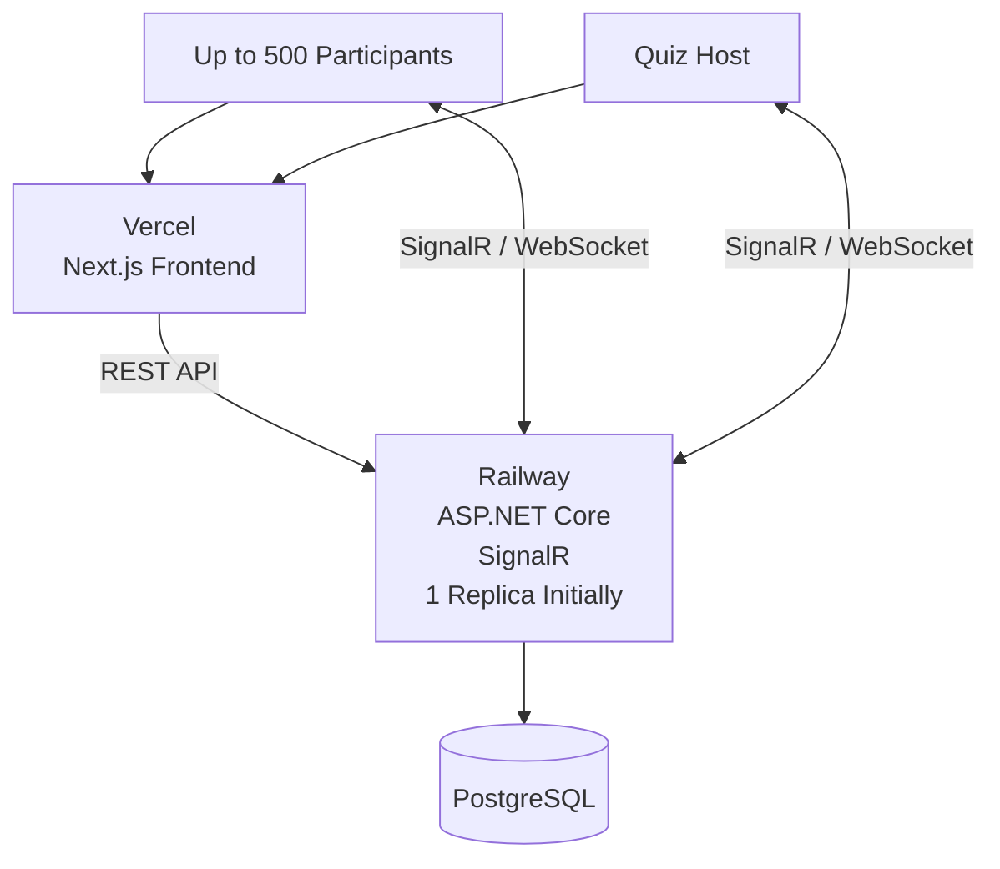
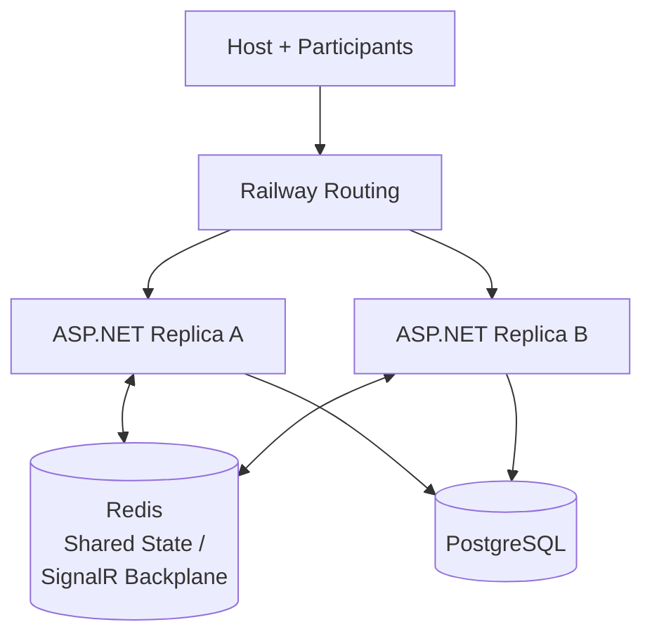
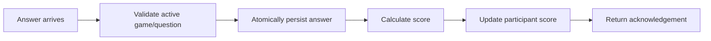

Act as a senior full-stack architect, ASP.NET Core engineer, real-time systems engineer, and performance engineer.

Build a production-ready **Kahoot-like real-time quiz platform**.

The most important non-functional requirement is:

> The application must reliably support at least **500 concurrent participants in the same live quiz session** without losing answers, duplicating scores, corrupting game state, or becoming unacceptably slow.

Do not treat this as a simple CRUD application. Real-time communication, concurrency, server-authoritative state, database integrity, performance, reconnection, and deployment must be first-class concerns.

---

# 1. Required Technology Stack

Use:

## Frontend

- Next.js
- TypeScript
- Responsive UI
- Mobile-first participant experience
- Deploy to **Vercel**

## Backend

- ASP.NET Core
- C#
- REST API where appropriate
- SignalR for real-time communication
- EF Core
- Deploy to **Railway**

## Database

- PostgreSQL
- Prefer Railway PostgreSQL unless there is a strong reason otherwise

## Load Testing

Use:

- k6

or another tool only if it provides materially better SignalR/WebSocket testing.

Do not introduce microservices.

Use a **modular monolith** unless there is a demonstrated requirement that cannot reasonably be solved with it.

---

# 2. Deployment Architecture

The initial production architecture should be:



Start with **one Railway backend replica**.

Do NOT introduce Redis simply because this is a real-time application.

First determine whether one properly sized ASP.NET Core instance can support the required 500 concurrent users.

The application architecture must, however, avoid unnecessary coupling that would make future horizontal scaling difficult.

If load testing demonstrates that one replica is insufficient, then design the next stage as:



Because multiple backend replicas cannot rely on local in-memory state, introduce Redis or another appropriate SignalR backplane/shared-state mechanism before horizontally scaling.

Do not horizontally scale SignalR blindly.

---

# 3. Main Roles

There are two primary roles.

## Host

A host can:

- Register/login
- Create quizzes
- Edit quizzes
- Delete quizzes
- Create questions
- Add answer options
- Choose the correct answer
- Configure question duration
- Configure points
- Start a live game
- Receive a short unique game PIN
- Show the PIN to participants
- See participants joining the lobby
- Remove inappropriate participants if needed
- Start the quiz
- Start the next question
- See how many participants answered
- End a question
- Display question statistics
- Display leaderboard
- Continue to the next question
- End the game
- See final results

## Participant

Participants should not need accounts.

A participant can:

1. Open the join page
2. Enter a game PIN
3. Enter a nickname
4. Join the lobby
5. Wait for the host
6. Receive questions in real time
7. Submit an answer
8. Submit only once per question
9. See whether the answer was accepted
10. See whether it was correct after appropriate reveal
11. See points earned
12. See leaderboard updates
13. Continue until the game ends

---

# 4. Game State Machine

Model game state explicitly.

For example:

```text
CREATED
   ↓
LOBBY
   ↓
QUESTION_ACTIVE
   ↓
QUESTION_RESULTS
   ↓
LEADERBOARD
   ↓
QUESTION_ACTIVE
   ↓
...
FINISHED
```

Do not manage this using random boolean fields such as:

```text
isStarted
isQuestionOpen
showResult
isFinished
```

Prefer a clear state machine with valid transitions.

Invalid state transitions must be rejected server-side.

For example:

```text
LOBBY -> QUESTION_ACTIVE
```

is valid.

But:

```text
FINISHED -> QUESTION_ACTIVE
```

must be rejected.

---

# 5. Server-Authoritative Design

The backend must be the source of truth.

The client must NEVER decide:

- Whether an answer is correct
- Whether an answer arrived on time
- The official timer
- How many points were earned
- The current game state
- The current question
- Whether a participant has already answered
- The official leaderboard
- Whether a question is open
- Whether the quiz has ended

Client timers are for display only.

The server determines deadlines using server timestamps.

Never send the correct answer to participant clients before the question is closed/revealed.

---

# 6. Real-Time Communication

Use SignalR for live game communication.

Clearly define all important events.

Examples:

```text
participant:join
participant:joined
participant:left

game:state
game:start
game:end

question:start
question:end
question:results

answer:submit
answer:accepted
answer:rejected

leaderboard:update

connection:restored
```

Define a typed contract for every event.

For every event document:

- Direction
- Payload
- Validation
- Possible errors
- Idempotency behavior

For example:

```text
Client -> Server

answer:submit

{
    gameId,
    questionId,
    participantId,
    selectedChoiceId
}
```

Do not trust timestamps supplied by the client for scoring or deadline validation.

---

# 7. Answer Submission Concurrency

This is one of the most important requirements.

Assume that:

> 500 participants may submit their answers within approximately the same second.

The system must handle that safely.

A participant may have only one accepted answer for:

```text
(gameId, questionId, participantId)
```

Enforce this at multiple appropriate layers.

At minimum:

- Application validation
- Database unique constraint

For example:

```text
UNIQUE(game_id, question_id, participant_id)
```

The database must be the final integrity boundary.

Do not rely on:

```text
if (!alreadyAnswered)
```

alone.

Handle this race:

```text
Request A ─────┐
               ├──> Same participant / same question
Request B ─────┘
```

If both arrive simultaneously, only one may succeed.

The second should receive an idempotent/meaningful response rather than creating another answer or score.

---

# 8. Idempotency

Important operations must be safe against duplicate requests or SignalR messages.

Especially:

- Submit answer
- Start game
- Start question
- End question
- Move to next question
- End game

Consider situations such as:

```text
Host double-clicks "Next"
```

or:

```text
Mobile network retries answer submission
```

These must not corrupt state.

---

# 9. Scoring

Implement scoring server-side.

Score should consider:

- Correctness
- Response speed

Keep the algorithm isolated behind a scoring service.

For example:

```text
score = basePoints × timeFactor
```

Do not hard-code scoring logic throughout controllers or SignalR hubs.

The exact formula should be easy to replace later.

Provide automated tests for:

- Correct answer
- Wrong answer
- Immediate answer
- Late answer
- Boundary timestamp
- Maximum points
- Minimum points

---

# 10. Timer Handling

Do NOT run authoritative quiz timers only in browser JavaScript.

When the server starts a question, store:

```text
questionStartedAt
questionEndsAt
```

The client can display its countdown using `questionEndsAt`.

When submitting an answer, the server determines whether:

```text
serverTime <= questionEndsAt
```

The client timestamp must never determine acceptance.

Handle the boundary case where an answer arrives exactly when the question closes.

Define the behavior explicitly and test it.

---

# 11. Reconnection

Mobile connections are unreliable.

A participant may:

```text
disconnect
↓
wait several seconds
↓
reconnect
```

Do not create another participant record.

Restore:

- Participant identity
- Game
- Current game state
- Current question
- Question deadline
- Whether the participant already answered
- Current score
- Result state
- Leaderboard when appropriate

Use a secure participant/session token rather than relying only on SignalR ConnectionId.

A SignalR ConnectionId is temporary and must not be treated as participant identity.

Test reconnection during:

- Lobby
- Active question before answering
- Active question after answering
- Results
- Leaderboard

---

# 12. Database Design

Design an appropriate PostgreSQL schema.

Likely entities include:

```text
Host
Quiz
Question
Choice

GameSession
Participant
Answer
```

Add other entities only where justified.

Create appropriate:

- Primary keys
- Foreign keys
- Unique constraints
- Check constraints
- Indexes

Important uniqueness examples may include:

```text
GameSession.pin
```

and:

```text
(gameId, questionId, participantId)
```

for answers.

Do not add indexes blindly.

Explain each important index based on the query pattern it supports.

---

# 13. Efficient Answer Processing

Do not perform excessive database operations per answer.

Avoid flows such as:

```text
Answer
 ↓
Load participant
 ↓
Load quiz
 ↓
Load game
 ↓
Load question
 ↓
Load all choices
 ↓
Load previous answers
 ↓
Insert answer
 ↓
Update participant
 ↓
Load all participants
 ↓
Calculate leaderboard
 ↓
Broadcast leaderboard
```

× 500 participants.

Design the hot answer path carefully.

Target something closer to:



Minimize:

- Database round trips
- Locks
- Allocations
- Serialized payload size
- Unnecessary broadcasts

---

# 14. Leaderboard Performance

Do NOT broadcast the complete leaderboard after every answer.

For example, this is unacceptable:

```text
500 answers
×
calculate entire leaderboard
×
broadcast entire leaderboard
```

Instead, design an efficient strategy.

Possible approaches include:

- Calculate leaderboard when question closes
- Throttled updates
- Periodic snapshots

Choose the simplest strategy that meets the UX requirements.

Explain the choice.

---

# 15. Security

Implement:

- Host authentication
- Host authorization
- Game ownership authorization
- Server-side validation
- Game PIN validation
- Nickname validation
- Input sanitization
- Rate limiting
- Payload size limits
- Answer spam protection
- Secure error responses
- CORS configured specifically for the Vercel frontend
- Production HTTPS
- Secure secret/environment-variable management

Participants must not be able to call host-only operations.

A participant must not be able to submit an answer for:

- Another participant
- Another game
- Another question
- A future question
- A closed question

Never expose database credentials or other secrets to the frontend.

---

# 16. Rate Limiting

Apply sensible rate limits.

Especially protect:

```text
/join
```

and answer-related operations.

Do not accidentally rate-limit legitimate bursts from 500 different participants.

Rate limiting should distinguish malicious repeated traffic from expected quiz traffic.

---

# 17. Frontend Pages

Create a clean, modern, responsive interface inspired by the interaction model of Kahoot, but do not copy copyrighted branding/assets/UI exactly.

Required routes should include equivalents of:

```text
/
 /join

 /login

 /host
 /host/quizzes
 /host/quizzes/new
 /host/quizzes/:id
 /host/game/:id

 /play/:gameId
```

---

# 18. Participant UX

Design participant pages mobile-first.

Important states:

```text
Entering PIN
Entering nickname
Joining
Waiting in lobby
Question active
Answer submitted
Waiting for others
Question results
Leaderboard
Disconnected
Reconnecting
Game finished
```

When an answer has already been submitted, prevent accidental re-submission in the UI.

But remember:

> Frontend prevention is UX only; backend/database enforcement provides correctness.

---

# 19. Host UX

The host screen should clearly show:

- Game PIN
- Participant count
- Participant names
- Current game state
- Current question
- Timer
- Number of responses received
- Question results
- Leaderboard
- Next question button
- End game button

Disable actions that are invalid for the current state.

Server-side state transition validation must still exist.

---

# 20. Railway Deployment

Prepare the ASP.NET backend specifically for Railway.

Include:

- Production Dockerfile if appropriate
- Environment-based configuration
- Correct port binding
- PostgreSQL connection configuration
- Production CORS
- HTTPS/proxy awareness
- Health endpoint

For example:

```text
/health
```

Do not expose sensitive information through the health endpoint.

Configure structured logs suitable for Railway logs.

Never store secrets in source control.

Document all required environment variables.

---

# 21. Vercel Deployment

Prepare the frontend for Vercel.

Use environment variables for:

```text
API_BASE_URL
SIGNALR_URL
```

or equivalent.

Do not hard-code localhost or Railway URLs into application code.

Configure separate:

```text
Development
Production
```

environments.

---

# 22. SignalR Production Configuration

Configure SignalR correctly for production.

Consider:

- WebSocket transport
- Automatic reconnect
- Keep-alive
- Client timeout
- Maximum receive size
- Serialization
- Connection lifecycle
- Logging
- Group membership
- Reconnection

Use SignalR groups for game sessions where appropriate.

For example:

```text
game:{gameId}
```

Avoid broadcasting game events to every connected application user.

---

# 23. Railway Scaling Strategy

Start with:

```text
1 Railway ASP.NET replica
```

Do not use multiple replicas prematurely.

First run the required load tests.

If one instance passes the acceptance criteria, keep the architecture simple.

If it fails because backend compute capacity is genuinely exhausted, investigate the bottleneck before scaling.

Possible bottlenecks include:

```text
CPU
Memory
Database
Connection pool
Slow queries
Serialization
Excessive broadcasts
SignalR code
Lock contention
```

Do not assume horizontal scaling fixes inefficient code.

---

# 24. Future Horizontal Scaling

Before moving to multiple Railway replicas, ensure the architecture supports distributed operation.

Do not depend on application-memory state such as:

```text
Dictionary<GameId, Game>
```

as the only authoritative state.

When multiple replicas become necessary, evaluate:

```text
Redis
+
SignalR Redis backplane
```

or another appropriate managed SignalR solution.

Shared/distributed state may then handle:

- SignalR broadcasts
- Presence where necessary
- Active game coordination
- Distributed synchronization
- Shared temporary state

PostgreSQL remains the durable source of truth for persistent business data.

Do not implement Redis until it provides a demonstrated benefit, but do not make future adoption unnecessarily difficult.

---

# 25. Observability

Implement structured logging.

Important logs should include identifiers such as:

```text
gameId
participantId
questionId
connectionId
requestId
```

where appropriate.

Never log passwords, tokens, or secrets.

Track useful metrics such as:

```text
active_games
active_participants
signalr_connections

answers_submitted_total
answers_accepted_total
answers_rejected_total

duplicate_answers_total
late_answers_total

answer_processing_duration

database_query_duration
signalr_broadcast_duration

reconnections_total

game_state_transition_failures_total
```

---

# 26. Performance Requirements

The application must be designed for:

```text
500 concurrent SignalR connections

500 participants
inside one game

500 near-simultaneous
answer submissions
```

Performance targets:

```text
Normal API p95:
< 300 ms

Answer submission p95:
< 500 ms under expected load

Error rate:
< 1%

Lost accepted answers:
0

Duplicate scores:
0

Invalid duplicated answers:
0

Inconsistent game state:
0
```

Real-time question broadcasts should normally reach connected participants within hundreds of milliseconds under the expected load.

Treat these as engineering targets to validate, not assumptions.

---

# 27. Required Load Tests

Create load tests that simulate realistic user behavior.

## Scenario 1 — Connections

Connect:

```text
500 participants
```

to SignalR.

Measure:

- Successful connections
- Failed connections
- Connection establishment time
- Memory
- CPU

---

## Scenario 2 — Lobby

500 participants join the same quiz.

Verify:

```text
participant count = 500
```

with no duplicates.

---

## Scenario 3 — Question Broadcast

Host starts a question.

Broadcast it to all:

```text
500 participants
```

Measure how long delivery takes.

---

## Scenario 4 — Answer Burst

Simulate approximately:

```text
500 answers
within ~1 second
```

Measure:

```text
p50
p95
p99
throughput
errors
CPU
memory
database latency
```

Verify every valid answer is handled exactly once.

---

## Scenario 5 — Duplicate Answer Attack

Send several duplicate answers from the same participant.

Verify:

```text
1 accepted answer
1 score calculation
```

only.

---

## Scenario 6 — Reconnection

Disconnect approximately:

```text
100 participants
```

and reconnect them.

Verify that:

```text
participant count does NOT become 600
```

and participant/game state is restored correctly.

---

## Scenario 7 — Multiple Games

Simulate:

```text
10 games
×
50 participants
=
500 connected participants
```

Verify isolation between SignalR groups.

No game should receive another game's messages.

---

# 28. Database Load Testing

During the answer burst, inspect:

- Database CPU/resource usage
- Slow queries
- Connection pool
- Lock contention
- Transaction duration
- Query count per answer

Look specifically for N+1 queries.

Do not consider the performance requirement complete merely because HTTP requests return 200.

---

# 29. Automated Tests

Create:

## Unit Tests

Cover:

- Scoring
- State transitions
- Validation
- Deadline calculation

## Integration Tests

Cover:

- Database constraints
- Answer submission
- Duplicate answer prevention
- Game creation
- Joining

## Concurrency Tests

Especially test simultaneous submissions for:

```text
(gameId, questionId, participantId)
```

Verify exactly one succeeds.

## SignalR Tests

Cover:

- Joining groups
- Broadcast
- Answers
- Host commands
- Reconnection

## Authorization Tests

Ensure participants cannot execute host operations.

---

# 30. Failure Scenarios

Explicitly handle and test:

- Duplicate SignalR message
- Duplicate HTTP request
- Host double-clicking next question
- Two state transitions occurring simultaneously
- Participant losing network connection
- Participant reconnecting after answering
- Database timeout
- Slow database
- Invalid game PIN
- Expired game
- Answer after deadline
- Answer exactly at deadline
- Backend restart
- 500 participants reconnecting close together

Clearly document behavior for every important failure scenario.

---

# 31. Code Architecture

Keep business logic outside controllers and SignalR hubs.

Prefer a structure conceptually similar to:

```text
Frontend
    components/
    features/
    hooks/
    services/
    realtime/

Backend
    Domain/
    Application/
    Infrastructure/
    Api/
```

Do not force this exact folder structure if the repository already has good conventions.

Important business concepts should have dedicated services/use cases.

For example:

```text
GameService
GameStateMachine

AnswerSubmissionService

ScoringService

LeaderboardService
```

SignalR Hub should primarily handle transport concerns and delegate business logic.

---

# 32. EF Core Rules

Use EF Core carefully.

Avoid unnecessary:

```text
Include()
```

chains on hot paths.

For read-only queries use:

```text
AsNoTracking()
```

where appropriate.

Project only the columns needed.

Use asynchronous database operations.

Avoid loading complete aggregate graphs merely to validate one answer.

Create migrations for schema changes.

Never silently modify production schema outside migration management.

---

# 33. Development Process

Do NOT immediately start generating random files.

Follow this process.

## Phase 1 — Repository Analysis

Inspect the complete repository first.

Identify:

- Existing frontend
- Existing backend
- Existing database
- Existing authentication
- Existing architecture
- Existing conventions
- Existing tests

Preserve good existing architecture.

Do not rewrite working systems unnecessarily.

---

## Phase 2 — Architecture

Before implementation, create:

```text
docs/architecture.md
```

Include Mermaid diagrams for:

- Deployment
- HTTP communication
- SignalR communication
- Answer submission
- Game state machine

Explain each diagram.

---

## Phase 3 — Requirements and Data Model

Create/document:

- Business rules
- Database entities
- Relationships
- Constraints
- Indexes
- Game lifecycle

---

## Phase 4 — Real-Time Protocol

Document all SignalR events and payloads.

Clearly specify:

```text
Client -> Server

Server -> Client
```

events.

---

## Phase 5 — Backend

Implement:

- Authentication
- Quiz management
- Game creation
- Game PIN generation
- Joining
- Participants
- Game state machine
- SignalR
- Questions
- Answers
- Scoring
- Results
- Leaderboard
- Reconnection
- Authorization
- Validation
- Rate limiting

---

## Phase 6 — Frontend

Implement:

- Host interface
- Participant interface
- Quiz editor
- Lobby
- Question screen
- Answer screen
- Results
- Leaderboard
- Reconnection UX

---

## Phase 7 — Tests

Implement and run:

```text
unit tests
integration tests
concurrency tests
SignalR tests
```

Fix failures.

---

## Phase 8 — Local Load Testing

Run increasingly large tests:

```text
50 users
100 users
250 users
500 users
750 users
```

Do not jump directly to conclusions based on small tests.

---

## Phase 9 — Railway/Vercel Deployment

Deploy:

```text
Frontend
→ Vercel

Backend
→ Railway

Database
→ PostgreSQL
```

Verify production configuration.

---

## Phase 10 — Production-like Load Testing

Run the 500-user tests against an environment that reflects production infrastructure as closely as practical.

Record the results.

---

## Phase 11 — Optimization

If requirements fail:

1. Identify the bottleneck.
2. Measure it.
3. Fix it.
4. Run the test again.

Do not blindly increase resources.

---

## Phase 12 — Final Verification

Run:

```text
frontend build
backend build
lint
unit tests
integration tests
concurrency tests
SignalR tests
load tests
```

Everything must pass before declaring the project complete.

---

# 34. Engineering Rules

Follow these rules throughout the implementation:

- Server is authoritative
- Never trust client game state
- Do not expose the correct answer early
- Make answer submission idempotent
- Use DB constraints for critical integrity
- Keep transactions short
- Avoid N+1 queries
- Avoid unnecessary database round trips
- Avoid excessive SignalR broadcasts
- Use SignalR groups
- Use async/non-blocking I/O
- Add cancellation and timeouts
- Avoid unbounded retries
- Avoid global mutable application state
- Do not introduce microservices
- Do not introduce Redis prematurely
- Do not horizontally scale prematurely
- Use environment variables for secrets
- Keep business logic out of transport layers
- Add tests for every critical business rule
- Optimize based on measurements, not guesses

---

# 35. Acceptance Criteria

The project is complete only when all of the following are verified:

1. Host can authenticate.
2. Host can create a quiz.
3. Host can manage questions.
4. Host can start a game.
5. Game receives a unique PIN.
6. Participants can join using the PIN.
7. 500 participants can join the same game.
8. All participants receive questions in real time.
9. Participants can submit answers.
10. Only one answer per participant/question can be accepted.
11. Duplicate submissions cannot generate duplicate scores.
12. Late answers are rejected correctly.
13. Score is calculated server-side.
14. Question deadline is server-authoritative.
15. Correct answer is not leaked before reveal.
16. Leaderboard is correct.
17. Game state transitions are protected.
18. Host-only actions require authorization.
19. Reconnection restores participant state.
20. Reconnection does not duplicate participants.
21. Different games are properly isolated.
22. Database constraints enforce critical integrity.
23. Application builds successfully.
24. Automated tests pass.
25. Concurrency tests pass.
26. SignalR tests pass.
27. 500-user load test is executed.
28. No accepted answers are lost.
29. No duplicate scores occur.
30. Performance metrics are documented.
31. Railway backend deployment works.
32. Vercel frontend deployment works.
33. Production CORS works.
34. SignalR works correctly through Railway.
35. Health endpoint works.
36. Environment variables are documented.
37. Setup documentation exists.

---

# 36. Final Report

At the end create:

```text
docs/final-report.md
```

Include:

## Architecture

Final architecture and Mermaid diagrams.

## Technology Decisions

Explain:

- Why ASP.NET Core
- Why SignalR
- Why PostgreSQL
- Why Vercel
- Why Railway
- Why one backend replica initially
- Whether Redis was required

## Database

Document:

- Schema
- Constraints
- Important indexes

## Real-Time Protocol

Document SignalR events.

## Concurrency

Explain how duplicate submissions and race conditions are prevented.

## Load-Test Results

Include a table similar to:

```text
Users:                     500
SignalR connections:       X/500
Connection failures:       X

Answers submitted:         500
Answers accepted:          X
Unexpected failures:       X

p50:                       X ms
p95:                       X ms
p99:                       X ms

Peak CPU:                  X
Peak Memory:               X

Duplicate scores:          0
Lost accepted answers:     0
```

Do not fabricate performance results.

If a test could not be executed, explicitly state that instead of claiming success.

## Deployment

Document:

- Vercel configuration
- Railway configuration
- PostgreSQL configuration
- Required environment variables

## Known Limitations

Clearly list remaining limitations.

## Scaling Recommendation

Based on actual measurements, state whether:

```text
1 Railway replica
```

is sufficient for 500 users.

Only recommend:

```text
multiple Railway replicas
+
Redis / SignalR backplane
```

if measurements justify it.

---

# 37. Definition of Done

Do NOT claim:

```text
"Supports 500 users"
```

simply because the architecture theoretically supports it.

You may only make that claim after running the required load tests and providing the measurements.

Code existing does not mean the requirement is complete.

For every important requirement:

```text
Implement
    ↓
Test
    ↓
Measure
    ↓
Fix if necessary
    ↓
Verify
```

is required.

---

# Start Now

Begin by inspecting the repository.

Then:

1. Summarize the existing architecture.
2. Identify what already exists and should be reused.
3. Identify missing requirements.
4. Create the proposed architecture.
5. Create the database design.
6. Define the SignalR protocol.
7. Create an implementation plan.
8. Then implement the system phase by phase.
9. Build and test after each meaningful phase.
10. Finish with the 500-concurrent-user load test and final report.

Do not stop at planning if you have the ability to implement and test the project.

Do not ask me for confirmation between normal implementation phases unless a decision genuinely cannot be resolved safely from the repository and these requirements.

Make reasonable engineering decisions, document them, and continue.