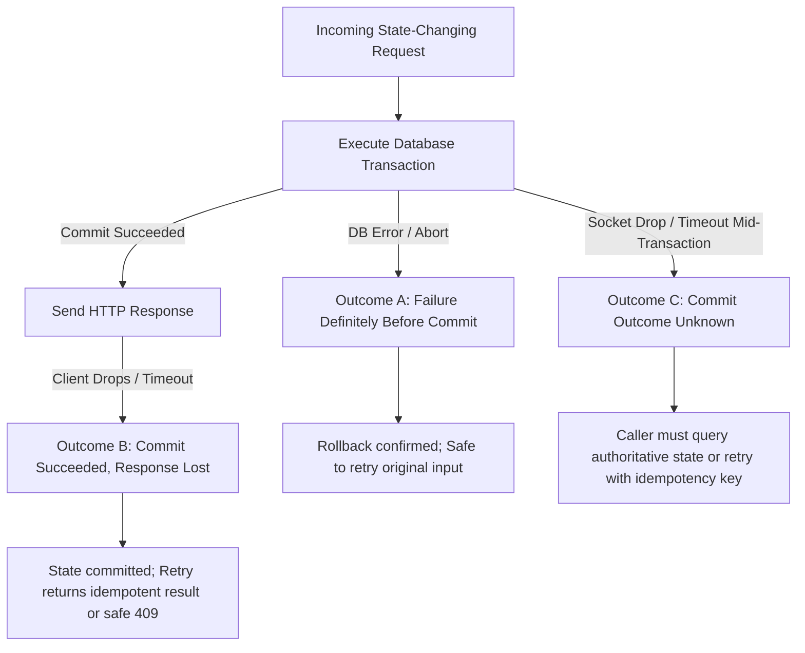

# 01. Roles, Ownership, and Access

This document establishes the authoritative, canonical foundation for system actors, tenant boundaries, global access controls, Unicode identity normalization, error contracts, shared pagination conventions, and cross-tenant security guarantees. It combines both functional requirements and non-functional specifications into a unified, normative specification.

---

## 1. Topic Overview & Actors

The platform is designed strictly as a **multi-tenant SaaS platform where each registered user is one isolated tenant**.

### 1.1 Actor Definitions
* **`RA-ACTOR-001`**: The platform defines exactly four conceptual actors with strict authority boundaries:
  1. **System Administrator**: A dedicated platform-level operational account. Responsible for system health, platform account queries, and account lifecycle management (suspension/reactivation). Strictly barred from viewing, editing, or participating in private tenant data (quizzes, questions, gameplay, answers, media metadata).
  2. **Registered User / Host**: A normal registered user account. Represents exactly one tenant boundary. Possesses full ownership of their own tenant-scoped resources: quizzes, questions, media, live game sessions, and reports.
  3. **Player / Participant**: An ephemeral, account-free participant in a specific game. Possesses no tenant ownership. Restricted strictly to the specific game session in which they joined via PIN/link. Zero access to Host or Admin APIs.
  4. **Anonymous Visitor**: An unauthenticated public client. Can self-register a normal Host account, submit login credentials, query public joinability of game PINs, and fetch public immutable game images.

### 1.2 Tenant & Ownership Invariants `[NORMATIVE]`
* **`RA-TENANT-001` (Tenant Boundary)**: One normal registered user equals exactly one tenant boundary, acting as Host for all resources created under that account.
* **`RA-TENANT-002` (No Hierarchies)**: There are no organizations, teams, workspaces, tenant administrators, user memberships, user invitations, or tenant switching.
* **`RA-TENANT-003` (Multi-Tenant SaaS Classification)**: The platform is a multi-tenant SaaS application where each user account is an isolated tenant. It must never be configured or described as a single-tenant platform.
* **`RA-AUTHZ-001` (Derived Authorization)**: The server derives tenant context solely from the cryptographically validated identity token. Untrusted client headers, query parameters, route segments, or payload fields specifying a `TenantId` are strictly rejected.
* **`RA-AUTHZ-002` (Zero Impersonation)**: System Administrators cannot impersonate normal users, assume Host roles, or bypass tenant boundaries to browse private Host content.

---

## 2. Functional Specification & Authoritative Matrix

### 2.1 Role and Responsibility Matrix `[NORMATIVE]`

The backend enforces this matrix across every REST endpoint, SignalR hub method, background worker, and cache retrieval:

| Operation / Capability | Anonymous Visitor | Active Host | Active System Administrator | Valid Player Session | Canonical Requirement ID |
| :--- | :--- | :--- | :--- | :--- | :--- |
| **Register Normal Account** | Yes | Public flow | Public flow (cannot register admin) | Public flow | `AUTH-REG-001` |
| **Login / Authenticate** | Yes | Public flow | Public flow | Public flow | `AUTH-LOGIN-001` |
| **Token Refresh / Logout** | With refresh cookie | Own session only | Own session only | No account authority | `AUTH-REF-001` |
| **Author / Publish Quizzes & Questions** | No | Own tenant only | No | No | `QUIZ-AUTH-001` |
| **Upload / Manage Media** | No | Own tenant only | No | No | `MED-UPL-001` |
| **Create & Control Game Sessions** | No | Own game only | No | No | `GAME-CTRL-001` |
| **List / Search Accounts & Audit Logs** | No | No | Yes | No | `ACCT-QUERY-001` |
| **Suspend / Reactivate Accounts** | No | No | Yes (last-admin protected) | No | `ACCT-SUSP-001` |
| **Join Game Lobby via PIN & Nickname** | Yes | Public Player flow | Public Player flow | Public flow (no special privilege) | `JOIN-FLOW-001` |
| **Submit Answers / Reconnect** | No | Only via Player session | Only via Player session | Own game & participant only | `PLAY-ANS-001` |
| **Subscribe to Host Realtime Events** | No | Own game only | No | No | `RT-HOST-001` |
| **Fetch Public Game Image Bytes** | Yes | Yes | Yes | Yes | `MED-PUB-001` |

### 2.2 Host Ownership & Effective Tenant Derivation
* **`RA-OWN-001` (Exclusive Ownership)**: Quizzes, questions, choices, media items, game sessions, immutable snapshots, participants, answers, scores, and leaderboards belong exclusively to one Host tenant.
* **`RA-OWN-002` (Hierarchical Inheritance)**: Questions and choices strictly inherit the tenant boundary of their parent quiz. Snapshots, participants, and answers strictly inherit the tenant boundary of their game session.
* **`RA-ISOL-001` (Foreign Resource Concealment)**: Accessing a resource belonging to another tenant returns `404 Quiz.NotFound` or `404 Game.NotFound` rather than disclosing resource existence via 403 Forbidden.

### 2.3 Account-Free Player Identity
* **`RA-PLAY-001` (Account-Free Session)**: Players require no registration, email, or prior credentials.
* **`RA-PLAY-002` (Session Token Issuance)**: Joining a game generates a unique `Participant` entity bound to that `GameId` and a high-entropy, cryptographically random `PlayerSessionToken`.
* **`RA-PLAY-003` (Hashed Persistence)**: The server stores strictly the SHA-256 hash of the session token.
* **`RA-PLAY-004` (Authority Boundary)**: A Player credential cannot be used to authenticate to any Host, REST administrative, or management API.

### 2.4 Unicode Identity Normalization Foundation `[NORMATIVE]`
To prevent visually equivalent or confusing account usernames and participant nicknames while avoiding false homograph defense claims:

```text
User Input: Display Form (Preserves casing, trimmed of leading/trailing ASCII whitespace)
       │
       ▼ Unicode Normalization Form KC (NFKC) + Culture-Independent Case Folding
Stored Canonical Form: NormalizedUsername / NormalizedNickname (Strict DB uniqueness)
```

* **`RA-UNI-001` (Dual Representation)**:
  * `DisplayUsername` / `DisplayNickname`: Preserves original user-entered casing and permitted printable characters after stripping leading and trailing whitespace.
  * `NormalizedUsername` / `NormalizedNickname`: Canonical representation generated via Unicode Normalization Form KC (NFKC) followed by culture-independent case folding (`ToUpperInvariant` / `ToLowerInvariant`).
* **`RA-UNI-002` (Uniqueness Enforcement)**: Database unique constraints are enforced strictly on `NormalizedUsername` globally, and `(GameId, NormalizedNickname)` per game session.
* **`RA-UNI-003` (Zero Normalization of Passwords)**: Passwords must **never** be trimmed, lowercased, case-folded, or Unicode-normalized. Passwords must be validated and hashed byte-for-byte as entered.
* **`RA-UNI-004` (Explicit Confusable Boundary & Non-Claims)**:
  * NFKC normalization handles compatibility equivalence (e.g., ligature splitting, fullwidth-to-standard ASCII conversions).
  * NFKC + case folding **does NOT prevent cross-script visual confusables / homoglyphs** (e.g., Latin `a` U+0061 vs. Cyrillic `а` U+0430 remain distinct code points). The system explicitly does not claim full visual homoglyph immunity under default normalization.
  * Control characters (Unicode category `Cc`), zero-width characters (`Cf` such as zero-width spaces/joiners), and surrogate code points are strictly rejected during input validation with `400 Validation.Failed`.

### 2.5 Common Response and Error Contract `[NORMATIVE]`
* **`RA-ERR-001` (RFC 7807 Format)**: REST API errors adhere strictly to the RFC 7807 `application/problem+json` format:
  ```json
  {
    "type": "https://api.kahoot-saas.local/errors/Auth.InvalidCredentials",
    "title": "Invalid credentials",
    "status": 401,
    "code": "Auth.InvalidCredentials",
    "detail": "The provided username or password was incorrect.",
    "instance": "/api/auth/login",
    "requestId": "req_01HPX7E4K9N3R8V2M5W1B6Z4J9",
    "errors": {}
  }
  ```
* **`RA-ERR-002` (SignalR Envelope)**: SignalR hub method invocations return a consistent envelope:
  ```json
  {
    "success": false,
    "data": null,
    "error": {
      "code": "Game.InvalidStateTransition",
      "description": "Requested state transition is invalid from current state."
    }
  }
  ```

### 2.6 Shared Pagination Conventions `[NORMATIVE]`
* **`RA-PAGE-001` (Keyset Cursor Pagination)**: High-volume entity listing endpoints (`/api/quizzes`, `/api/games`, `/api/admin/users`) enforce deterministic keyset (cursor-based) pagination.
* **`RA-PAGE-002` (Page Size Bounds)**: `pageSize` must be an integer between 1 and 100 (inclusive), defaulting to 50. Values $\le 0$ or $> 100$ return `400 Validation.Failed`.
* **`RA-PAGE-003` (Stable Sorting)**: Pagination ordering is strictly deterministic, using composite sort keys ending with unique identity: `(CreatedAt DESC, Id DESC)`.

---

## 3. Boundaries, Edge Cases & Negative Validation

### 3.1 Input Length & Character Boundaries

| Parameter | Min - 1 | Min | Normal | Max | Max + 1 | Rule / Validation | Stable Req ID |
| :--- | :--- | :--- | :--- | :--- | :--- | :--- | :--- |
| **Username Length** | 2 (Rejected) | 3 (Accepted) | 12 (Accepted) | 64 (Accepted) | 65 (Rejected) | Alphanumeric, underscores, hyphens; scalar length evaluated post-NFKC. | `RA-BOUND-001` |
| **Nickname Length** | 1 (Rejected) | 2 (Accepted) | 10 (Accepted) | 30 (Accepted) | 31 (Rejected) | Printable Unicode scalar characters; no control codes. | `RA-BOUND-002` |
| **Pagination PageSize**| 0 (Rejected) | 1 (Accepted) | 50 (Accepted) | 100 (Accepted) | 101 (Rejected) | Default is 50. Opaque cursor required for subsequent pages. | `RA-BOUND-003` |

### 3.2 Canonical Negative Error Codes

| Status | Error Code | Triggering Condition | Stable Req ID |
| :--- | :--- | :--- | :--- |
| **400** | `Validation.Failed` | Malformed body, missing fields, illegal Unicode characters, or boundary violation. | `RA-ERR-003` |
| **401** | `Auth.Unauthorized` | Missing, malformed, expired, or signature-invalid JWT access token. | `RA-ERR-004` |
| **401** | `Game.InvalidSessionToken` | Invalid, expired, or tampered Player session token. | `RA-ERR-005` |
| **403** | `Auth.Forbidden` | Authenticated role lacks authority (e.g., Host calling Admin endpoint). | `RA-ERR-006` |
| **403** | `Auth.AccountSuspended` | Authenticated account is in `Suspended` status. | `RA-ERR-007` |
| **403** | `Game.ParticipantRemoved` | Player session token belongs to an explicitly removed participant. | `RA-ERR-008` |
| **404** | `Quiz.NotFound` | Quiz does not exist or belongs to another Host tenant. | `RA-ERR-009` |
| **404** | `Game.NotFound` | Game does not exist or belongs to another Host tenant. | `RA-ERR-010` |
| **409** | `Auth.UsernameUnavailable`| Normalized username conflicts with an existing normal or admin account. | `RA-ERR-011` |
| **429** | `Request.RateLimited` | Rate limit bucket exhausted. Includes `Retry-After` header. | `RA-ERR-012` |
| **503** | `Service.Unavailable` | Temporary infrastructure or database connectivity failure. | `RA-ERR-013` |

---

## 4. Topic-Specific Non-Functional Requirements & Performance SLOs

### 4.1 Authorization Evaluation Latency `[NORMATIVE]`
* **`RA-SLO-001` (Evaluation Speed)**: Server-side authorization check (signature validation, claims extraction, tenant context derivation, and authority freshness check) must complete in:
  * $p50 \le 2\text{ ms}$
  * $p95 \le 5\text{ ms}$
  * $p99 \le 10\text{ ms}$
* **`RA-SLO-002` (Revocation Propagation Bound)**: Across a multi-instance deployment, revoking account authority (suspension, logout-all, password change) must propagate to all backend instances within $\le 100\text{ ms}$ ($p95$). Stale access tokens must be rejected after this window.

### 4.2 Multi-Tenant Database Segregation Invariants
* **`RA-ISOL-002` (Persistence Filtering)**: Every tenant-scoped query must enforce `TenantId = @CurrentTenantId` as its primary filter prior to evaluating secondary filters, sorting, or pagination cursors.
* **`RA-ISOL-003` (Composite Indexing)**: Tenant-scoped tables (`Quizzes`, `Questions`, `MediaItems`, `Games`) must include `TenantId` as the leading column in composite clustering keys or primary indexes:
  ```sql
  -- NON-NORMATIVE REFERENCE EXAMPLE
  CREATE INDEX IX_Quizzes_TenantId_CreatedAt ON Quizzes (TenantId, CreatedAt DESC);
  CREATE INDEX IX_Games_TenantId_Status ON Games (TenantId, Status);
  ```
* **`RA-ISOL-004` (Integrity Constraints)**: Database relational constraints must prevent creating cross-tenant relationships (e.g., associating a Question with a Quiz of a different tenant, or referencing another tenant's MediaItem).

---

## 5. Security & Threat Mitigations

### 5.1 Multi-Tenant Data Segregation Invariants
* **`RA-SEC-001` (Strict Logical Isolation)**: Tenant A can never read, modify, delete, or receive realtime events for Tenant B's data under any circumstance.
* **`RA-SEC-002` (No Tenant Header Injection)**: Server code must strictly reject any request body, route parameter, or header that attempts to declare an external `TenantId`. The authenticated security token is the sole authority for tenant identity.
* **`RA-SEC-003` (Foreign Resource Concealment)**: Foreign IDOR requests return `404 Quiz.NotFound` or `404 Game.NotFound`. The system avoids distinguishable fast-path rejections that leak ownership through response payload or execution timing.

### 5.2 Authorization & Password Timing Side Channels
* **`RA-SEC-004` (Timing Side-Channel Defense)**: The system must avoid intentionally distinguishable fast-path execution paths when looking up foreign vs. non-existent resources. Statistical distribution testing under controlled network harnesses must verify that foreign-resource concealment and non-existent resource lookups exhibit indistinguishable latency distributions. (Zero claim of exact network millisecond identity across public networks).

---

## 6. Concurrency, Lost-Response & Failure-Mode Contracts

### 6.1 State-Changing Commit Outcome Contract `[NORMATIVE]`
Every state-changing workflow across authorization, roles, and account identity must adhere to these three explicit failure outcome classes:



* **Outcome A (Failure definitely before commit)**: The database transaction was aborted or connectivity failed before commit. No state change occurred. The caller may safely retry without side effects.
* **Outcome B (Commit definitely succeeded, response lost)**: The database transaction committed, but the network connection severed before the response reached the caller. A subsequent retry with identical idempotency identifiers (`commandId`, `joinOperationId`, or unchanged payload) must return the previously committed result or a safe domain conflict (`409`), never creating duplicate resources or corrupting state.
* **Outcome C (Commit outcome unknown to caller)**: The caller experienced a network timeout during the request. The caller must not assume rollback; it must either query authoritative state (e.g., `GET /api/games/{id}`) or retry with an idempotency key.

### 6.2 Per-Topic Failure-Mode & Risk Matrix `[NORMATIVE]`

| Risk ID | Trigger / Failure | Potential Impact | Required System Behavior | Recovery / Mitigation | Verification |
| :--- | :--- | :--- | :--- | :--- | :--- |
| `RA-RISK-001` | Database connection pool exhausted during authz check. | Inability to evaluate user permissions; connection hanging. | Bounded acquisition timeout ($\le 3\text{ s}$); fail fast with `503 Service.Unavailable` and `Retry-After: 5`. | Pool exhaustion alerts; client exponential backoff with jitter. | `RA-TEST-007` |
| `RA-RISK-002` | Stale JWT presented after immediate Host account suspension. | Suspended user continues executing protected operations. | Server checks revocation version / suspension status. Request rejected immediately with `403 Auth.AccountSuspended`. | Revocation broadcast across cluster in $\le 100\text{ ms}$; socket disconnect. | `RA-TEST-008` |
| `RA-RISK-003` | IDOR attempt: Host A calls Host B's quiz ID. | Potential disclosure of quiz content or existence across tenants. | Query includes `TenantId = HostA`; zero rows match; returns `404 Quiz.NotFound`. | Statistical timing parity between foreign and non-existent IDs. | `RA-TEST-002` |
| `RA-RISK-004` | Malicious client submits Unicode zero-width or control characters. | Bypassing unique username rules or corrupting UI rendering. | Rejected at input validation layer with `400 Validation.Failed`. | Dual-representation model; category `Cc` and `Cf` rejection. | `RA-TEST-005` |
| `RA-RISK-005` | High-volume keyset pagination cursor tampering. | SQL injection or cross-tenant cursor traversal. | Cursor is cryptographically HMAC-signed or validated as strictly typed scalar ID; invalid cursor returns `400 Validation.Failed`. | Tamper detection on pagination cursor. | `RA-TEST-009` |
| `RA-RISK-006` | Network timeout during privilege escalation or role change. | Caller uncertain if role transition committed. | Caller queries `GET /api/admin/users/{id}` or resubmits with idempotency key. | Deterministic Outcome C resolution; no orphan states. | `RA-TEST-010` |

---

## 7. Traceable Acceptance Tests & Test Matrix

| Test ID | Mapped Requirement IDs | Category | Description & Preconditions | Expected Outcome |
| :--- | :--- | :--- | :--- | :--- |
| `RA-TEST-001` | `RA-ACTOR-001`, `RA-AUTHZ-001` | Functional | Unauthenticated visitor attempts to create a quiz via REST. | Returns `401 Auth.Unauthorized`. |
| `RA-TEST-002` | `RA-ISOL-001`, `RA-SEC-003` | Security | Host A attempts to access `/api/quizzes/{id}` belonging to Host B. | Returns `404 Quiz.NotFound`. Zero tenant data or existence disclosed. |
| `RA-TEST-003` | `RA-ACTOR-001`, `RA-AUTHZ-002` | Security | System Administrator attempts to query Host A's quiz or question endpoints. | Returns `403 Auth.Forbidden`. Impersonation barred. |
| `RA-TEST-004` | `RA-PLAY-004` | Functional | Player session token attempts to call Host game start endpoint. | Returns `401 Auth.Unauthorized`. |
| `RA-TEST-005` | `RA-UNI-001`, `RA-UNI-004` | Functional | User registers with leading/trailing whitespace and mixed casing (`"  UserOne  "`). | Normalized to `"userone"` for uniqueness. Display name preserved as `"UserOne"`. Control/ignorable characters rejected with `400 Validation.Failed`. |
| `RA-TEST-006` | `RA-BOUND-001` | Boundaries | User attempts to register with usernames of 2, 3, 64, and 65 characters. | 2 and 65 rejected (`400 Validation.Failed`); 3 and 64 accepted (`201 Created`). |
| `RA-TEST-007` | `RA-SLO-001`, `RA-RISK-001` | Non-Functional | Measure authorization claim evaluation time under 1,500 RPS load. | Meets $p95 \le 5\text{ ms}$ and $p99 \le 10\text{ ms}$. Pool exhaustion returns 503 within 3s. |
| `RA-TEST-008` | `RA-SLO-002`, `RA-RISK-002` | Security / Concurrency | Host initiates quiz update simultaneously with an administrator suspension action. | Race is serialized; if suspension commits first, update fails with `403 Auth.AccountSuspended` across all nodes within 100 ms. |
| `RA-TEST-009` | `RA-PAGE-001`, `RA-RISK-005` | Functional | Request quiz listing with invalid or cross-tenant pagination cursor. | Rejected with `400 Validation.Failed`. |
| `RA-TEST-010` | `RA-SEC-004` | Security | Statistical latency test comparing 10,000 requests for non-existent quiz IDs vs. 10,000 requests for foreign-tenant quiz IDs. | Distributions are statistically indistinguishable under controlled test harness. |
