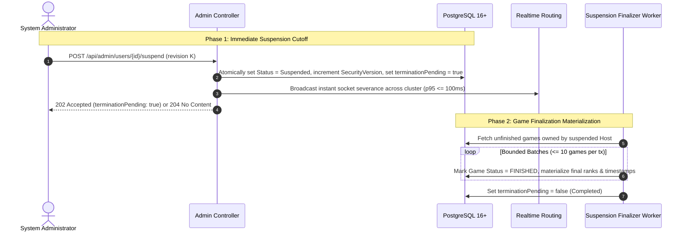

# 03. Platform Account Management and Tenant Lifecycle

This document defines the normative requirements for account lifecycle states, immediate suspension cutoff enforcement, bounded asynchronous game finalization, account reactivation, and administrator search/query capabilities. It combines functional specifications and non-functional requirements into a single unified specification.

---

## 1. Topic Overview & Actors

Account lifecycle governs administrative oversight of Host accounts and platform administrators:
* **System Administrator**: Initiates account queries, status changes, and administrator lifecycle actions.
* **Registered User / Host**: The target of lifecycle state mutations.
* **Player / Participant**: Ephemeral participant impacted by suspension of their game's Host.
* **Account Lifecycle States `[NORMATIVE]`**: Exactly two lifecycle states are supported:
  * `Active`: Account is authorized for standard operations.
  * `Suspended`: Account is immediately blocked from all authenticated actions and its unfinished games are permanently terminated.
* *No Deactivated, Soft-Deleted, Archived, or Purged states exist as normal account lifecycle states.*

---

## 2. Functional Specification & Workflows

### 2.1 Bounded Account Search & Queries `[NORMATIVE]`
* **`ACCT-QUERY-001` (Administrative Listing Endpoints)**:
  * `GET /api/admin/users`: Lists normal Host accounts with keyset cursor pagination and filters (`username`, `status`).
  * `GET /api/admin/users/{accountId}`: Fetches individual Host administrative metadata.
  * `GET /api/admin/administrators`: Lists System Administrator platform accounts.
* **`ACCT-QUERY-002` (Metadata Projection & Privacy Barrier)**:
  * Responses expose strictly administrative metadata:
    ```json
    {
      "accountId": "acc_01HPX8...",
      "username": "TeacherJane",
      "accountKind": "Host",
      "status": "Active",
      "createdAt": "2026-09-10T14:30:00Z",
      "statusChangedAt": null,
      "revision": 3,
      "terminationPending": false
    }
    ```
  * **Privacy Guarantee**: Administrative responses must **never** join, project, or disclose private tenant content (quizzes, question text, choices, media items, game history, player answers, or scores).

### 2.2 Immediate Account Suspension & Bounded Finalization `[NORMATIVE]`
* **`ACCT-SUSP-001` (Suspension Endpoint)**:
  * **Endpoint**: `POST /api/admin/users/{accountId}/suspend`
  * **Precondition**: Requires current `revision` for optimistic concurrency control (`{ "revision": 3 }`).
* **`ACCT-SUSP-002` (Two-Phase Suspension Architecture)**:
  To avoid unbounded database transactions when a suspended Host has numerous active games or high participant counts, suspension is partitioned into two distinct phases:



1. **Phase 1: Immediate Suspension Cutoff (`ACCT-SUSP-003`)**:
   At the exact durable commit timestamp of the suspension transaction:
   * Account status transitions to `Suspended`.
   * `TokenSecurityVersion` increments, immediately invalidating all active JWTs and refresh token families.
   * All owned unfinished games (`CREATED`, `LOBBY`, `QUESTION_ACTIVE`, `QUESTION_RESULTS`, `LEADERBOARD`) become **logically unavailable/terminal** for future actions.
   * Logical check rule: Application code checks `Account.Status == Suspended` or `Game.IsTerminatedBySuspension` before accepting any join, answer, or control command. A game is **never** playable merely because its physical row update is pending.
   * SignalR connections for the Host and connected Players are evicted within $\le 500\text{ ms}$ ($p95$).
   * Returns `204 No Content` (if finalized synchronously) or `202 Accepted` with `terminationPending: true`.
2. **Phase 2: Bounded Game Finalization Materialization (`ACCT-SUSP-004`)**:
   * Executed via bounded resumable background worker tasks ($\le 10$ games per transaction).
   * For each unfinished game: sets `Status = FINISHED`, `FinishedAt = CutoffTimestamp`, materializes final ranks, and releases PINs.
   * Once all games are materialized, sets `terminationPending = false`.
   * **Reactivation Gate**: Reactivation is strictly blocked while `terminationPending == true`.

### 2.3 Account Reactivation `[NORMATIVE]`
* **`ACCT-REACT-001` (Reactivation Endpoint)**:
  * **Endpoint**: `POST /api/admin/users/{accountId}/reactivate`
  * **Preconditions**: Target account is `Suspended` and `terminationPending == false`. Requires current `revision`.
  * **Workflow**: Sets `Status = Active`; increments `revision`.
  * **Invariants**:
    * Old refresh tokens and old JWTs remain permanently revoked; fresh login is strictly required.
    * Terminated games remain permanently `FINISHED`; reactivation never reopens terminated games.
  * **Response**: `204 No Content`.

### 2.4 System Administrator Account Lifecycle `[NORMATIVE]`
* **`ACCT-ADMIN-001` (Administrator Creation)**:
  * `POST /api/admin/administrators`: Validates username (3–64 chars post-NFKC) and password (12–128 chars); verifies global uniqueness; creates active platform administrator account. Zero tenant boundary created.
* **`ACCT-ADMIN-002` (Administrator Suspension & Reactivation)**:
  * Uses `POST /api/admin/administrators/{id}/suspend` and `/reactivate`.
* **`ACCT-ADMIN-003` (Last-Active-Administrator Invariant)**:
  * The system must transactionally prevent suspending the final active System Administrator account. Attempting to do so returns `409 Account.LastAdministrator`.

---

## 3. Boundaries, Edge Cases & Negative Validation

### 3.1 Boundaries Table

| Parameter | Boundary Condition | Result / Handling | Stable Req ID |
| :--- | :--- | :--- | :--- |
| **Account Revision** | Client supplies stale revision | `409 Account.ConcurrentModification` | `ACCT-BOUND-001` |
| **Search Username Filter**| Length $> 64$ characters | `400 Validation.Failed` | `ACCT-BOUND-002` |
| **PageSize** | $\le 0$ or $> 100$ | `400 Validation.Failed` | `ACCT-BOUND-003` |
| **Last Active Admin** | Suspending 1 of 1 active admin | `409 Account.LastAdministrator` | `ACCT-BOUND-004` |
| **Pending Finalization** | Reactivating while `terminationPending == true` | `409 Account.TerminationPending` | `ACCT-BOUND-005` |

### 3.2 Canonical Negative Error Codes

| Status | Code | Meaning | Stable Req ID |
| :--- | :--- | :--- | :--- |
| **400** | `Validation.Failed` | Invalid cursor, page size boundary violation, or malformed body. | `ACCT-ERR-001` |
| **401** | `Auth.Unauthorized` | Missing or invalid admin credentials. | `ACCT-ERR-002` |
| **403** | `Auth.Forbidden` | Non-admin caller attempting administrative operations. | `ACCT-ERR-003` |
| **404** | `Account.NotFound` | Target account ID does not exist or matches wrong account kind. | `ACCT-ERR-004` |
| **409** | `Account.ConcurrentModification` | Revision mismatch during status transition. | `ACCT-ERR-005` |
| **409** | `Account.LastAdministrator` | Attempt to suspend the sole remaining active administrator. | `ACCT-ERR-006` |
| **409** | `Account.TerminationPending` | Attempt to reactivate while suspension finalization is in-flight. | `ACCT-ERR-007` |
| **503** | `Service.Unavailable` | Database failure during status mutation. | `ACCT-ERR-008` |

---

## 4. Topic-Specific Non-Functional Requirements & Performance SLOs

### 4.1 Revocation Latency SLO `[NORMATIVE]`
* **`ACCT-SLO-001` (Cutoff Latency)**: Once a suspension transaction commits, subsequent requests presenting an access token issued prior to the cutoff must be rejected across all nodes within:
  * $p95 \le 100\text{ ms}$
* **`ACCT-SLO-002` (Socket Eviction)**: Connected SignalR WebSockets for the suspended Host and associated games must receive disconnect frames within $p95 \le 500\text{ ms}$.

### 4.2 Account Search & Query Performance `[NORMATIVE]`
* **`ACCT-SLO-003` (Keyset Query Speed)**: Searching across 100,000 registered accounts by `NormalizedUsername` prefix with keyset pagination (50 items) must complete in:
  * $p50 \le 50\text{ ms}$
  * $p95 \le 150\text{ ms}$
  * $p99 \le 300\text{ ms}$

---

## 5. Security & Threat Mitigations

### 5.1 Administrative Access Control
* **`ACCT-SEC-001` (Administrative Authorization)**:
  * Administrative operations (admin creation, admin suspension, Host suspension) require an authenticated session possessing the `SystemAdmin` role.
  * System Administrator Multi-Factor Authentication (MFA) is identified as an optional future enhancement; email/SMS MFA is explicitly excluded.

---

## 6. Concurrency, Lost-Response & Failure-Mode Contracts

### 6.1 State-Changing Commit Outcome Contract `[NORMATIVE]`
* **Outcome A (Failure before commit)**: Suspension transaction fails/aborts; account remains `Active`; live games remain operational. Admin retries.
* **Outcome B (Commit succeeded, response dropped)**: Account status is committed as `Suspended` and `terminationPending = true`. Admin client retries with identical `revision`: server returns `204 No Content` or `202 Accepted` idempotently.
* **Outcome C (Outcome unknown to caller)**: Admin queries `GET /api/admin/users/{accountId}` to verify `status` and `terminationPending` before re-attempting status modification.

### 6.2 Per-Topic Failure-Mode & Risk Matrix `[NORMATIVE]`

| Risk ID | Trigger / Failure | Potential Impact | Required System Behavior | Recovery / Mitigation | Verification |
| :--- | :--- | :--- | :--- | :--- | :--- |
| `ACCT-RISK-001` | Host has 50 active games during suspension. | DB lock contention or transaction timeout if executed synchronously. | Phase 1 commits cutoff in single lightweight transaction; Phase 2 materializes games in bounded batches ($\le 10$ games/tx). | Two-phase suspension architecture; returns 202 Accepted. | `ACCT-TEST-002` |
| `ACCT-RISK-002` | Crash during Phase 2 game finalization. | Games remain in intermediate state; `terminationPending` stuck. | Startup background worker identifies `terminationPending == true` accounts and resumes batch materialization. | Resumable background sweep. | `ACCT-TEST-008` |
| `ACCT-RISK-003` | Concurrent suspension of two administrators when only two exist. | Risk of zero remaining active administrators. | Serialized DB transaction checks `COUNT(ActiveAdmins) > 1` under row lock; second fails with `409 Account.LastAdministrator`. | Database transactional check. | `ACCT-TEST-005` |
| `ACCT-RISK-005` | Admin attempts to reactivate account while Phase 2 finalization is in-flight. | Race between game termination and account reopening. | Request rejected with `409 Account.TerminationPending`. | Reactivation gate check. | `ACCT-TEST-009` |

---

## 7. Traceable Acceptance Tests & Test Matrix

| Test ID | Mapped Requirement IDs | Category | Description & Preconditions | Expected Outcome |
| :--- | :--- | :--- | :--- | :--- |
| `ACCT-TEST-001` | `ACCT-QUERY-001`, `ACCT-QUERY-002` | Functional | Admin lists accounts with keyset pagination (`pageSize=50`). | Returns `200 OK` with 50 accounts, opaque cursor, and administrative metadata only (zero quiz data). |
| `ACCT-TEST-002` | `ACCT-SUSP-001`, `ACCT-SUSP-003`, `ACCT-RISK-001` | Functional | Admin suspends an active Host running live games. | Cutoff committed immediately; tokens invalidated; games marked logically terminal; returns 202/204. |
| `ACCT-TEST-003` | `ACCT-REACT-001` | Functional | Admin reactivates suspended Host after finalization completes. | Account status becomes `Active`; past games remain `FINISHED`; prior tokens remain revoked. |
| `ACCT-TEST-004` | `ACCT-ADMIN-001` | Functional | Admin creates a second System Administrator. | `201 Created`; new admin can log in; zero tenant boundary created. |
| `ACCT-TEST-005` | `ACCT-ADMIN-003`, `ACCT-RISK-003` | Concurrency / Boundary | Attempt to suspend the only active System Administrator, or two admins attempt mutual suspension. | Exactly one admin remains active; other attempt rejected with `409 Account.LastAdministrator`. |
| `ACCT-TEST-007` | `ACCT-SLO-001`, `ACCT-SLO-002` | Non-Functional | Measure token rejection latency and socket eviction latency post-suspension commit. | Token requests rejected in $\le 100\text{ ms}$ ($p95$); sockets severed in $\le 500\text{ ms}$ ($p95$). |
| `ACCT-TEST-008` | `ACCT-SUSP-004`, `ACCT-RISK-002` | Fault Injection | Terminate application process mid-way through Phase 2 finalization. | On restart, background finalizer detects `terminationPending`, finishes all games, and clears flag. |
| `ACCT-TEST-009` | `ACCT-BOUND-005`, `ACCT-RISK-005` | Boundary | Attempt `POST /api/admin/users/{id}/reactivate` while `terminationPending == true`. | Rejected with `409 Account.TerminationPending`. |
