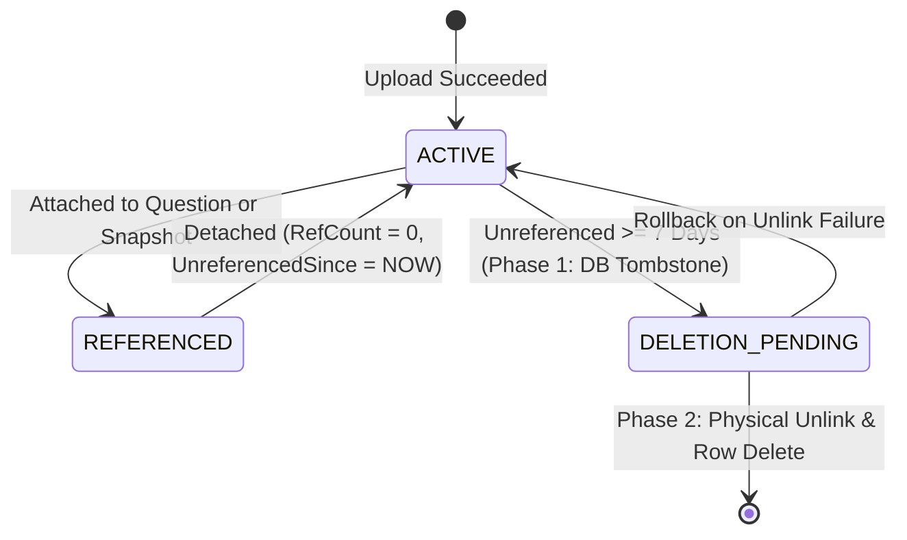

# 05. Media Management and Lifecycle

This document defines the normative requirements for image upload processing, dimension and memory sanitization, tenant-scoped media attachment, public immutable image delivery, filesystem-safe two-phase orphan cleanup, and historical snapshot protection. It unifies functional workflows and non-functional specifications into a single document.

---

## 1. Topic Overview & Actors

Media management handles image assets utilized within quiz questions:
* **Registered User / Host**: Uploads images and attaches them to questions within their own tenant boundary.
* **Anonymous Visitor / Player**: Fetches public image bytes during gameplay or preview via immutable URL.
* **System Administrator**: Cannot browse private media inventories or view unreferenced images.
* **Separation of Bytes vs. Metadata `[NORMATIVE]`**:
  * Uploaded image bytes are intentionally publicly readable by URL once uploaded (`/uploads/{filename}`). The system does not guarantee secrecy of public image URLs.
  * Media ownership metadata, private inventories, and attachment rights are strictly protected tenant resources.

---

## 2. Functional Specification & Workflows

### 2.1 Image Upload Processing `[NORMATIVE]`
* **`MED-UPL-001` (Upload Endpoint)**: `POST /api/uploads/images`
* **`MED-UPL-002` (Payload & Constraints)**: Multipart form upload with field `file`. Maximum byte size: $5\text{ MiB}$ ($5,242,880\text{ bytes}$).
* **`MED-UPL-003` (Validation & Sanitization Pipeline)**:
  1. **Header & Signature Sniffing**: Inspects initial magic numbers to verify genuine image format (JPEG, PNG, WebP). Files claiming an image extension but failing magic byte checks are rejected with `400 Media.InvalidImage`.
  2. **Dimension & Decompression Bomb Guards**: Decoder checks declared width/height before full bitmap allocation. Width $\le 4,096\text{px}$, Height $\le 4,096\text{px}$, and total pixel count $\le 16,777,216\text{ pixels}$. Total uncompressed decode memory must not exceed $64\text{ MiB}$.
  3. **Animation / Multi-Frame Handling**: Animated WebP and animated PNG (APNG) are processed by decoding strictly the **first frame** as a static image, or rejected with `415 Media.UnsupportedType`.
  4. **Orientation Correction**: Reads EXIF orientation flags and applies necessary rotation/flip to pixel data *before* metadata stripping, preventing sideways/upside-down rendering.
  5. **Metadata Stripping**: Completely strips all EXIF, IPTC, and XMP metadata (removing GPS coordinates, camera serial numbers, and creator tags).
  6. **Re-Encoding & Polyglot Elimination**: Re-encodes image into canonical JPEG, PNG, or WebP. Eliminates trailing polyglot payloads, embedded HTML/script blocks, and corrupt chunk structures. *(Non-Claim: Re-encoding does NOT guarantee elimination of steganographic data concealed in raw pixel values).*
  7. **Durable File Persistence**: Writes file to persistent volume under `/uploads/{guid}.{extension}` using a cryptographically random UUIDv4.
  8. **Atomic Metadata Commit**: Inserts `MediaItem` into PostgreSQL with `MediaId`, `TenantId`, `StoragePath`, `ByteSize`, `PixelWidth`, `PixelHeight`, `Status = 'ACTIVE'`, `ReferenceCount = 0`, `CreatedAt = NOW()`.
* **`MED-UPL-004` (Upload Response)**: `201 Created`
  ```json
  {
    "mediaId": "med_01HPX9...",
    "url": "/uploads/550e8400-e29b-41d4-a716-446655440000.png"
  }
  ```

### 2.2 Media Attachment to Questions `[NORMATIVE]`
* **`MED-ATT-001` (Attachment Contract)**:
  * Host specifies `mediaId` during question creation or edit.
  * Server verifies that `MediaItem` exists, has `Status == 'ACTIVE'`, and `TenantId == CurrentHost.TenantId`.
  * Foreign media items or items in `DELETION_PENDING` return `400 Quiz.InvalidMediaReference`.
  * On attachment: increments `MediaItem.ReferenceCount` and clears `UnreferencedSince`.

### 2.3 Public Image Delivery Boundary `[NORMATIVE]`
* **`MED-PUB-001` (Public Delivery Route)**:
  * Endpoint: `GET /uploads/{filename}`
  * Serves immutable image bytes directly via reverse proxy or backend file streamer.
* **`MED-PUB-002` (Delivery Headers)**:
  * `Content-Type`: Matching validated MIME type (`image/jpeg`, `image/png`, `image/webp`).
  * `X-Content-Type-Options: nosniff`
  * `Cache-Control: public, max-age=31536000, immutable`
* **`MED-PUB-003` (Security Restrictions)**: Directory browsing and script execution are strictly disabled in `/uploads`.

### 2.4 Filesystem-Safe Two-Phase Orphan Cleanup `[NORMATIVE]`
Because PostgreSQL transactions and filesystem deletes are not unified in a distributed transaction, media cleanup operates via a race-safe two-phase protocol:



1. **`MED-LIFE-001` (Historical Protection Invariant)**:
   * Any media referenced by an active question (in any quiz) OR an immutable game snapshot has `ReferenceCount > 0` and can **never** be deleted while that quiz or game history is retained.
2. **`MED-LIFE-002` (Unreferenced Tracking)**:
   * When an image is detached from a question, or when a never-played quiz is deleted:
     ```text
     ReferenceCount--
     if (ReferenceCount == 0) UnreferencedSince = NOW()
     ```
3. **`MED-LIFE-003` (Phase 1: Database Tombstone)**:
   * The cleanup worker queries items where:
     ```sql
     -- NON-NORMATIVE REFERENCE EXAMPLE
     SELECT MediaId, StoragePath FROM MediaItems 
     WHERE Status = 'ACTIVE' 
       AND ReferenceCount = 0 
       AND UnreferencedSince <= NOW() - INTERVAL '7 days'
     FOR UPDATE SKIP LOCKED LIMIT 100;
     ```
   * Transitions target rows to `Status = 'DELETION_PENDING'`. Once tombstoned, concurrent question attachments fail with `400 Quiz.InvalidMediaReference`.
4. **`MED-LIFE-004` (Phase 2: Physical Unlink & Final Commit)**:
   * Worker physically unlinks the file from disk (`/uploads/{guid}.ext`).
   * Upon successful filesystem unlink, deletes the database metadata row in a fresh transaction.
   * If physical unlink fails or crashes: the record remains `DELETION_PENDING` and is retried on the next worker pass.
5. **`MED-LIFE-005` (Incomplete Upload Quarantine)**:
   * Temporary files from interrupted upload streams are stored in a staging quarantine directory.
   * Files in staging older than 24 hours are deleted by a periodic sweep without database interaction.

---

## 3. Boundaries, Edge Cases & Negative Validation

### 3.1 Input & Image Dimension Boundaries Table

| Parameter | Min - 1 | Min | Normal | Max | Max + 1 | Rule / Error | Stable Req ID |
| :--- | :--- | :--- | :--- | :--- | :--- | :--- | :--- |
| **File Size (Bytes)** | 0 (400) | 1 byte (201)| 500 KB (201) | 5,242,880 (201)| 5,242,881 (413)| Max 5 MiB payload. | `MED-BOUND-001` |
| **Pixel Dimensions** | 0 (400) | 1px (201) | 1,920px (201) | 4,096px (201) | 4,097px (400) | Width and Height $\le 4096\text{px}$. | `MED-BOUND-002` |
| **Total Pixel Area** | 0 (400) | 1px (201) | 2,073,600 (201)| 16,777,216 (201)| 16,777,217 (400)| $W \times H \le 16.7\text{M}$ pixels. | `MED-BOUND-003` |
| **Decode RAM Budget** | - | - | 12 MiB | 64 MiB | 65 MiB (400) | Decompression bomb protection. | `MED-BOUND-004` |
| **Orphan Retention** | 6.99d (Keep)| 7.0d (Eligible)| 30d (Eligible)| - | - | 7 days unreferenced retention. | `MED-BOUND-005` |

### 3.2 Canonical Negative Error Codes

| Status | Code | Meaning | Stable Req ID |
| :--- | :--- | :--- | :--- |
| **400** | `Media.InvalidImage` | Corrupt file, truncated chunks, dimensions $> 4096\text{px}$, or decode memory $> 64\text{ MiB}$. | `MED-ERR-001` |
| **400** | `Quiz.InvalidMediaReference` | Image does not exist, upload incomplete, belongs to another tenant, or tombstoned. | `MED-ERR-002` |
| **404** | `Media.NotFound` | Image file not found on storage volume during public GET. | `MED-ERR-003` |
| **413** | `Media.TooLarge` | Raw upload payload exceeds 5 MiB. | `MED-ERR-004` |
| **415** | `Media.UnsupportedType` | Disallowed MIME type (e.g., SVG, GIF, BMP, TIFF, EXE). | `MED-ERR-005` |
| **503** | `Media.StorageUnavailable` | Local storage volume write failure or storage disk full. | `MED-ERR-006` |

---

## 4. Topic-Specific Non-Functional Requirements & Performance SLOs

### 4.1 Workload Capacity & Latency SLO Targets `[NORMATIVE]`
* **`MED-SLO-001` (Concurrent Upload Capacity)**: Platform supports at least **50 concurrent image uploads** executing simultaneously.
* **`MED-SLO-002` (Burst Upload Rate)**: Platform sustains **25 upload requests/second** for a 10-second burst.
* **`MED-SLO-003` (Public Delivery Latency)**: Public image serving via reverse proxy / caching layer sustains at least **2,000 req/s** with:
  * $p95 \le 30\text{ ms}$
* **`MED-SLO-004` (Image Processing Latency)**:
  * Standard Images ($\le 2\text{ MB}$, $\le 1920\times 1080$): $p50 \le 500\text{ ms}$, $p95 \le 1.2\text{ seconds}$.
  * Large Images ($5\text{ MB}$, $4096\times 4096$): $p95 \le 2.0\text{ seconds}$, $p99 \le 5.0\text{ seconds}$.

---

## 5. Security & Threat Mitigations

### 5.1 Defense Against Malicious Image Formats `[NORMATIVE]`
* **`MED-SEC-001` (Polyglot Elimination)**: Images are decoded into raw pixel memory buffers and reconstructed. Embedded scripts, trailing HTML, and malformed container structures are dropped.
* **`MED-SEC-002` (Path Traversal Elimination)**: Client-supplied filenames are ignored. Server assigns UUIDv4 filenames. URLs with traversal tokens (`..`, `/`, `\`, `%2e%2e`) return `404 Media.NotFound`.
* **`MED-SEC-003` (Storage Exhaustion Defenses)**: Inbound uploads check available storage disk space before accepting payload stream. If storage free space is $< 10\%$, upload returns `503 Media.StorageUnavailable`.

---

## 6. Concurrency, Lost-Response & Failure-Mode Contracts

### 6.1 State-Changing Commit Outcome Contract `[NORMATIVE]`
* **Outcome A (Failure before commit)**: Upload stream aborts or image fails validation: storage file deleted/quarantined; no DB record committed. Caller retries safely.
* **Outcome B (Commit succeeded, response lost)**: Media record and file committed; response dropped. Caller retrying upload receives a new `mediaId`. The unacknowledged first image remains unreferenced and is safely reclaimed after 7 days.
* **Outcome C (Outcome unknown to caller)**: Network timeout during upload. Caller retries upload with fresh file; unreferenced orphan is collected automatically.

### 6.2 Per-Topic Failure-Mode & Risk Matrix `[NORMATIVE]`

| Risk ID | Trigger / Failure | Potential Impact | Required System Behavior | Recovery / Mitigation | Verification |
| :--- | :--- | :--- | :--- | :--- | :--- |
| `MED-RISK-001` | File written to disk, but DB transaction aborts. | Orphan file on disk taking up storage space. | File written to staging path first; moved to `/uploads` only within/after DB commit. Uncommitted staging files deleted after 24h. | Staging quarantine cleanup. | `MED-TEST-007` |
| `MED-RISK-002` | DB metadata committed, but storage disk write fails or disk fills. | Database points to non-existent image bytes. | File write and verification precede metadata transaction commit. DB transaction aborts if file write fails. | Transactional rollback; 503 returned. | `MED-TEST-008` |
| `MED-RISK-003` | Host attaches image at exact millisecond cleanup worker runs. | Question points to missing image or foreign key violation. | Worker sets `Status = 'DELETION_PENDING'` first. If attachment commits first, `ReferenceCount > 0` aborts tombstone. If worker commits first, attachment fails with 400. | Two-phase state machine with transactional locks. | `MED-TEST-009` |
| `MED-RISK-004` | Worker crashes between DB tombstone and physical file unlink. | Stale `DELETION_PENDING` record remains in database. | Next worker run scans for stale `DELETION_PENDING` rows ($> 1\text{ hour}$ old) and resumes physical unlink. | Resumable tombstone sweep. | `MED-TEST-010` |
| `MED-RISK-005` | Upload of decompression bomb image (e.g. tiny file declaring $4096\times 4096$). | Out of memory crash in backend application. | Header parser validates declared dimensions; decodes in bounded buffer; aborts if $> 64\text{ MiB}$ required. | Memory ceiling guard; 400 returned. | `MED-TEST-006` |

---

## 7. Traceable Acceptance Tests & Test Matrix

| Test ID | Mapped Requirement IDs | Category | Description & Preconditions | Expected Outcome |
| :--- | :--- | :--- | :--- | :--- |
| `MED-TEST-001` | `MED-UPL-001`, `MED-UPL-003` | Functional | Host uploads valid PNG (2 MB, $1920\times 1080$). | `201 Created` with `/uploads/{guid}.png`; EXIF stripped. |
| `MED-TEST-002` | `MED-ATT-001` | Functional | Host attaches uploaded image to question. | Question references media; `ReferenceCount` increments to 1. |
| `MED-TEST-003` | `MED-PUB-001`, `MED-PUB-002` | Functional | Public anonymous client requests image URL. | `200 OK` with `Cache-Control: public, max-age=31536000, immutable` and `nosniff`. |
| `MED-TEST-004` | `MED-BOUND-001`, `MED-ERR-004` | Boundary | Upload file size $5,242,880$ bytes vs $5,242,881$ bytes. | $5,242,880$ succeeds; $5,242,881$ fails with `413 Media.TooLarge`. |
| `MED-TEST-005` | `MED-BOUND-002`, `MED-ERR-001` | Boundary | Upload image with dimensions $4096\times 4096$ vs $4097\times 4096$. | $4096$ succeeds; $4097$ fails with `400 Media.InvalidImage`. |
| `MED-TEST-006` | `MED-BOUND-004`, `MED-RISK-005` | Security / Boundary | Upload malformed decompression bomb requiring $> 64\text{ MiB}$ decode buffer. | Decode aborted; returns `400 Media.InvalidImage`; process RAM stable. |
| `MED-TEST-007` | `MED-RISK-001` | Fault Injection | Interrupt connection after file upload completes but before DB commit. | Staging file is quarantined; deleted by 24h worker; zero DB record. |
| `MED-TEST-008` | `MED-ERR-006`, `MED-RISK-002` | Fault Injection | Simulate read-only storage volume during image upload. | Upload fails with `503 Media.StorageUnavailable`; zero orphan DB records. |
| `MED-TEST-009` | `MED-LIFE-003`, `MED-RISK-003` | Concurrency | Barrier test: Host attaches 7-day-old unreferenced image concurrently with cleanup worker pass. | Serialized: either image preserved with `ReferenceCount = 1`, or rejected with `400 Quiz.InvalidMediaReference`. |
| `MED-TEST-010` | `MED-LIFE-004`, `MED-RISK-004` | Fault Injection | Crash worker process immediately after setting `Status = 'DELETION_PENDING'`. | Next worker pass identifies pending record, deletes physical file, and removes DB row. |
| `MED-TEST-011` | `MED-SLO-003` | Non-Functional | Benchmark public image delivery under 2,000 req/s. | Serves with $p95 \le 30\text{ ms}$; zero server memory growth. |
