# 06. Game Lifecycle and Session State Machine

This document defines the normative requirements for creating live game sessions, allocating game PINs, executing canonical state machine transitions, enforcing inclusive deadline and auto-close rules, handling Host presence and abandonment, and managing immutable historical game archives. It combines functional requirements and non-functional specifications into a single document.

---

## 1. Topic Overview & Actors

The game lifecycle manages live quiz sessions from lobby creation to final completion:
* **Registered User / Host**: Sole actor authorized to launch, advance, and terminate game sessions for their own quizzes.
* **Player / Participant**: Connects to the session, interacts during active phases, and views results.
* **System Administrator**: Cannot control, participate in, or join live games in an administrative capacity.

### 1.1 Authoritative Game State Machine `[NORMATIVE]`
* **`GAME-STATE-001` (Canonical States)**: Every game session adheres strictly to this deterministic six-state machine. Aliases such as `ACTIVE`, `RESULTS`, `REVEALED`, or `DONE` are strictly prohibited in normative contracts:

```mermaid
stateDiagram-v2
    [*] --> CREATED: Host creates game from owned quiz
    CREATED --> LOBBY: Transaction commits; PIN allocated
    LOBBY --> QUESTION_ACTIVE: Host starts game; Question 1 snapshot bound
    QUESTION_ACTIVE --> QUESTION_RESULTS: acceptedAnswerCount == effectiveEligible (non-empty) OR Host EndQuestion
    QUESTION_RESULTS --> LEADERBOARD: Host ShowLeaderboard
    LEADERBOARD --> QUESTION_ACTIVE: Host AdvanceQuestion (next question)
    QUESTION_RESULTS --> QUESTION_ACTIVE: Host skips podium; advances question
    LEADERBOARD --> FINISHED: Host EndGame OR all questions completed
    QUESTION_RESULTS --> FINISHED: Host EndGame
    LOBBY --> FINISHED: Host terminates lobby OR Abandonment / Suspension
    QUESTION_ACTIVE --> FINISHED: Host terminates game OR Abandonment / Suspension
    FINISHED --> [*]: PIN released; terminal immutable archive
```

* **`GAME-STATE-002` (State Semantics)**:
  * `CREATED`: Ephemeral internal state during database transaction before lobby is exposed.
  * `LOBBY`: PIN is active. Players can join, pick nicknames, and receive tokens. **Players may join only in `LOBBY`.**
  * `QUESTION_ACTIVE`: Question text, image, and choices broadcast. Countdown timer runs. Answer submissions open.
  * `QUESTION_RESULTS`: Submissions closed. Correct choices and aggregate answer distributions revealed.
  * `LEADERBOARD`: Cumulative ranked scores and podium positions displayed.
  * `FINISHED`: Permanent, immutable terminal state. PIN released. Player credentials enter 24-hour read-only recovery window. No further transitions allowed.

---

## 2. Functional Specification & Workflows

### 2.1 Game Creation & Snapshot Generation `[NORMATIVE]`
* **`GAME-SNAP-001` (Creation Endpoint)**: `POST /api/games`
* **`GAME-SNAP-002` (Execution & Deep Snapshot)**:
  * Verifies quiz belongs to authenticated Host and contains at least one question.
  * Atomically creates deep immutable snapshot tables: copies quiz title, question text, choices, correctness flags, image URLs, durations, and base points into game snapshot records.
  * Allocates a unique **4 to 8 numeric digit PIN** (preserving leading zeroes as strings, e.g., `"048912"`) that is not currently in use by any unfinished game.
  * Initializes game state: `Status = LOBBY`, `StateVersion = 1`, `CreatedAt = NOW()`.
  * Starts the initial Host-attachment grace timer (5 minutes).
  * Returns `201 Created` with `gameId`, `pin`, `joinUrl`, and initial state.

### 2.2 Canonical Question Deadline & Auto-Close Rules `[NORMATIVE]`
* **`GAME-AUTO-001` (Question Deadline Rule)**:
  * Server computes inclusive deadline: `DeadlineUtc = NOW() + DurationSeconds`.
  * Expiration of `DeadlineUtc` stops accepting new answers (subsequent answers rejected with `Game.AnswerTooLate`).
  * **Critical Boundary Invariant**: Expiration of the deadline **does NOT by itself change game state**. The game remains in `QUESTION_ACTIVE` until:
    1. An automatic closure condition is met; OR
    2. The Host explicitly calls `EndQuestion`.
* **`GAME-AUTO-002` (Equality-Based Auto-Close Rule)**:
  * When `acceptedAnswerCount == effectiveEligibleParticipantCount` for a **non-initially-empty effective set** ($> 0$), the server automatically transitions the game from `QUESTION_ACTIVE` to `QUESTION_RESULTS`.
  * **Initially Zero-Eligible Invariant**: A question that starts with zero eligible players does **not** auto-close merely because $0 == 0$. It remains in `QUESTION_ACTIVE` until the Host explicitly issues `EndQuestion`.
  * **Participant Removal Trigger**: If an eligible participant who has not yet answered is removed by the Host, `effectiveEligibleParticipantCount` decrements by 1; if this decrement causes `acceptedAnswerCount == effectiveEligibleParticipantCount`, the equality-based auto-close triggers immediately.

### 2.3 Host Game Controls `[NORMATIVE]`
All Host control operations require the target `gameId`, the expected `stateVersion` (for optimistic concurrency), and a client-generated UUIDv4 `commandId` (for idempotency):

| Action & Route | Valid Source State | Target State | Immediate State Transitions & Persistence Effects | Stable Req ID |
| :--- | :--- | :--- | :--- | :--- |
| **Start Game** `POST /api/games/{id}/start` | `LOBBY` | `QUESTION_ACTIVE` | Closes lobby to new joins. Binds Question 1 snapshot. Computes `DeadlineUtc = NOW() + DurationSeconds`. Sets `effectiveEligibleParticipantCount` to current active seat count. Broadcasts question to players (correct choices omitted). | `GAME-CTRL-001` |
| **End Question** `POST /api/games/{id}/end-question` | `QUESTION_ACTIVE` | `QUESTION_RESULTS` | Immediately closes answer acceptance. Materializes question answer statistics. Reveals correct choices and answer distributions. | `GAME-CTRL-002` |
| **Show Leaderboard** `POST /api/games/{id}/show-leaderboard` | `QUESTION_RESULTS` | `LEADERBOARD` | Materializes cumulative player scores and ranks. Pushes podium to Host and individual ranks to Players. | `GAME-CTRL-003` |
| **Advance Question** `POST /api/games/{id}/advance` | `QUESTION_RESULTS` or `LEADERBOARD` | `QUESTION_ACTIVE` | Binds next question snapshot. Resets question timer and answer submissions. Fails with `409 Game.NoMoreQuestions` if already on final question. | `GAME-CTRL-004` |
| **End Game** `POST /api/games/{id}/end` | Any unfinished state | `FINISHED` | Authoritatively terminates session. Releases PIN for future allocation. Sets `FinishedAt = NOW()`. Broadcasts terminal `GameEnded` event. | `GAME-CTRL-005` |

### 2.4 Command Idempotency & Lost-Response Replay `[NORMATIVE]`
* **`GAME-IDEM-001` (Idempotent Execution)**:
  * The server persists `(GameId, CommandId, ResultStateVersion, ResponsePayload)` in an idempotency log.
  * If a client resubmits the exact same `commandId`: returns the previously committed response without re-executing state changes or double-advancing questions.
  * Re-submitting an existing `commandId` with altered parameters returns `400 Validation.Failed`.

### 2.5 Host Presence, Disconnect Grace & Abandonment `[NORMATIVE]`
* **`GAME-ABANDON-001` (Disconnect Grace Period)**:
  * When the **last active Host connection** disconnects from the game hub, a 5-minute (300-second) grace timer begins.
  * Reconnection of any authenticated Host session before expiration cancels the grace timer.
* **`GAME-ABANDON-002` (Authoritative Abandonment Finalization)**:
  * A Host disconnect grace expiring at $T$ must produce authoritative abandonment finalization no later than $T + 30\text{ seconds}$ (maximum scheduling delay).
  * The abandonment finalizer transitions the game to `FINISHED`, materializes final scores, and releases the PIN.
  * **Rolling Restart Safety**: A planned rolling restart must not trigger abandonment; the disconnect grace window (300s) comfortably exceeds the maximum rolling restart drain period ($\le 30\text{s}$).

### 2.6 Permanent Game Archive Semantics `[NORMATIVE]`
* **`GAME-ARCH-001` (Immutable Archive Contract)**:
  * Once marked `FINISHED`, game data becomes permanently immutable.
  * **Strict Mutation Lock**:
    * Zero participant removals: `DELETE /api/games/{id}/participants/{pid}` returns `409 Game.InvalidStateTransition` or `409 Game.ArchiveImmutable`.
    * Zero answer submissions or alterations.
    * Zero scoring changes or rank adjustments.
    * Zero snapshot mutations.
  * **Read-Only Access**:
    * Host can query historical reports via `GET /api/games/{id}/report`.
    * Players can reconnect to view read-only summaries strictly while `serverTime < FinishedAt + 24 hours`.

---

## 3. Boundaries, Edge Cases & Negative Validation

### 3.1 Boundaries Table

| Parameter | Boundary Condition | Result / Handling | Stable Req ID |
| :--- | :--- | :--- | :--- |
| **Game PIN Length** | 4 to 8 numeric digits | Retains leading zeroes as strings (e.g. `"049218"`). | `GAME-BOUND-001` |
| **Lobby Participant Count** | 0 players when starting | Allowed. Question starts; waits for explicit Host closure. | `GAME-BOUND-002` |
| **Lobby Max Seats** | 500 active participants | 501st join attempt rejected with `409 Game.Full`. | `GAME-BOUND-003` |
| **Advance on Last Question** | Advancing past question $N$ of $N$ | Rejected with `409 Game.NoMoreQuestions`. | `GAME-BOUND-004` |
| **Transitions out of FINISHED** | Any command after FINISHED | Rejected with `409 Game.InvalidStateTransition`. | `GAME-BOUND-005` |
| **Participant Removal in FINISHED**| Remove participant after game finish | Rejected with `409 Game.InvalidStateTransition`. | `GAME-BOUND-006` |

### 3.2 Canonical Negative Error Codes

| Status | Code | Meaning | Stable Req ID |
| :--- | :--- | :--- | :--- |
| **400** | `Validation.Failed` | Malformed payload, invalid command ID, parameter mismatch, or an owned quiz with no questions. | `GAME-ERR-001` |
| **404** | `Game.NotFound` | Game ID does not exist or belongs to another Host tenant. | `GAME-ERR-002` |
| **404** | `Quiz.NotFound` | Referenced quiz ID does not exist or belongs to another tenant. | `GAME-ERR-003` |
| **409** | `Game.InvalidStateTransition` | Requested transition is not permitted from current state. | `GAME-ERR-005` |
| **409** | `Game.NoMoreQuestions` | Attempting to advance beyond the final question. | `GAME-ERR-006` |
| **409** | `Game.ConcurrentModification` | Client submitted stale `stateVersion`. | `GAME-ERR-007` |
| **409** | `Game.PinUnavailable` | Failed to generate unique PIN after 5 retries. | `GAME-ERR-008` |
| **409** | `Game.AnswerTooLate` | Answer submitted after question deadline expired. | `GAME-ERR-009` |
| **409** | `Game.ArchiveImmutable` | Attempting to mutate a game session in FINISHED state. | `GAME-ERR-010` |

---

## 4. Topic-Specific Non-Functional Requirements & Performance SLOs

### 4.1 State Transition Latency SLO `[NORMATIVE]`
Under full platform concurrency (200 simultaneous live games, 20,000 players):

| Operation | Metric | Target SLO | Stable Req ID |
| :--- | :--- | :--- | :--- |
| **Game Session Creation (`POST /api/games`)** | $p95$ | $\le 200\text{ ms}$ | `GAME-SLO-001` |
| **Start Game / Advance Question** | $p95$ | $\le 100\text{ ms}$ | `GAME-SLO-002` |
| **End Question (Clamping Submissions)** | $p95$ | $\le 80\text{ ms}$ | `GAME-SLO-003` |
| **End Game / Finalize Ranks** | $p95$ | $\le 250\text{ ms}$ | `GAME-SLO-004` |

### 4.2 PIN Allocation Collision Resistance `[NORMATIVE]`
* **`GAME-PIN-001` (Randomized Keyspace)**: PIN generator selects numeric PINs from 4–8 digits ($\sim 100,000,000$ combinations). With $\le 200$ simultaneous active games, collision probability is $< 0.0002\%$. On collision, system automatically retries up to 5 times before failing.

---

## 5. Security & Threat Mitigations

### 5.1 Pre-Reveal Answer Concealment `[NORMATIVE]`
* **`GAME-SEC-001` (Stripped Question Broadcast)**: When transitioning to `QUESTION_ACTIVE`, the player broadcast contains question text, choices (IDs and text only), duration, and image URL. Correctness flags (`isCorrect`) are strictly stripped on the server.

### 5.2 Terminal State Locking `[NORMATIVE]`
* **`GAME-SEC-002` (Immutable Lock)**: Once `Status = FINISHED`, database constraints and application guards prevent answer insertion, score mutation, or participant deletion.

---

## 6. Concurrency, Lost-Response & Failure-Mode Contracts

### 6.1 State-Changing Commit Outcome Contract `[NORMATIVE]`
* **Outcome A (Failure before commit)**: State command aborts; game remains in prior state with prior `StateVersion`. Caller retries with same `commandId`.
* **Outcome B (Commit succeeded, response lost)**: State transition committed to PostgreSQL and `StateVersion` incremented, but client dropped. Resubmitting with same `commandId` returns the cached committed result. Resubmitting with prior `stateVersion` returns `409 Game.ConcurrentModification`.
* **Outcome C (Outcome unknown to caller)**: Network timeout. Host queries `GET /api/games/{id}` to verify current `status` and `stateVersion` before repeating action.

### 6.2 Per-Topic Failure-Mode & Risk Matrix `[NORMATIVE]`

| Risk ID | Trigger / Failure | Potential Impact | Required System Behavior | Recovery / Mitigation | Verification |
| :--- | :--- | :--- | :--- | :--- | :--- |
| `GAME-RISK-001` | Host clicks "Advance Question" twice rapidly. | Double question advancement; players miss question. | Handled via `stateVersion` check and `commandId` idempotency. First commits; second returns idempotent response or 409. | Optimistic concurrency & idempotency log. | `GAME-TEST-007` |
| `GAME-RISK-002` | Question timer expires while answers are in-flight. | State transition race with late submissions. | Deadline strictly stops answer acceptance (`serverTime > DeadlineUtc`). Game state remains `QUESTION_ACTIVE` until auto-close or Host `EndQuestion`. | Exact time authority check. | `GAME-TEST-008` |
| `GAME-RISK-003` | Host disconnects mid-game during active question. | Game hangs indefinitely or terminates prematurely. | 5-minute disconnect grace starts. Game remains playable. If Host reconnects, grace cancelled. If 5m expires, abandoned game marked `FINISHED`. | Authoritative abandonment worker. | `GAME-TEST-009` |
| `GAME-RISK-004` | Question starts with zero eligible players. | Auto-close could immediately trigger if evaluating $0 == 0$. | System evaluates auto-close only when effective eligible count $> 0$. Question waits for explicit Host `EndQuestion`. | Non-empty eligible guard. | `GAME-TEST-010` |
| `GAME-RISK-005` | Host attempts to remove participant after game is `FINISHED`. | Historical leaderboard altered or inconsistent archives. | Request rejected with `409 Game.InvalidStateTransition` (or `409 Game.ArchiveImmutable`). | Terminal state immutability guard. | `GAME-TEST-011` |

---

## 7. Traceable Acceptance Tests & Test Matrix

| Test ID | Mapped Requirement IDs | Category | Description & Preconditions | Expected Outcome |
| :--- | :--- | :--- | :--- | :--- |
| `GAME-TEST-001` | `GAME-SNAP-001`, `GAME-SNAP-002` | Functional | Host launches owned quiz. | Game created in `LOBBY`; unique 4–8 digit PIN assigned; deep snapshot created. |
| `GAME-TEST-002` | `GAME-STATE-001`, `GAME-CTRL-001` through `005` | Functional | Host advances through full lifecycle: `LOBBY` $\rightarrow$ `QUESTION_ACTIVE` $\rightarrow$ `QUESTION_RESULTS` $\rightarrow$ `LEADERBOARD` $\rightarrow$ `QUESTION_ACTIVE` $\rightarrow$ `FINISHED`. | All transitions succeed; state versions increment sequentially; zero non-canonical state names. |
| `GAME-TEST-003` | `GAME-SNAP-002`, `GAME-ERR-001` | Boundary | Host attempts to launch an owned quiz with no questions. | Rejected with `400 Validation.Failed`; no game or snapshot is created. |
| `GAME-TEST-004` | `GAME-CTRL-004`, `GAME-ERR-006` | Boundary | Host calls Advance on final question of quiz. | Rejected with `409 Game.NoMoreQuestions`. |
| `GAME-TEST-005` | `GAME-AUTO-001`, `GAME-ERR-009` | Boundary | Question deadline expires; participant submits answer before Host `EndQuestion`. | Submission rejected with `Game.AnswerTooLate`; game remains in `QUESTION_ACTIVE`. |
| `GAME-TEST-006` | `GAME-AUTO-002` | Functional | All eligible participants submit answers for question. | Game automatically transitions to `QUESTION_RESULTS`. |
| `GAME-TEST-007` | `GAME-IDEM-001`, `GAME-RISK-001` | Concurrency | Host sends two concurrent `Advance` commands with same `stateVersion` and same `commandId`. | First commits state transition; second returns identical committed response. |
| `GAME-TEST-008` | `GAME-AUTO-001`, `GAME-RISK-002` | Concurrency | Player answer commits simultaneously with Host `EndQuestion`. | Serialized: if answer commits first, scored; if `EndQuestion` commits first, answer rejected with `Game.AnswerTooLate` or `Game.InvalidStateTransition`. |
| `GAME-TEST-009` | `GAME-ABANDON-001`, `GAME-ABANDON-002`, `GAME-RISK-003` | Concurrency / Worker | Host disconnects; 5-minute grace expires without reconnection. | Within $300\text{s} + 30\text{s}$, abandonment finalizer transitions game to `FINISHED` and releases PIN. |
| `GAME-TEST-010` | `GAME-AUTO-002`, `GAME-RISK-004` | Boundary | Question starts with zero eligible players. | Game remains in `QUESTION_ACTIVE` until Host explicitly issues `EndQuestion` (no premature $0==0$ auto-close). |
| `GAME-TEST-011` | `GAME-ARCH-001`, `GAME-RISK-005` | Boundary | Host attempts to delete a participant from a game in `FINISHED` state. | Rejected with `409 Game.InvalidStateTransition`. Historical records preserved. |
| `GAME-TEST-012` | `GAME-SLO-001` through `004` | Non-Functional | Measure state transition latency under 200 concurrent games. | Meets $p95 \le 100\text{ ms}$ and $p99 \le 250\text{ ms}$. |
