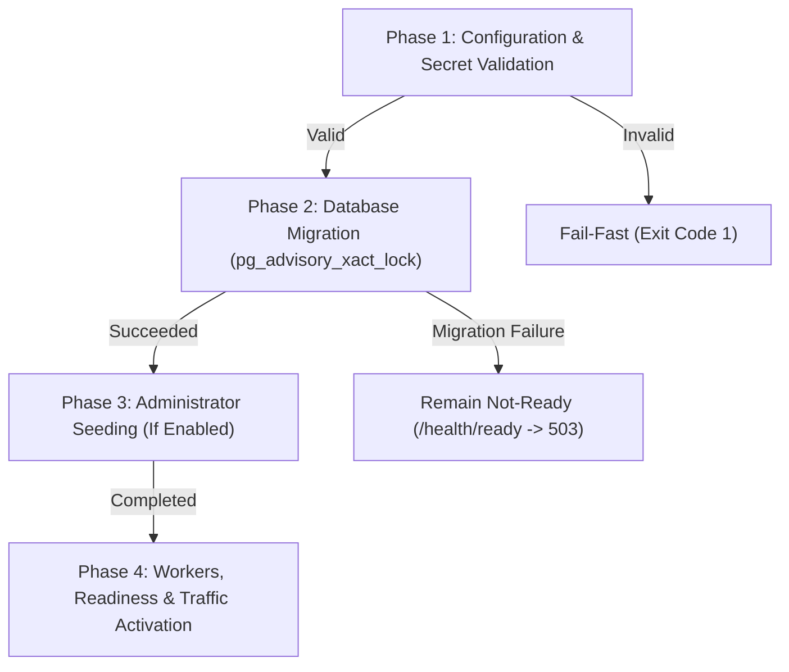

# 12. Platform Operations, Health Probes, and Worker Orchestration

This document defines the normative requirements for ordered system startup, large-database safe migrations, anti-amplification health probes, background worker scheduling and isolation, graceful rolling shutdown, and structured local logging. It unifies functional operational requirements and non-functional execution SLOs into a single specification.

---

## 1. Topic Overview & Actors

Platform operations manage system lifecycle, database migrations, and internal background tasks:
* **Container Supervisor / Orchestrator**: Manages container lifecycles, liveness, and readiness routing.
* **Reverse Proxy / Ingress**: Uses readiness probes to route HTTP and WebSocket traffic.
* **Internal Background Workers**: Hosted background services executing periodic cleanup and finalization.
* **System Administrator**: Receives platform health status via administrative endpoints.
* **Observability Stack**: The platform employs a vendor-neutral, three-signal observability architecture using OpenTelemetry (OTLP) to an OpenTelemetry Collector gateway, routing metrics to Prometheus, traces to Jaeger, and logs to Loki, with Grafana providing the unified operational UI. Structured JSON console logging remains independently available on `stdout`/`stderr`.

---

## 2. Functional Specification & Workflows

### 2.1 Ordered Startup Sequence `[NORMATIVE]`
When an application container initializes, it must execute these phases in strict sequential order:

1. **`OPS-START-001` (Phase 1: Validation)**: Reads configuration; confirms presence and entropy of connection strings, JWT signing keys, and storage paths. Fails fast (exit code 1) if any required secret is missing.
2. **`OPS-START-002` (Phase 2: Migrations)**: Applies pending migrations to PostgreSQL under a transaction-level advisory lock. (See Section 2.2 for large-database rules).
3. **`OPS-START-003` (Phase 3: Seeding)**: If `BOOTSTRAP_ADMIN_ENABLED=true`, creates initial System Administrator if absent.
4. **`OPS-START-004` (Phase 4: Traffic Readiness)**: Activates background hosted services and begins responding `200 OK` on `/health/ready`.

### 2.2 Large-Database Migration Safety `[NORMATIVE]`
To ensure schema updates remain safe across databases containing up to **100,000,000 historical rows**:
* **`OPS-MIG-001` (Lock Timeouts)**: Every DDL migration must configure an explicit, bounded lock timeout (e.g., `SET lock_timeout = '5s'`). If an exclusive lock cannot be acquired within 5 seconds, the migration aborts rather than creating a lock convoy.
* **`OPS-MIG-002` (No Unbounded Table Rewrites)**: Migrations must not execute full table rewrites or unbounded `ACCESS EXCLUSIVE` table locks on high-volume tables (`AnswerSubmissions`, `Quizzes`, `Games`). Column additions must use nullable or default values that do not require table rewrites in PostgreSQL 11+.
* **`OPS-MIG-003` (Expand/Contract Compatibility)**: Schema changes that modify existing column formats must employ an expand/contract strategy, ensuring old and new application code versions can run concurrently during rolling deployments.
* **`OPS-MIG-004` (Single Migration Coordinator)**: In a multi-instance deployment, migrations acquire a PostgreSQL advisory lock (`pg_advisory_xact_lock`). Exactly one instance executes migrations; peers wait for lock release, verify schema version, and proceed. A dedicated external migration runner is permitted when scale demands.

### 2.3 Health Check Anti-Amplification & Probe Contracts `[NORMATIVE]`
To prevent health probes from causing connection storms or cascading failures during a database degradation:
* **`OPS-HEALTH-001` (Probe Isolation & Anti-Amplification)**:

| Endpoint | Probe Target | Checks Performed | Success Response | Failure Response |
| :--- | :--- | :--- | :--- | :--- |
| `GET /health/live` | Process Liveness | Verifies event loop responsiveness. **Zero I/O or DB calls.** | `200 OK` in $\le 50\text{ ms}$ | Process hung (Timeout / 500) |
| `GET /health/ready`| Traffic Readiness | Checks DB connectivity (`SELECT 1`) and storage writeability. Uses **cached/coalesced probe result (2–5 seconds TTL)** to prevent probe amplification during DB outages. | `200 OK` in $\le 500\text{ ms}$ | `503 Service Unavailable` |
| `GET /health` | Composite Check | Evaluates composite status of all registered health checks. | `200 OK` | `503 Service Unavailable` |

* **`OPS-HEALTH-002` (Zero Information Disclosure)**: Health responses return simple status strings (`"Healthy"`, `"Unhealthy"`). They must **never** disclose database hostnames, schema versions, or exception stack traces.

### 2.4 Background Worker Classification & Orchestration `[NORMATIVE]`
Workers run as internal hosted services and are strictly segregated by criticality:
* **`OPS-WORK-001` (Worker Classification)**:
  1. **Best-Effort Maintenance Workers**:
     * `RefreshTokenCleanupWorker`: Runs every 10–15 minutes; deletes expired tokens older than 7 days in batches of $\le 500$ rows.
     * `OrphanMediaCleanupWorker`: Runs daily; reclaims unreferenced media older than 7 days using two-phase deletion.
  2. **Correctness-Critical Finalization Workers**:
     * `AbandonedGameFinalizer`: Scans for unfinished games where Host disconnect grace (5 minutes) has expired. Must finalize abandonment authoritatively within $T_{\text{grace}} + 30\text{ seconds}$ maximum scheduling delay.
     * `SuspensionGameFinalizer`: Runs on startup and on-demand; resumes game materialization for accounts with `terminationPending == true`.
* **`OPS-WORK-002` (Critical Worker Failure Escalation)**:
  Failure of a correctness-critical finalization worker (e.g. inability to materialize suspended games) logs high-priority operational errors and marks `/health/ready` as degraded if backlog persists beyond 15 minutes.
* **`OPS-WORK-003` (Multi-Replica Safe Execution)**:
  Workers querying candidate rows across multiple application instances must use `FOR UPDATE SKIP LOCKED` or PostgreSQL advisory locks to prevent redundant processing and deadlocks.

### 2.5 Graceful Shutdown and Rolling Deployment `[NORMATIVE]`
* **`OPS-SHUT-001` (Shutdown Sequence)**:
  When a backend instance receives a termination signal (`SIGTERM`):
  1. Stops advertising readiness (`/health/ready` returns 503); reverse proxy ceases routing new traffic.
  2. Stops accepting new WebSocket/SignalR connections.
  3. Bounded Drain Period: Allows an in-flight drain window of up to **30 seconds** for active HTTP requests to complete.
  4. Realtime Socket Close: Active SignalR connections receive a clean close frame (`1001 Going Away`), triggering immediate, jittered client reconnection to ready peer instances.
  5. Uncommitted database transactions are safely rolled back.
  6. **Host Abandonment Exemption**: Planned rolling restarts must **never** trigger Host abandonment finalization; the 5-minute Host grace window comfortably exceeds the 30-second shutdown drain period.

### 2.6 Structured Logging & Central Observability `[NORMATIVE]`
* **`OPS-LOG-001` (Structured JSON Format)**: Emitted to `stdout` / `stderr` using standard .NET console JSON formatting.
* **`OPS-LOG-002` (Mandatory Redaction)**:
  * Passwords, password hashes, and raw credentials.
  * JWT access tokens and raw refresh tokens.
  * `Authorization` headers and cookie values.
  * `access_token` query-string parameters on SignalR connections.
  * Quiz question text and player answers.
  * Connection strings and database credentials in metrics or log scopes.
* Operational context retained: `Timestamp`, `LogLevel`, `RequestId`, `EventName`, `ElapsedMilliseconds`, `StatusCode`, and sanitized error codes.
* **`OPS-OBS-001` (Vendor-Neutral OTLP Gateway)**:
  * The application exports metrics, distributed traces, and structured logs over standard OTLP (HTTP/protobuf) exclusively to the OpenTelemetry Collector gateway.
  * The Collector routes:
    * Metrics to Prometheus via a Prometheus scrape exporter.
    * Distributed traces to Jaeger over OTLP.
    * Application logs to Loki via native OTLP HTTP ingestion (`/otlp/v1/logs`).
  * The application contains zero vendor SDK dependencies on Prometheus, Jaeger, Loki, or Grafana.
* **`OPS-OBS-002` (Telemetry Failure Isolation & Availability Independence)**:
  * Application availability, boot sequence, and traffic readiness (`/health`, `/health/ready`) are completely independent of the observability infrastructure.
  * Network timeouts, crashes, or unresponsiveness of the OpenTelemetry Collector or backend data stores (Prometheus, Jaeger, Loki, Grafana) must never prevent the API from starting, serving traffic, or executing background workers.
  * In-flight telemetry is buffered in bounded non-blocking in-memory queues; if the Collector is unreachable, telemetry records are dropped gracefully without crashing or degrading application throughput.
  * Local structured JSON console logs to `stdout`/`stderr` remain fully operational even during complete telemetry collector outages.
* **`OPS-OBS-003` (Health Probe Filtering & Sampling Policy)**:
  * Health check endpoints (`/health`, `/health/live`, `/health/ready`) are filtered out of distributed tracing to prevent high-frequency probe noise from overwhelming trace storage.
  * Distributed tracing in production employs parent-based ratio sampling (`parentbased_traceidratio`), configurable via standard `OTEL_TRACES_SAMPLER` and `OTEL_TRACES_SAMPLER_ARG`.
* **`OPS-OBS-004` (ProblemDetails Trace Correlation)**:
  * Whenever an active trace exists during HTTP request handling, the 32-character hexadecimal `traceId` is included additively in RFC 7807 ProblemDetails responses (`["traceId"] = Activity.Current.TraceId.ToString()`), alongside the existing `requestId` (`TraceIdentifier`), enabling seamless correlation across client responses, Grafana dashboards, Loki logs, and Jaeger trace graphs.

---

## 3. Boundaries, Edge Cases & Negative Validation

### 3.1 Boundaries Table

| Parameter | Boundary Condition | Result / Handling | Stable Req ID |
| :--- | :--- | :--- | :--- |
| **Liveness Latency** | Target execution time | $\le 50\text{ ms}$. Zero I/O. | `OPS-BOUND-001` |
| **Readiness Latency** | Database probe timeout | Max 3 seconds timeout on DB probe before returning 503. | `OPS-BOUND-002` |
| **Worker DB Connections** | Aggregate worker pool share | Max 5 connections reserved for background workers. | `OPS-BOUND-003` |
| **Drain Period Ceiling** | Maximum graceful shutdown time | 30 seconds before forceful container exit. | `OPS-BOUND-004` |

---

## 4. Topic-Specific Non-Functional Requirements & Performance SLOs

### 4.1 Probe Latency SLOs `[NORMATIVE]`
* **`OPS-SLO-001` (Liveness Latency)**: `/health/live`: $p99 \le 50\text{ ms}$.
* **`OPS-SLO-002` (Readiness Latency)**: `/health/ready`: $p95 \le 100\text{ ms}$, $p99 \le 500\text{ ms}$.
* **`OPS-SLO-003` (Worker Resource Headroom)**: Aggregate background workers consume $\le 10\%$ CPU and $\le 5$ connections from the database pool.

---

## 5. Security & Threat Mitigations

### 5.1 Defense Against Health Check Flooding `[NORMATIVE]`
* Reverse proxy configurations rate-limit external access to health probes to prevent denial-of-service against internal checking mechanisms.

### 5.2 Production API Surface Sanitization `[NORMATIVE]`
* In production mode (`ASPNETCORE_ENVIRONMENT=Production`), interactive API tools (Swagger UI, Scalar) are strictly disabled (`404 Not Found`).

---

## 6. Concurrency, Lost-Response & Failure-Mode Contracts

### 6.1 Per-Topic Failure-Mode & Risk Matrix `[NORMATIVE]`

| Risk ID | Trigger / Failure | Potential Impact | Required System Behavior | Recovery / Mitigation | Verification |
| :--- | :--- | :--- | :--- | :--- | :--- |
| `OPS-RISK-001` | PostgreSQL unavailable during container boot. | Application crashes into boot loop. | Startup retries DB connection with backoff; `/health/ready` remains 503 until DB recovers. | Bounded startup retry. | `OPS-TEST-003` |
| `OPS-RISK-002` | Migration lock held by dying container. | Other containers blocked from starting indefinitely. | Transaction-level advisory lock (`pg_advisory_xact_lock`) automatically releases on connection drop. | Automatic lock reclamation by PostgreSQL. | `OPS-TEST-006` |
| `OPS-RISK-003` | Hundred external health check requests/sec during DB degradation. | Probes exhaust remaining DB connections, worsening outage. | Readiness probe uses cached result (3s TTL); at most 1 active probe query runs against DB. | Anti-amplification probe caching. | `OPS-TEST-007` |
| `OPS-RISK-004` | Background cleanup worker crashes on unhandled error. | Risk of container process termination. | Background exception caught, logged with full context; worker enters exponential backoff (10s, 30s, 60s); process remains alive. | Isolated hosted service lifecycle. | `OPS-TEST-008` |
| `OPS-RISK-005` | Planned rolling restart severs 5,000 sockets. | Thundering herd against remaining nodes; false abandonment. | Shutdown sends `1001 Going Away`; clients reconnect with jitter; 5-min Host grace window ignores rolling restarts. | Graceful drain sequence. | `OPS-TEST-009` |

---

## 7. Traceable Acceptance Tests & Test Matrix

| Test ID | Mapped Requirement IDs | Category | Description & Preconditions | Expected Outcome |
| :--- | :--- | :--- | :--- | :--- |
| `OPS-TEST-001` | `OPS-START-001` through `004` | Functional | Container starts with valid config and pending migration. | Migrations applied; seeding executed; `/health/ready` becomes 200. |
| `OPS-TEST-002` | `OPS-HEALTH-001`, `OPS-SLO-001` | Functional | Benchmark `GET /health/live` under 500 req/s. | Returns `200 OK` in $\le 50\text{ ms}$; zero database calls made. |
| `OPS-TEST-003` | `OPS-HEALTH-001`, `OPS-RISK-001` | Fault Injection | Temporarily stop PostgreSQL container; request `/health/ready`. | Returns `503 Service Unavailable`; `/health/live` remains 200. |
| `OPS-TEST-004` | `OPS-HEALTH-001` | Functional | Restore PostgreSQL container; request `/health/ready`. | Automatically recovers to `200 OK` without container restart. |
| `OPS-TEST-005` | `OPS-LOG-002` | Security | Inspect application logs after failed login and WebSocket connect. | Passwords, raw tokens, and `access_token` query params are absent. |
| `OPS-TEST-006` | `OPS-MIG-004`, `OPS-RISK-002` | Concurrency | Start 3 application containers simultaneously against same fresh DB. | Advisory lock prevents race; migrations run once; all 3 become ready. |
| `OPS-TEST-007` | `OPS-HEALTH-001`, `OPS-RISK-003` | Non-Functional | Flood `/health/ready` with 1,000 requests during DB pause. | Coalescing/cache ensures DB connection pool is not overwhelmed; 503 returned gracefully. |
| `OPS-TEST-008` | `OPS-WORK-001`, `OPS-RISK-004` | Fault Injection | Inject database timeout into `OrphanMediaCleanupWorker`. | Worker logs error, applies exponential backoff; container process does not crash. |
| `OPS-TEST-009` | `OPS-SHUT-001`, `OPS-RISK-005` | Lifecycle | Trigger graceful shutdown during active game session. | Sockets receive close frame; clients reconnect to peer instance; game does not abort. |
| `OPS-TEST-010` | `OPS-MIG-001`, `OPS-MIG-002` | Boundary | Execute DDL migration with lock timeout against locked table. | Lock timeout aborts migration after 5s; zero long-running lock convoy. |
