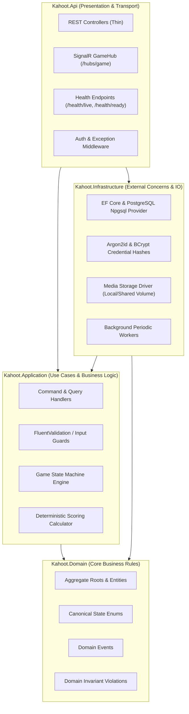
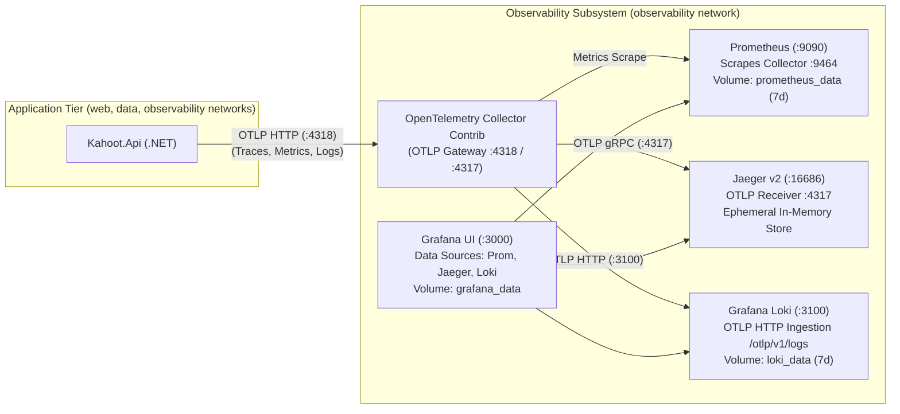

# 13. Architecture and Deployment

## 1. Topic Overview & Actors

### 1.1 Scope and Objective
This document defines the technical software architecture, containerized infrastructure topology, environment configuration, capacity scale, monthly availability objectives, and disaster recovery specifications for the Kahoot-like live quiz SaaS platform. It establishes the architectural invariants that govern deployment on generic, cloud-agnostic Linux container hosts, distinguishing between the **baseline single-host reference deployment** and the **target SaaS multi-instance scale requirements**.

### 1.2 Actors & Stakeholders
* **System Operators / DevOps**: Provision container topology, configure production environment variables, execute zero-downtime rolling deployments, monitor system health, and manage backup/restore operations.
* **System Administrators**: Perform administrative tenant lifecycle operations and manage elevated accounts.
* **Registered Hosts**: Access web dashboard, author quizzes, upload question media, and host live games via HTTPS and WSS connections.
* **Anonymous Players**: Join live game sessions via PIN or join link without registration, receiving question broadcasts and submitting real-time answers via WSS and REST.

### 1.3 Tenant & System Invariants `[NORMATIVE]`
* **`ARCH-TENANT-001` (Multi-Tenant Isolation)**: The platform is a multi-tenant SaaS application where each registered Host account forms an isolated tenant boundary. Cross-tenant data sharing, co-ownership of quizzes, or cross-tenant game visibility is strictly prohibited across application, query, and persistence layers.
* **`ARCH-DATA-001` (Durable Source of Truth)**: PostgreSQL 16+ is the single authoritative system of record. Global process memory or cache is never the sole authority for game state, participant presence, or credential validity.
* **`ARCH-APP-001` (Stateless Application Tier)**: The backend application tier remains logically stateless. In-memory connection mappings and channel subscriptions are disposable, reconstructible projections of durable state.
* **`ARCH-CLOUD-001` (Cloud-Agnostic Infrastructure)**: The deployment model relies exclusively on standardized containerization and open standard protocols (HTTP/2, TLS 1.3, WebSockets). The core architecture contains zero proprietary cloud dependencies or vendor-locked services.

---

## 2. Technical Architecture & Deployment Specifications

### 2.1 Clean Architecture Modular Monolith `[NORMATIVE]`
The backend application is structured as a Clean Architecture modular monolith partitioned into four distinct layers:



#### Layer Responsibilities
1. **`Kahoot.Domain`**:
   * Contains core entities (`Account`, `Quiz`, `Question`, `GameSession`, `Participant`, `AnswerSubmission`).
   * Encapsulates domain invariants, state machines, and business rules independent of databases or UI concerns.
2. **`Kahoot.Application`**:
   * Contains CQRS command/query handlers.
   * Enforces tenant boundary isolation and derived authorization.
   * Orchestrates transactions, validation rules, state transitions, and deterministic scoring calculations.
3. **`Kahoot.Infrastructure`**:
   * Implements persistence using Entity Framework Core with the PostgreSQL Npgsql driver.
   * Implements Argon2id password hashing and SHA-256 token hashing.
   * Implements media storage adapters and image processing pipelines.
   * Hosts background services (`RefreshTokenCleanupWorker`, `OrphanMediaCleanupWorker`, `AbandonedGameFinalizer`, `SuspensionGameFinalizer`).
4. **`Kahoot.Api`**:
   * Exposes RESTful HTTP endpoints and SignalR WebSocket hub (`/hubs/game`).
   * Resolves caller identity from validated JWT access tokens or player session token hashes.
   * Converts exceptions into standard RFC 7807 `ProblemDetails`.
   * Exposes probes (`/health/live`, `/health/ready`, `/health`).

### 2.2 Baseline Reference vs. Target Multi-Instance Architecture `[NORMATIVE]`
* **`ARCH-TOPO-001` (Baseline Reference Deployment)**:
  Packaged as a multi-container Docker Compose topology on a single 64-bit Linux container host. Suitable for educational deployment, staging, and small-scale environments:
  * `proxy` (Nginx): TLS termination, static asset routing, WebSocket upgrade proxying.
  * `frontend` (React / Vite): Static SPA distribution.
  * `backend` (ASP.NET Core 8+): Single modular monolith container.
  * `db` (PostgreSQL 16+): Dedicated relational database volume (`db_data`).
  * `media_volume`: Persistent volume for `/app/uploads`.
  * Observability subsystem (on internal `observability` network):
    * `otel-collector` (OpenTelemetry Collector Contrib): OTLP gateway receiving traces, metrics, and logs from `backend`.
    * `prometheus`: Metrics storage and query engine scraping `otel-collector` (persistent volume `prometheus_data`).
    * `jaeger`: Distributed tracing backend receiving OTLP from `otel-collector` (in-memory ephemeral store for baseline single-host).
    * `loki`: Log aggregation store receiving OTLP logs from `otel-collector` (persistent volume `loki_data`).
    * `grafana`: Unified visualization dashboard querying Prometheus, Jaeger, and Loki (persistent volume `grafana_data`).
* **`ARCH-SCALE-001` (Target SaaS Multi-Instance Requirements)**:
  To support target SaaS scale (25,000 concurrent WebSockets, 5,000 answers/sec), the architecture specifies the following required properties for horizontal scaling without prematurely mandating specific cloud products:
  1. **Stateless Application Cluster**: Multiple backend replica instances running concurrently.
  2. **Distributed Realtime Routing Mechanism**: A shared message/routing abstraction ensuring events broadcast on one instance reach subscribers connected to other instances.
  3. **Shared Durable Media Storage**: Media files written by one instance must be immediately accessible to all instances.
  4. **Cross-Instance Revocation Propagation**: Account suspension, password changes, and token revocations must propagate across all backend nodes within $\le 100\text{ ms}$.
  5. **Concurrency Guarantees**: Cross-instance concurrency must rely on database uniqueness constraints, optimistic concurrency (`stateVersion`), and transactional locks rather than process-local memory.

### 2.3 Ingress Routing & Reverse Proxy Configuration

```nginx
# NON-NORMATIVE REFERENCE EXAMPLE: Nginx Ingress Configuration Template
upstream backend_nodes {
    server backend:8080 max_fails=3 fail_timeout=10s;
    keepalive 64;
}

server {
    listen 80;
    server_name quiz.example.com;
    location /.well-known/acme-challenge/ {
        root /var/www/certbot;
    }
    location / {
        return 301 https://$host$request_uri;
    }
}

server {
    listen 443 ssl http2;
    server_name quiz.example.com;

    ssl_certificate /etc/letsencrypt/live/quiz.example.com/fullchain.pem;
    ssl_certificate_key /etc/letsencrypt/live/quiz.example.com/privkey.pem;
    ssl_protocols TLSv1.2 TLSv1.3;
    ssl_ciphers HIGH:!aNULL:!MD5;

    # Security Headers
    add_header X-Frame-Options "DENY" always;
    add_header X-Content-Type-Options "nosniff" always;
    add_header Referrer-Policy "strict-origin-when-cross-origin" always;
    add_header Strict-Transport-Security "max-age=31536000; includeSubDomains" always;

    # API Endpoints
    location /api/ {
        proxy_pass http://backend_nodes;
        proxy_http_version 1.1;
        proxy_set_header Host $host;
        proxy_set_header X-Real-IP $remote_addr;
        proxy_set_header X-Forwarded-For $proxy_add_x_forwarded_for;
        proxy_set_header X-Forwarded-Proto $scheme;
        client_max_body_size 6M; # 5 MiB image upload + multipart overhead
        proxy_read_timeout 30s;
    }

    # SignalR WebSocket Hub
    location /hubs/game {
        proxy_pass http://backend_nodes;
        proxy_http_version 1.1;
        proxy_set_header Upgrade $http_upgrade;
        proxy_set_header Connection "upgrade";
        proxy_set_header Host $host;
        proxy_set_header X-Real-IP $remote_addr;
        proxy_set_header X-Forwarded-For $proxy_add_x_forwarded_for;
        proxy_set_header X-Forwarded-Proto $scheme;
        proxy_read_timeout 120s;
        proxy_send_timeout 120s;
    }

    # Health Checks
    location ~ ^/health(/live|/ready)?$ {
        proxy_pass http://backend_nodes;
        proxy_set_header Host $host;
        access_log off;
    }

    # Public Processed Media Delivery (Canonical Path: /uploads/)
    location /uploads/ {
        proxy_pass http://backend_nodes;
        proxy_cache_valid 200 30d;
        add_header Cache-Control "public, max-age=31536000, immutable";
    }

    # Frontend Static Single Page Application
    location / {
        root /var/www/frontend/dist;
        index index.html;
        try_files $uri $uri/ /index.html;
    }
}
```

### 2.4 Environment Configuration Matrix
Production configuration loaded via non-committed `.env` files:

| Environment Variable | Production Value / Pattern | Sensitive? | Purpose & Impact | Stable Req ID |
| :--- | :--- | :---: | :--- | :--- |
| `POSTGRES_DB` | `kahoot_prod` | No | Authoritative database name. | `ARCH-CFG-001` |
| `POSTGRES_USER` | `kahoot_app` | No | Dedicated unprivileged PostgreSQL service account. | `ARCH-CFG-002` |
| `POSTGRES_PASSWORD` | Strong generated secret (min 32 chars) | **YES** | Master database credential. Never committed. | `ARCH-CFG-003` |
| `ConnectionStrings__DefaultConnection` | `Host=db;Port=5432;Database=...;Username=...;Password=...;Pooling=true;Minimum Pool Size=10;Maximum Pool Size=80;` | **YES** | EF Core Npgsql connection string with explicit pool boundaries. | `ARCH-CFG-004` |
| `JWT_ISSUER` | `https://quiz.example.com` | No | Validated issuer claim in Host access tokens. | `ARCH-CFG-005` |
| `JWT_AUDIENCE` | `https://quiz.example.com` | No | Validated audience claim in Host access tokens. | `ARCH-CFG-006` |
| `JWT_SIGNING_KEY` | Cryptographic secret (min 256 bits, base64) | **YES** | HMAC-SHA256 signing key for access tokens. | `ARCH-CFG-007` |
| `JWT_ACCESS_TOKEN_MINUTES` | `15` | No | Host access token expiration lifetime (15m). | `ARCH-CFG-008` |
| `JWT_REFRESH_TOKEN_DAYS` | `14` | No | Host refresh token sliding window (14d). | `ARCH-CFG-009` |
| `JWT_REFRESH_FAMILY_MAX_DAYS` | `30` | No | Absolute maximum refresh token family lifetime (30d). | `ARCH-CFG-010` |
| `CLIENT_BASE_URL` | `https://quiz.example.com` | No | Canonical origin for generating join links. | `ARCH-CFG-011` |
| `CORS_ALLOWED_ORIGINS` | `https://quiz.example.com` | No | Whitelisted CORS origins; wildcards rejected. | `ARCH-CFG-012` |
| `AUTH_SECURE_COOKIES` | `true` | No | Enforces `SameSite=Lax; Secure; HttpOnly` on refresh cookies. | `ARCH-CFG-013` |
| `BOOTSTRAP_ADMIN_ENABLED` | `true` (initial boot only) | No | Gates initial System Administrator seeding. | `ARCH-CFG-014` |
| `BOOTSTRAP_ADMIN_USERNAME` | `sysadmin` | No | Username for bootstrap administrator. | `ARCH-CFG-015` |
| `BOOTSTRAP_ADMIN_PASSWORD` | One-time bootstrap secret (min 16 chars) | **YES** | Initial admin password. Rotated after boot. | `ARCH-CFG-016` |
| `STORAGE_MEDIA_PATH` | `/app/uploads` | No | Physical volume mount path for media storage. | `ARCH-CFG-017` |
| `ASPNETCORE_ENVIRONMENT` | `Production` | No | Runtime mode; disables Swagger and debug endpoints. | `ARCH-CFG-018` |
| `OTEL_SERVICE_NAME` | `kahoot-api` | No | Logical service name for OpenTelemetry resource attributes. | `ARCH-CFG-019` |
| `OTEL_RESOURCE_ATTRIBUTES` | `deployment.environment.name=production` | No | Standard OpenTelemetry comma-separated resource attributes. | `ARCH-CFG-020` |
| `OTEL_EXPORTER_OTLP_ENDPOINT` | `http://otel-collector:4318` (Compose) / `http://localhost:4318` (Host) | No | OTLP HTTP/protobuf receiver endpoint for telemetry signals. | `ARCH-CFG-021` |
| `OTEL_EXPORTER_OTLP_PROTOCOL` | `http/protobuf` | No | Export wire protocol for OpenTelemetry signals. | `ARCH-CFG-022` |
| `OTEL_TRACES_SAMPLER` | `parentbased_traceidratio` | No | Sampling mechanism for distributed tracing (`parentbased_traceidratio` or `always_on`). | `ARCH-CFG-023` |
| `OTEL_TRACES_SAMPLER_ARG` | `0.10` | No | Sampling probability ratio when ratio sampler is active (e.g. 0.10 = 10%). | `ARCH-CFG-024` |
| `GRAFANA_ADMIN_PASSWORD` | Strong generated secret (min 16 chars) | **YES** | Initial administrator password for Grafana web dashboard. | `ARCH-CFG-025` |

### 2.5 Reference Observability Architecture `[NORMATIVE]`

The platform implements a vendor-neutral, three-signal telemetry pipeline conforming to OpenTelemetry standards:



#### Observability Invariants
* **`ARCH-OBS-001` (Vendor-Neutral Observability Pipeline)**:
  * Application telemetry (traces, metrics, and structured logs) is exported exclusively using standard OTLP (HTTP/protobuf) to the OpenTelemetry Collector gateway.
  * The backend application contains zero direct vendor SDK dependencies on Prometheus, Jaeger, Loki, or Grafana.
  * Routing, filtering, batching, and target protocol transformations are performed solely by the Collector.
* **`ARCH-OBS-002` (Telemetry Network Isolation & Failure Independence)**:
  * Observability backend components (`prometheus`, `jaeger`, `loki`, `grafana`) reside on an isolated internal Docker bridge network (`observability`), shielded from public ingress and directly isolated from `db`.
  * The API joins `web`, `data`, and `observability`; the `otel-collector` joins `observability` to serve as a gateway.
  * **Failure Independence**: The OpenTelemetry .NET SDK in `Kahoot.Api` uses bounded in-memory batch queues and asynchronous export. If the Collector is unreachable, experiencing backpressure, or crashing:
    * Telemetry may be dropped. Repeated export failures still use some CPU and network resources but do not determine application readiness.
    * The application boot sequence and readiness state (`/health`, `/health/ready`) are unaffected.
    * Local structured JSON console logs to `stdout`/`stderr` continue uninterrupted.
* **`ARCH-OBS-003` (Storage Retention and Single-Host Local Caveats)**:
  * **Prometheus**: Metrics persist on a dedicated Docker volume (`prometheus_data`) with a retention window of 7 days (`--storage.tsdb.retention.time=7d`) and a 2GB size ceiling (`--storage.tsdb.retention.size=2GB`).
  * **Loki**: Application logs persist on a dedicated Docker volume (`loki_data`) with a retention window of 7 days (`retention_period: 168h`).
  * **Jaeger Baseline Ephemeral Store**: In the baseline reference single-host deployment, Jaeger runs using its default in-memory trace store. Distributed traces are ephemeral and cleared upon container restart. This design optimizes single-host memory and operational simplicity for development, staging, and small-scale deployments. For multi-instance production scale, Jaeger or Tempo backed by durable object storage or Cassandra/OpenSearch replaces the ephemeral in-memory store.
  * **Grafana**: Dashboards, provisioning files, and operational state persist on `grafana_data`.
* **`ARCH-OBS-004` (Sampling, Redaction & Cardinality Guardrails)**:
  * **Trace Sampling**: Production deployments employ parent-based ratio sampling (`parentbased_traceidratio`) configured via `OTEL_TRACES_SAMPLER` and `OTEL_TRACES_SAMPLER_ARG` (defaulting to 10% sampling, `0.10`), while development defaults to 100% (`always_on`).
  * **Health Probe Filtering**: Ingress health probes (`/health`, `/health/live`, `/health/ready`) are filtered out of distributed tracing at the ASP.NET Core instrumentation boundary to eliminate repetitive synthetic span clutter.
  * **Strict Metric & Label Low-Cardinality**: Dynamic high-cardinality identifiers (such as session tokens, game PINs, player connection IDs, individual answer IDs, or timestamps) must never be added as metric dimensions or Loki index labels.
  * **Zero Sensitive Data in Telemetry**: Headers containing credentials (`Authorization`, `Cookie`), query strings containing tokens (`access_token`), passwords, password hashes, and player response payloads are strictly redacted before emission to OTLP.
* **`ARCH-OBS-005` (Deployment Topology & Host-Run Precedence)**:
  * When executing inside Docker Compose, `OTEL_EXPORTER_OTLP_ENDPOINT` is injected as `http://otel-collector:4318`.
  * When executing directly on the host operating system (`dotnet run`), operators or developers set `OTEL_EXPORTER_OTLP_ENDPOINT=http://localhost:4318` and `OTEL_EXPORTER_OTLP_PROTOCOL=http/protobuf` to use the published Collector receiver port.
  * Standard `OTEL_*` settings use the .NET configuration hierarchy (`appsettings.json` < `appsettings.{Environment}.json` < environment variables); exporter settings are consumed by the OpenTelemetry SDK and sampler settings by the application.

---

## 3. Boundaries, Resource Ceilings & Connection Budgets

### 3.1 Global Database Connection Budget `[NORMATIVE]`
* **`ARCH-POOL-001` (Global Connection Budget Invariant)**:
  To prevent PostgreSQL connection exhaustion across scaled replicas:
  $$\sum (\text{Maximum Pool Size of every Backend Replica}) + \text{Worker Reserve} + \text{Admin/Migration Reserve} \le \text{PostgreSQL } \texttt{max\_connections}$$
  * **Baseline Example**: For PostgreSQL `max_connections = 100`, a single backend container assigns `Maximum Pool Size = 80`, leaving 20 connections reserved for migrations, background jobs, and operator queries.
  * **Scale-Out Rule**: In a multi-replica deployment (e.g., 3 backend replicas), each replica pool size must be scaled down (e.g., 25 connections per replica $\times 3 = 75$) OR an external pooling proxy must be employed to multiplex connections.
* **`ARCH-POOL-002` (Pool Exhaustion Handling)**:
  * Connection acquisition timeout: maximum **15 seconds**.
  * If no pool connection becomes available within 15 seconds, the request aborts with `503 Service.Unavailable` (code `Database.PoolExhausted`) and sends a `Retry-After: 5` header.
  * The operation rolls back cleanly without partial business mutations.

### 3.2 Overload and Graceful Degradation Contract `[NORMATIVE]`
* **`ARCH-OVERLOAD-001` (Resource Priority Hierarchy)**:
  When incoming traffic exceeds supported platform capacity, resources are allocated according to this strict priority order:
  1. **Active Gameplay Correctness**: Real-time answer submissions, question deadlines, and scoring calculations receive top execution priority.
  2. **Authentication & Security Enforcement**: Login, refresh, and immediate suspension checks.
  3. **Player Reconnection & Catch-Up**: Restoring dropped player sessions.
  4. **Normal Interactive APIs**: Quiz authoring, question editing, and lobby joins.
  5. **Administrative Bulk Queries**: Account listings and search.
  6. **Background Maintenance**: Media cleanup and expired token purging yield completely during peak load.
* **`ARCH-OVERLOAD-002` (Overload Invariants)**: Under severe traffic spikes:
  * The system must never corrupt data or accept and then silently drop an answer.
  * The system must reject lower-priority operations with `429 Request.RateLimited` or `503 Service.Unavailable` rather than allowing unbounded memory queues or thread pool starvation.

---

## 4. Topic-Specific Non-Functional Requirements & Performance SLOs

### 4.1 Target Platform Scale `[NORMATIVE]`
* **`ARCH-CAP-001` (Capacity Envelope)**:

| Dimension | Target Metric | Architectural Enforcement Mechanism |
| :--- | :---: | :--- |
| Registered Accounts / Tenants | 100,000 accounts | Indexed normalized usernames (`NormalizedUsername`). |
| Concurrent Active Hosts | 2,000 hosts | Stateless REST tokens; in-memory host presence sessions. |
| Simultaneous Live Games | 200 games | Authoritative game state machine; indexed PIN registry. |
| Concurrent Connected Players | 20,000 players | 500-seat per-game limit; lightweight SignalR connection state. |
| Aggregate Realtime Connections | $\ge 25,000$ connections | WebSocket multiplexing via reverse proxy; 64 KB buffer ceiling. |
| Historical Quizzes in Database | 1,000,000 quizzes | Tenant-scoped queries; composite index `(HostAccountId, CreatedAt DESC)`. |
| Historical Accepted Answer Records | 100,000,000 rows | Append-only partition-ready `AnswerSubmissions` table. |

### 4.2 Canonical Latency & Throughput SLO Targets `[NORMATIVE]`
* **`ARCH-REST-001` (Canonical REST Latency SLO)**:
  Under standard production load up to 1,500 req/s:
  * $p50 \le 100\text{ ms}$
  * $p95 \le 300\text{ ms}$
  * $p99 \le 750\text{ ms}$
* **`ARCH-THRU-001` (REST Throughput Capacity)**: Sustained 1,500 requests/second; burst up to 4,000 requests/second for 30 consecutive seconds.
* **`ARCH-ERR-001` (Error-Rate Semantics)**:
  * Expected domain rejections (`400`, `401`, `403`, `404`, `409`, `429`) resulting from invalid inputs, bad passwords, late answers, or full lobbies do NOT count as server reliability failures.
  * Unexpected server error rate (`5xx` due to infrastructure, unhandled bugs, or timeouts) must be $< 0.1\%$ across all eligible traffic.

### 4.3 Availability & Disaster Recovery SLOs `[NORMATIVE]`
* **`ARCH-AVAIL-001` (Availability Definition & Math)**:
  * Monthly service availability: $\ge 99.9\%$ (maximum 43.8 minutes of unplanned downtime per calendar month).
  * Formula:
    $$\text{Availability} = \frac{\text{Total Time} - \text{Unplanned Downtime}}{\text{Total Time}} \times 100\%$$
  * Measured at reverse proxy boundary across valid non-malicious client requests.
  * Exclusions: Planned maintenance with $\ge 48\text{ hours}$ notice (maximum 2 hours/month); public Internet DNS or client network carrier outages.
* **`ARCH-DR-001` (RPO & RTO Guarantees)**:
  * **Recovery Point Objective (RPO)**: $\le 5\text{ minutes}$ of committed relational transactions.
  * **Recovery Time Objective (RTO)**: $\le 30\text{ minutes}$ from disaster declaration to active traffic admission.

---

## 5. Security & Disaster Recovery Authority Fencing

### 5.1 Disaster Recovery Fail-Closed Security Authority `[NORMATIVE]`
* **`ARCH-DR-002` (Fail-Closed Security Restoration)**:
  Because an RPO of 5 minutes allows restored databases to predate credential revocations (account suspensions, password changes, logout-all, player kicks):
  * **Post-Restoration Security Reconciliation**:
    1. Invalidate **all active refresh token families**; all Hosts and Admins must log in fresh.
    2. Increment platform-wide security cutoff or revoke outstanding access token sessions.
    3. Transition all unfinished live games (`LOBBY`, `QUESTION_ACTIVE`, `QUESTION_RESULTS`, `LEADERBOARD`) to `FINISHED`.
    4. Expire pre-disaster player session tokens.
  * **Security Guarantee**: Stale pre-disaster credentials can **never** regain valid authority over a restored system.

### 5.2 Database & Media Storage Restore Consistency `[NORMATIVE]`
* **`ARCH-DR-003` (Storage Mismatch Reconciliation)**:
  PostgreSQL metadata and media file storage may be restored from different backup points. The reconciliation script handles inconsistencies:
  * **DB record exists, image file missing**: Question remains queryable, but missing image returns placeholder or graceful degraded marker. Media marked for re-upload.
  * **Image file exists, DB record missing**: File is treated as unreferenced quarantine file and collected after the retention window.
  * **Historical Snapshot missing image**: Snapshot text and choices remain intact; client renders question gracefully without image.

---

## 6. Concurrency, Lost-Response & Failure-Mode Contracts

### 6.1 Per-Topic Failure-Mode & Risk Matrix `[NORMATIVE]`

| Risk ID | Trigger / Failure | Potential Impact | Required System Behavior | Recovery / Mitigation | Verification |
| :--- | :--- | :--- | :--- | :--- | :--- |
| `ARCH-RISK-001` | Database connection pool reaches 80/80 connections. | Incoming requests queue indefinitely; thread exhaustion. | Acquisition timeout fires after 15s; fails fast with `503 Service.Unavailable` and `Retry-After: 5`. | Bounded timeout; client backoff. | `ARCH-TEST-004` |
| `ARCH-RISK-002` | Server crashes during live 500-player game. | Ephemeral WebSocket connections dropped. | Application is stateless. Surviving/restarted instances load authoritative state from PostgreSQL; players reconnect. | Indexed token catch-up. | `ARCH-TEST-005` |
| `ARCH-RISK-003` | Flash crowd: 10,000 players join concurrently. | CPU saturation or memory exhaustion. | Ingress buffers capped; rate limiters enforce quotas; excess requests receive 429; no process crash. | Multi-tier rate limiting. | `ARCH-TEST-006` |
| `ARCH-RISK-004` | Disaster recovery restores database to $T - 4\text{ minutes}$, resurrecting suspended Host. | Malicious or suspended Host regains access to account. | DR reconciliation protocol invalidates all prior refresh families and forces fresh login; verifies status. | Fail-closed security reconciliation. | `ARCH-TEST-007` |
| `ARCH-RISK-005` | Media volume snapshot timestamp lags DB backup timestamp. | Questions point to missing media files. | Media delivery returns `404 Media.NotFound`; application renders question with fallback placeholder; no crash. | Graceful image degradation. | `ARCH-TEST-008` |

---

## 7. Traceable Acceptance Tests & Test Matrix

| Test ID | Mapped Requirement IDs | Category | Description & Preconditions | Expected Outcome |
| :--- | :--- | :--- | :--- | :--- |
| `ARCH-TEST-001` | `ARCH-CFG-013` | Security / Config | Inspect refresh cookie generated on login. | `SameSite=Lax; Secure; HttpOnly` verified. `SameSite=Strict` strictly absent. |
| `ARCH-TEST-002` | `ARCH-REST-001`, `ARCH-THRU-001` | Non-Functional | Benchmark REST endpoints under sustained 1,500 req/s. | Latencies satisfy $p50 \le 100\text{ ms}$, $p95 \le 300\text{ ms}$, $p99 \le 750\text{ ms}$. |
| `ARCH-TEST-003` | `ARCH-CAP-001` | Non-Functional | Platform sustains 2,000 Hosts + 200 Games + 20,000 Players for 60 minutes. | CPU $< 70\%$, memory $< 75\%$, zero crash loops. |
| `ARCH-TEST-004` | `ARCH-POOL-001`, `ARCH-RISK-001` | Fault Injection | Artificially saturate DB connection pool with 80 sleep queries; issue 81st request. | 81st request times out after 15s; returns `503 Service.Unavailable` with `Retry-After: 5`. |
| `ARCH-TEST-005` | `ARCH-APP-001`, `ARCH-RISK-002` | Fault Injection | Kill backend container during active question; start new container. | Surviving/new container reads state from DB; players reconnect without data loss. |
| `ARCH-TEST-006` | `ARCH-OVERLOAD-001`, `ARCH-RISK-003`| Capacity | Apply 150% target load (6,000 req/s burst). | Core gameplay prioritized; excess shed with 429/503; zero state corruption. |
| `ARCH-TEST-007` | `ARCH-DR-002`, `ARCH-RISK-004` | Disaster Recovery | Restore DB backup predating a Host suspension; execute reconciliation script. | All sessions revoked; re-authentication required; suspended account remains blocked. |
| `ARCH-TEST-008` | `ARCH-DR-003`, `ARCH-RISK-005` | Disaster Recovery | Restore DB with missing media volume snapshot. | Questions load successfully; missing media renders placeholder without server exception. |
| `ARCH-TEST-009` | `ARCH-DR-001` | Disaster Recovery | Full cold DR drill from backup dump and WAL archives. | Verified `/health/ready` HTTP 200 state achieved within $\le 30\text{ minutes}$; RPO $\le 5\text{ minutes}$. |
