# 14. Verification and Testing

## 1. Topic Overview & Actors

### 1.1 Scope and Objective
This document defines the master quality assurance, verification, load testing, endurance validation, fault injection, and traceability framework for the Kahoot-like live quiz SaaS platform. It establishes testing methodologies, an exhaustive multi-agent concurrency race matrix, performance test profiles, chaos recovery regimes, over-capacity limits, and the master traceability matrix that binds every functional specification and non-functional constraint across all thirteen prior requirement documents into a traceable verification regime.

### 1.2 Actors & Stakeholders
* **QA & Test Automation Engineers**: Design, script, and maintain deterministic unit, integration, and load test suites.
* **Release Engineers / Operators**: Execute pre-release verification profiles and validate compliance with capacity and reliability gates prior to production deployment.
* **Continuous Integration (CI) Automation**: Executes regression test suites on every pull request, enforcing zero tolerance for functional or data integrity regressions.

### 1.3 Core Verification Principles `[NORMATIVE]`
* **`VERIF-TIME-001` (Deterministic Time Control)**: All business logic, deadline comparisons, and worker cycles depend on an abstract `TimeProvider`. Tests explicitly advance virtual time to verify expiration boundaries, countdown timers, grace periods, and worker schedules without fragile `Thread.Sleep` calls.
* **`VERIF-OBS-001` (Observability & Telemetry Integration)**: Verification evidence is collected through test harness metrics, native database statistics, operating system diagnostic tools, structured application logs, and the standardized OpenTelemetry OTLP pipeline (metrics, distributed traces, and correlated logs).
* **`VERIF-GATE-001` (Zero-Tolerance Quality Gates)**: Any test execution that exhibits data loss, cross-tenant leakage, duplicate scoring, seat over-allocation, or invalid state machine transitions constitutes a catastrophic failure that immediately blocks release.

---

## 2. Verification Framework & Methodology

### 2.1 Test Hierarchy & Coverage Boundaries

```mermaid
graph TD
    subgraph Level1 ["Level 1: Unit & Domain Invariant Tests"]
        DomainLogic["Pure Domain Entities & State Invariants"]
        Formulas["Deterministic Scoring Formula & Unicode NFKC Normalization"]
        Validators["Input Validation & ProblemDetails Mappings"]
    end

    subgraph Level2 ["Level 2: Integration & Persistence Tests"]
        EFCore["PostgreSQL Data Isolation & Unique Constraints"]
        SignalRHub["SignalR Audience Segregation & Event Framing"]
        Workers["Background Workers (Two-Phase Image, Token Cleanup, Abandonment)"]
    end

    subgraph Level3 ["Level 3: Multi-Agent Concurrency & Race Tests"]
        ThreadBarriers["Controlled Parallel Execution with TaskCompletionSource"]
        Idempotency["Lost-Response Replay & Idempotent Token Rotation"]
        Deadlocks["Database Lock Contention & Transaction Rollbacks"]
    end

    subgraph Level4 ["Level 4: Fault Injection & Chaos Scenarios"]
        MidTxFaults["Failure Injection Before/After Commit & Storage Drops"]
        NodeKills["Instance Termination, Proxy Restart, DB Pause"]
    end

    subgraph Level5 ["Level 5: Load, Soak & Over-Capacity Profiles"]
        ScaleProfiles["Target SaaS Scale (20k Players, 2k Hosts, 200 Games)"]
        BurstProfiles["5k Answers/sec, 1.5k Joins/sec, 5k Reconnects/60s"]
        OverCapacity["110%, 125%, 150% Overload Shedding Profiles"]
        SoakTest["4-Hour Soak Test (Trend/Slope Memory Analysis)"]
    end

    Level1 --> Level2
    Level2 --> Level3
    Level3 --> Level4
    Level4 --> Level5
```

---

## 3. Comprehensive Performance & Load Test Profiles

### 3.1 Standard Test Profiles Summary Matrix `[NORMATIVE]`

| Profile Identifier | Workload Description | Minimum Duration | Target Concurrency / Throughput | Success Criteria & Resource Headroom | Stable Req ID |
| :--- | :--- | :---: | :--- | :--- | :--- |
| `PROFILE-BASE` | Multi-tenant smoke regression | 15 min | 10 games $\times$ 50 players (500 players total) | Latencies within SLO; CPU $< 30\%$; zero errors. | `PRF-BASE-001` |
| `PROFILE-GAME` | Single maximum-capacity game | 10 min | 1 game $\times$ 500 players; 500 answers/sec | 500 answers ingested in $\le 1.0\text{ s}$; 501st join rejected with 409. | `PRF-GAME-001` |
| `PROFILE-SAAS` | Target educational SaaS scale | 60 min | 100k accounts, 2k hosts, 200 games, 20k players | Sustained 1,500 req/s REST + 25k WSS connections; CPU $< 70\%$; REST $p95 \le 300\text{ ms}$. | `PRF-SAAS-001` |
| `PROFILE-BURST` | Platform answer storm | 30 sec | 5,000 answers/sec sustained for $\ge 5\text{ s}$ | $\ge 25,000$ valid answers ingested; $p95 \le 500\text{ ms}$; zero lost answers. | `PRF-BURST-001` |
| `PROFILE-JOIN` | Lobby join storm | 60 sec | 1,500 joins/sec across 200 games | Seat reservations strictly $\le 500$/game; $p95 \le 500\text{ ms}$. | `PRF-JOIN-001` |
| `PROFILE-RECON` | Network storm reconnection | 60 sec | 5,000 player reconnections in 60s | $p95 \le 3.0\text{ s}$; full state restored; zero duplicate scores. | `PRF-RECON-001` |
| `PROFILE-IMAGE` | Image processing & delivery | 15 min | 50 concurrent uploads; 2,000 req/s delivery | Processing $p95 \le 2\text{ s}$; delivery $p95 \le 30\text{ ms}$; memory stable. | `PRF-IMAGE-001` |
| `PROFILE-SOAK` | Extended endurance soak test | 4 hours | 50%–70% target capacity (12k players, 120 games) | Trend analysis: zero monotonic memory growth; zero connection leaks. | `PRF-SOAK-001` |

### 3.2 Detailed Execution Protocols

#### 1. Target Steady-State SaaS Test (`PROFILE-SAAS`)
* **Environment**: Production-grade Linux host, Docker Compose, PostgreSQL 16+ initialized with 100,000 accounts, 1,000,000 historical quizzes, and 100,000,000 historical answer records.
* **Duration**: 60 continuous minutes.
* **Traffic Ingestion**:
  * 2,000 active Hosts performing quiz authoring, question editing, and hosting operations.
  * 200 simultaneously active live games distributed evenly across tenants.
  * 20,000 active connected Players across the 200 games.
  * 25,000 aggregate persistent SignalR WebSocket connections through Nginx.
  * Sustained 1,500 HTTP REST requests/second.
* **Pass/Fail Verdict**:
  * Canonical REST Latency: $p50 \le 100\text{ ms}$, $p95 \le 300\text{ ms}$, $p99 \le 750\text{ ms}$.
  * SignalR Message Delivery: $p50 \le 150\text{ ms}$, $p95 \le 500\text{ ms}$.
  * Resource Ceilings: Application CPU $< 70\%$, Application RAM $< 75\%$, Database CPU $< 70\%$, Database Pool utilization $< 70\%$ (max 56 / 80).
  * System Reliability: Unexpected server `5xx` error rate $< 0.1\%$.

#### 2. Statistically Realistic Four-Hour Endurance Soak Test (`PROFILE-SOAK`)
* **Duration**: 4 continuous hours.
* **Evaluation Criteria `[NORMATIVE]`**:
  * **Memory Trend Analysis**: The evaluation must not require an unrealistic fixed $\pm 10\%$ memory bound at all instants (which violates normal GC, cache sizing, and buffer pool behavior). Instead, evaluation requires:
    1. Initial warm-up phase (30 minutes) excluded from baseline.
    2. Bounded high-water mark below assigned container memory limits ($< 75\%$).
    3. Linear regression slope analysis over the 4-hour window must show **no statistically significant upward trend** ($R^2 < 0.3$ on post-GC memory samples).
    4. Memory returns to an established equilibrium band during traffic troughs.
  * **Database Connection Leaks**: Active database pool connections return to minimum idle pool size during quiet periods. Zero unclosed connection handles.
  * **Background Worker Health**:
    * `RefreshTokenCleanupWorker` continuously drains backlog ($\ge 20,000$ rows/hour).
    * `OrphanImageCleanupWorker` safely reclaims unreferenced images without deadlocking active quiz edits.
    * `AbandonedGameFinalizer` transitions orphaned games to `FINISHED` within $300\text{s} + 30\text{s}$ of Host absence.

#### 3. Over-Capacity Tests (110%, 125%, 150%) `[NORMATIVE]`
To verify graceful degradation without requiring full SLO compliance beyond rated capacity:
* **`VERIF-OVER-001` (110% Capacity Profile)**: Traffic at 1,650 req/s REST and 27,500 WebSockets. The system maintains full data integrity; latency degrades gracefully; zero unhandled errors.
* **`VERIF-OVER-002` (125% Capacity Profile)**: Traffic at 1,875 req/s REST and 31,250 WebSockets. The system invokes admission control: lower-priority administrative queries and background cleanup yield; live gameplay answers continue to commit; excess requests receive `429 Request.RateLimited` or `503 Service.Unavailable`.
* **`VERIF-OVER-003` (150% Capacity Profile)**: Traffic at 2,250 req/s REST and 37,500 WebSockets. Core gameplay correctness is preserved; zero database deadlocks or transaction corruption; excess traffic is shed cleanly; system recovers automatically within 60 seconds once load returns to baseline.

---

## 4. Comprehensive Concurrency & Race Matrix (53 Scenarios)

To guarantee absolute mathematical data integrity across multi-threaded and multi-instance executions, the test harness evaluates both serial interleaving orders (`Order A` vs. `Order B`) for every meaningful race:

### 4.1 Authentication & Credential Races
| Race ID | Competing Operations | Order A Resolution (First Wins) | Order B Resolution (Second Wins) | Stable Req ID |
| :---: | :--- | :--- | :--- | :--- |
| `RACE-AUTH-01` | Host Login vs. Admin Account Suspension | Login commits first (`200 OK`); suspension commits immediately after; next API call returns `403 Auth.AccountSuspended`. | Suspension commits first; login returns `401 Auth.InvalidCredentials` (suspension concealed). | `RACE-VER-001` |
| `RACE-AUTH-02` | Concurrent Token Refresh vs. Refresh ($< 10\text{s}$) | First refresh commits (`200 OK`), rotates family, issues new token pair. | Arrives within 10s grace window: returns `409 Auth.RefreshRace`. Family remains valid; replay receives no new secret. | `RACE-VER-002` |
| `RACE-AUTH-03` | Token Refresh vs. Logout | Refresh commits first (`200 OK`); logout commits immediately after, revoking the newly issued family. | Logout commits first (`204 No Content`); refresh presentation encounters revoked family, returns `401 Auth.InvalidRefreshToken`. | `RACE-VER-003` |
| `RACE-AUTH-04` | Token Refresh vs. `logout-all` | Refresh commits first; `logout-all` commits next, invalidating all token families and incrementing `TokenSecurityVersion`. | `logout-all` commits first; refresh encounters revoked family and fails with `401 Auth.InvalidRefreshToken`. | `RACE-VER-004` |
| `RACE-AUTH-05` | Token Refresh vs. Password Change | Refresh commits first; password change commits next, revoking all refresh families and severing active sessions. | Password change commits first; refresh fails with `401 Auth.InvalidRefreshToken`. | `RACE-VER-005` |
| `RACE-AUTH-06` | Token Refresh vs. Host Suspension | Refresh commits first; suspension commits next, revoking all families and terminating active games. | Suspension commits first; refresh rejected with `401 Auth.InvalidCredentials`. | `RACE-VER-006` |
| `RACE-AUTH-07` | JWT Request vs. Host Suspension | Request commits before suspension; output returned. | Suspension commits first; request rejected at authorization check with `403 Auth.AccountSuspended`. | `RACE-VER-007` |
| `RACE-AUTH-08` | Admin Revocation vs. Privileged Admin Action | Admin action commits before revocation. | Revocation commits first; admin action fails with `403 Auth.Forbidden`. | `RACE-VER-008` |

### 4.2 Quiz & Authoring Races
| Race ID | Competing Operations | Order A Resolution (First Wins) | Order B Resolution (Second Wins) | Stable Req ID |
| :---: | :--- | :--- | :--- | :--- |
| `RACE-QZ-01` | Quiz Question Edit vs. Publish | Edit commits first (`Revision = K+1`, `IsPublished = false`); publish validates updated question set. | Publish commits first (`IsPublished = true`); edit commits immediately after, automatically resetting `IsPublished = false`. | `RACE-VER-009` |
| `RACE-QZ-02` | Quiz Edit vs. Game Creation Snapshot | Edit commits first; game snapshot captures updated question text and choices. | Game snapshot transaction commits first; captures pre-edit snapshot. Edit succeeds on quiz draft without mutating live game. | `RACE-VER-010` |
| `RACE-QZ-03` | Quiz Deletion vs. Game Creation | Deletion commits first (`204 No Content`); game creation fails with `404 Quiz.NotFound`. | Game creation commits first; quiz marked in-use; deletion attempt fails with `409 Quiz.HasSessions`. | `RACE-VER-011` |
| `RACE-QZ-04` | Question Reorder vs. Question Insertion | Reorder commits first (`Revision = K+1`); insertion with stale revision fails with `409 Quiz.ConcurrentModification`. | Insertion commits first; reorder fails with `400 Quiz.QuestionSetMismatch` (missing new question ID) or 409. | `RACE-VER-012` |
| `RACE-QZ-05` | Question Reorder vs. Question Deletion | Reorder commits first; deletion removes target and re-indexes. | Deletion commits first; reorder payload contains deleted question ID, fails with `400 Quiz.QuestionSetMismatch`. | `RACE-VER-013` |
| `RACE-QZ-06` | Question Image Attachment vs. Orphan Cleanup | Attachment commits first; cleanup detects the question reference and skips deletion. | Cleanup deletes the image row first; attachment fails with `400 Quiz.InvalidImageReference`. | `RACE-VER-014` |

### 4.3 Game Lifecycle & Live Gameplay Races
| Race ID | Competing Operations | Order A Resolution (First Wins) | Order B Resolution (Second Wins) | Stable Req ID |
| :---: | :--- | :--- | :--- | :--- |
| `RACE-GM-01` | Concurrent Joins for 500th Seat | Exactly one player commits seat 500 (`200 OK`, session token). | Competing player rejected with `409 Game.Full`. Total seats equal exactly 500. | `RACE-VER-015` |
| `RACE-GM-02` | Player Join vs. Host Start Game | Join commits in `LOBBY`; player included in Question 1 eligibility. | Start Game commits first (`Status = QUESTION_ACTIVE`); join fails with `409 Game.NotJoinable`. | `RACE-VER-016` |
| `RACE-GM-03` | Player Join vs. Host Account Suspension | Join commits first; suspension commits next, terminating game and revoking newly issued token. | Suspension commits first; game is `FINISHED`; join returns `404 Game.InvalidPin` or `409 Game.NotJoinable`. | `RACE-VER-017` |
| `RACE-GM-04` | Host Start Game vs. Host End Game | Start commits first; game moves to `QUESTION_ACTIVE`; End Game moves to `FINISHED`. | End Game commits first; game is `FINISHED`; Start Game fails with `409 Game.InvalidStateTransition`. | `RACE-VER-018` |
| `RACE-GM-05` | Host Advance vs. Concurrent Advance | First Advance commits; increments `stateVersion` to $K+1$. | Second Advance with stale version $K$ fails with `409 Game.ConcurrentModification` (or idempotent response). | `RACE-VER-019` |
| `RACE-GM-06` | Host Advance vs. Host End Game | Advance commits to next question; End Game terminates session. | End Game commits first (`FINISHED`); Advance fails with `409 Game.InvalidStateTransition`. | `RACE-VER-020` |
| `RACE-GM-07` | Answer Submission vs. Server Deadline | Answer commits at $T \le \text{Deadline}$; accepted and scored. | Answer arrives at $T > \text{Deadline}$; rejected with `409 Game.AnswerTooLate`. | `RACE-VER-021` |
| `RACE-GM-08` | Answer Submission vs. Host `EndQuestion` | Answer commits while `QUESTION_ACTIVE`; scored in results. | `EndQuestion` commits first (`QUESTION_RESULTS`); answer rejected with `409 Game.AnswerTooLate`. | `RACE-VER-022` |
| `RACE-GM-09` | Answer Submission vs. Host Suspension | Answer commits first; points durable; suspension terminates game. | Suspension commits first; answer rejected with `Game.Unavailable`. | `RACE-VER-023` |
| `RACE-GM-10` | Answer Submission vs. Participant Removal | Answer commits first; removal proceeds; answer and points preserved in question distribution. | Removal commits first; answer rejected with `403 Game.ParticipantRemoved`. | `RACE-VER-024` |
| `RACE-GM-11` | Participant Removal vs. Auto-Close | Removal decrements eligibility; causes `accepted == eligible`; triggers auto-close to `QUESTION_RESULTS`. | All answers commit first; auto-close triggers; removal executed during `QUESTION_RESULTS`. | `RACE-VER-025` |
| `RACE-GM-12` | Host Reconnect vs. Abandonment Expiry | Host reconnects at $T < 300\text{s}$; grace cancelled; game remains active. | Grace expires ($T \ge 300\text{s}$); abandonment worker marks game `FINISHED`; late reconnect is read-only. | `RACE-VER-026` |
| `RACE-GM-13` | Explicit Host End Game vs. Abandonment Sweep | Host calls `EndGame`; marks `FINISHED`; worker sweep detects game already finished and skips. | Worker sweep finishes game; Host command receives idempotent `200 OK` or safe `409`. | `RACE-VER-027` |
| `RACE-GM-14` | Host Suspension vs. Abandonment Finalizer | Suspension commits immediately; marks game terminal; worker sweep detects terminal state and skips. | Abandonment worker marks `FINISHED`; suspension marks account suspended; no conflict. | `RACE-VER-028` |

### 4.4 Realtime & Reconnection Races
| Race ID | Competing Operations | Order A Resolution (First Wins) | Order B Resolution (Second Wins) | Stable Req ID |
| :---: | :--- | :--- | :--- | :--- |
| `RACE-RT-01` | Player Reconnect vs. Stale Disconnect Callback | New socket connects, increments generation to $G+1$; stale disconnect for generation $G$ arrives and is discarded. | Disconnect processes first (decrements transient presence); reconnect connects and sets authoritative presence. | `RACE-VER-029` |
| `RACE-RT-02` | Player Reconnect vs. Host Participant Removal | Reconnect commits first; Host removal severs new connection and revokes token. | Removal commits first; reconnect fails with `Game.ParticipantRemoved`. | `RACE-VER-030` |
| `RACE-RT-03` | Player Reconnect vs. Host Account Suspension | Reconnect commits first; suspension severs connection within $\le 500\text{ ms}$. | Suspension commits first; reconnect fails with `Game.Unavailable`. | `RACE-VER-031` |
| `RACE-RT-04` | Event Broadcast vs. Token Revocation | Event delivered to socket; revocation severs socket immediately after. | Revocation severs socket; event delivery to that socket fails safely; server memory reclaimed. | `RACE-VER-032` |
| `RACE-RT-05` | Rolling Shutdown vs. Player Reconnect | Shutdown sends `1001 Going Away`; client reconnects to peer instance with jitter. | Reconnect arrives at draining node; node rejects with 503; client routes to healthy peer node. | `RACE-VER-033` |
| `RACE-RT-06` | Realtime Backplane Drop vs. Committed Transition | DB transition commits; backplane drop causes partial event delivery; clients detect version gap and catch up. | Backplane recovers; subsequent event triggers catch-up; zero state desynchronization. | `RACE-VER-034` |

### 4.5 Operational, Background & Disaster Recovery Races
| Race ID | Competing Operations | Order A Resolution (First Wins) | Order B Resolution (Second Wins) | Stable Req ID |
| :---: | :--- | :--- | :--- | :--- |
| `RACE-OPS-01` | Two Cleanup Workers Competing on Same Rows | Worker 1 acquires rows with `SKIP LOCKED`; deletes batch. | Worker 2 skips locked rows; processes next available batch without deadlock. | `RACE-VER-035` |
| `RACE-OPS-02` | Orphan Image Cleanup vs. New Question Reference | Attachment commits first; cleanup skips the referenced image. | Cleanup deletes the image row first; attachment fails with 400. | `RACE-VER-036` |
| `RACE-OPS-03` | Schema Migration vs. Startup Replica Instances | Replica 1 acquires advisory lock; executes DDL migration. | Replicas 2 and 3 wait on advisory lock; on release, verify schema version and start. | `RACE-VER-037` |
| `RACE-OPS-04` | Backup Dump vs. Active Write Burst | PostgreSQL MVCC snapshot captures consistent point-in-time state without locking writers. | Concurrent writes proceed; WAL logs record delta for Point-in-Time Recovery. | `RACE-VER-038` |
| `RACE-OPS-05` | Disaster Recovery Restore vs. Credential Freshness | Restored DB predating suspension reconciles: invalidates all refresh families, forces re-login, terminates games. | Stale credentials cannot authenticate; security fails closed. | `RACE-VER-039` |
| `RACE-OPS-06` | Worker Process Crash Mid-Batch | Transaction aborts; uncommitted batch items remain in queue. | On worker restart, unprocessed items are claimed and processed; zero lost rows. | `RACE-VER-040` |

---

## 5. Fault Injection & Chaos Recovery Scenarios `[NORMATIVE]`

To prove resilience, the test suite injects faults at specific, controlled execution boundaries:

| Fault ID | Injection Point / Failure Trigger | System Invariant Tested | Expected Recovery Behavior | Stable Req ID |
| :---: | :--- | :--- | :--- | :--- |
| `FAULT-01` | Dependency failure before DB transaction begin. | Zero partial execution. | HTTP 503 returned; zero records written; client retries. | `FLT-TEST-001` |
| `FAULT-02` | Process crash after INSERT but before score update. | Transaction atomicity. | Database rolls back completely; zero partial answer or score committed. | `FLT-TEST-002` |
| `FAULT-03` | Network severed immediately before COMMIT. | Rollback integrity. | Connection drop causes database rollback; client retry creates fresh transaction. | `FLT-TEST-003` |
| `FAULT-04` | Network severed after COMMIT but before HTTP response. | Outcome B idempotency. | State is durable; client retries with idempotency key; receives committed response. | `FLT-TEST-004` |
| `FAULT-05` | Realtime broadcast failure after COMMIT. | Commit-first priority. | DB state is authoritative; clients detect sequence gap and resynchronize. | `FLT-TEST-005` |
| `FAULT-06` | Storage disk fills during image re-encoding write. | Clean rollback. | Temp file cleaned; metadata insert aborted; `503 Image.StorageUnavailable` returned. | `FLT-TEST-006` |
| `FAULT-07` | Terminate backend container during active 500-player game. | Stateless tier recovery. | Sockets severed; clients reconnect to peer instance; game continues without state loss. | `FLT-TEST-007` |
| `FAULT-08` | Pause PostgreSQL process for 8 seconds. | Connection pool resilience. | Requests within timeout wait; requests exceeding timeout fail with 503; auto-recovers upon unpause. | `FLT-TEST-008` |
| `FAULT-09` | Inject 10% packet drop in test harness realtime traffic. | Message gap resynchronization. | Clients detect `stateVersion` gaps; invoke catch-up; game remains in exact sync. | `FLT-TEST-009` |
| `FAULT-10` | Force 5,000 simultaneous socket reconnects. | Anti-thundering herd. | Clients apply jittered backoff; DB pool remains $< 70\%$; all 5,000 reconnect in $\le 60\text{s}$. | `FLT-TEST-010` |

---

## 6. Master Requirements Traceability Matrix (01–13) `[NORMATIVE]`

Every normative requirement from documents 01 through 13 is mapped to its formal verification case. (Requirement verification is exhaustive: 0 unmapped requirements; 0 orphan tests):

| Requirement ID | Owning Document | Requirement Summary | Verification Test ID |
| :--- | :---: | :--- | :--- |
| `RA-ACTOR-001` | 01 | Actor definitions & boundary segregation | `RA-TEST-001`, `RA-TEST-003` |
| `RA-TENANT-001`| 01 | 1 Registered User = 1 Tenant Boundary | `RA-TEST-002`, `ARCH-TEST-003` |
| `RA-AUTHZ-001` | 01 | Derived authorization from token; no tenant header | `RA-TEST-001`, `RA-TEST-007` |
| `RA-AUTHZ-002` | 01 | Zero admin impersonation of host content | `RA-TEST-003` |
| `RA-ISOL-001`  | 01 | Foreign IDOR concealment returns 404 Quiz.NotFound | `RA-TEST-002`, `RA-TEST-010` |
| `RA-UNI-001`   | 01 | Dual-representation display vs. normalized NFKC | `RA-TEST-005` |
| `RA-UNI-004`   | 01 | Reject control/ignorable chars; confusable non-claims | `RA-TEST-005` |
| `RA-ERR-001`   | 01 | RFC 7807 ProblemDetails error format | `RA-TEST-001`, `RA-TEST-006` |
| `RA-PAGE-001`  | 01 | Keyset cursor pagination (pageSize 1–100) | `RA-TEST-009` |
| `RA-SLO-001`   | 01 | Authorization check latency $p95 \le 5\text{ ms}$ | `RA-TEST-007` |
| `RA-SLO-002`   | 01 | Revocation propagation across nodes $\le 100\text{ ms}$ | `RA-TEST-008`, `RT-TEST-008` |
| `AUTH-CRED-001`| 02 | Username 3–64 chars post-NFKC; global uniqueness | `AUTH-TEST-001` |
| `AUTH-CRED-002`| 02 | Password 12–128 chars with complexity rules | `AUTH-TEST-001` |
| `AUTH-REG-001` | 02 | Normal host self-registration flow | `AUTH-TEST-001` |
| `AUTH-LOGIN-001`| 02 | User login; 15m JWT + 14d HttpOnly SameSite=Lax cookie | `AUTH-TEST-002`, `ARCH-TEST-001` |
| `AUTH-REF-001` | 02 | Token refresh rotation with CSRF and Origin check | `AUTH-TEST-003` |
| `AUTH-ROT-001` | 02 | Refresh rotation with 30-day absolute family cap | `AUTH-TEST-003`, `AUTH-TEST-012` |
| `AUTH-ROT-002` | 02 | Rotation race grace (10s) vs. malicious reuse (401) | `AUTH-TEST-009`, `AUTH-TEST-010` |
| `AUTH-LOG-001` | 02 | Logout clears cookie and revokes token family | `AUTH-TEST-003` |
| `AUTH-LOG-002` | 02 | `logout-all` revokes all families and increments version | `AUTH-TEST-005` |
| `AUTH-PASS-001`| 02 | Authenticated password change revokes all sessions | `AUTH-TEST-004` |
| `AUTH-CLEAN-001`| 02 | Cleanup worker retains revoked tokens for 7 days | `AUTH-TEST-011` |
| `AUTH-CLEAN-002`| 02 | Cleanup drain capacity $\ge 20,000$ rows/hr (batches $\le 500$) | `AUTH-TEST-011` |
| `AUTH-HASH-001`| 02 | Argon2id memory 64 MiB, iterations 3, parallelism 1 | `AUTH-TEST-008` |
| `AUTH-HASH-002`| 02 | Global hashing concurrency cap 16; 1 GiB memory ceiling | `AUTH-TEST-008` |
| `AUTH-SEC-001` | 02 | Dummy-hash timing defense (statistical parity) | `AUTH-TEST-007` |
| `AUTH-SEC-002` | 02 | Multi-dimensional rate limiting; zero account lockout | `AUTH-TEST-007` |
| `AUTH-SLO-001` | 02 | Login latency $p95 \le 750\text{ ms}$, $p99 \le 1.5\text{ s}$ | `AUTH-TEST-006` |
| `AUTH-SLO-002` | 02 | Refresh latency $p95 \le 150\text{ ms}$ | `AUTH-TEST-006` |
| `ACCT-QUERY-001`| 03 | Administrative account listing with keyset pagination | `ACCT-TEST-001` |
| `ACCT-QUERY-002`| 03 | Administrative privacy barrier (zero quiz disclosure) | `ACCT-TEST-001` |
| `ACCT-SUSP-001`| 03 | Host suspension requirement | `ACCT-TEST-002` |
| `ACCT-SUSP-003`| 03 | Phase 1 suspension cutoff (tokens revoked, games terminal) | `ACCT-TEST-002`, `ACCT-TEST-007` |
| `ACCT-SUSP-004`| 03 | Phase 2 bounded game finalization ($\le 10$ games/tx) | `ACCT-TEST-002`, `ACCT-TEST-008` |
| `ACCT-REACT-001`| 03 | Reactivate host; prior tokens and games stay terminal | `ACCT-TEST-003`, `ACCT-TEST-009` |
| `ACCT-ADMIN-001`| 03 | System administrator creation | `ACCT-TEST-004` |
| `ACCT-ADMIN-003`| 03 | Transactional last-active administrator protection | `ACCT-TEST-005` |
| `ACCT-SLO-001` | 03 | Immediate revocation latency $p95 \le 100\text{ ms}$ | `ACCT-TEST-007` |
| `ACCT-SLO-002` | 03 | Socket eviction latency $p95 \le 500\text{ ms}$ | `ACCT-TEST-007` |
| `QUIZ-AUTH-001`| 04 | Create unpublished quiz draft | `QUIZ-TEST-001` |
| `QUIZ-AUTH-002`| 04 | Update quiz metadata automatically unpublishes quiz | `QUIZ-TEST-004` |
| `QUIZ-DEL-001` | 04 | Never-played delete allowed; ever-played returns 409 | `QUIZ-TEST-005` |
| `QUIZ-QUEST-001`| 04 | Add question with contiguous OrderIndex | `QUIZ-TEST-002` |
| `QUIZ-REORDER-001`| 04 | Reorder questions atomically | `QUIZ-TEST-008` |
| `QUIZ-PUB-001`  | 04 | Publication validation rules (1–200 questions, 2–6 choices) | `QUIZ-TEST-003`, `QUIZ-TEST-010` |
| `QUIZ-LIMIT-001`| 04 | Technical safety limit: max 200 questions per quiz | `QUIZ-TEST-006` |
| `QUIZ-OVERFLOW-001`| 04 | Checked 64-bit arithmetic on maximum score | `QUIZ-TEST-009` |
| `QUIZ-SEC-001`  | 04 | Cross-tenant image attachment rejected (400) | `QUIZ-TEST-011` |
| `QUIZ-SLO-001`  | 04 | Publish 200-question quiz $p95 \le 300\text{ ms}$ | `QUIZ-TEST-010` |
| `IMG-UPL-001`   | 05 | Image upload endpoint `POST /api/uploads/images` | `IMG-TEST-001` |
| `IMG-UPL-003`   | 05 | MIME sniff, bomb guard ($\le 64\text{MB}$), EXIF strip, re-encode | `IMG-TEST-001`, `IMG-TEST-006` |
| `IMG-MODEL-001` | 05 | Dedicated question-image record with one current question owner | `IMG-TEST-002` |
| `IMG-MODEL-002` | 05 | Snapshot image reference preserves historical bytes | `IMG-TEST-012` |
| `IMG-ATT-001`   | 05 | Question attachment validates ownership and single-owner rule | `IMG-TEST-002` |
| `IMG-PUB-001`   | 05 | Public image delivery at `/uploads/{filename}` | `IMG-TEST-003` |
| `IMG-PUB-002`   | 05 | Public cache header: `max-age=31536000, immutable` | `IMG-TEST-003` |
| `IMG-LIFE-001`  | 05 | Historical game snapshots retain question images while snapshots exist | `IMG-TEST-012` |
| `IMG-LIFE-002`  | 05 | Unclaimed image uploads are reclaimed after seven days | `IMG-TEST-013` |
| `IMG-LIFE-003`  | 05 | Bounded DB-first cleanup of unreferenced image rows | `IMG-TEST-009` |
| `IMG-LIFE-004`  | 05 | File unlink and orphan-file reconciliation after DB deletion | `IMG-TEST-010` |
| `IMG-SLO-003`   | 05 | Public image delivery throughput 2,000 req/s, $p95 \le 30\text{ ms}$ | `IMG-TEST-011` |
| `GAME-STATE-001`| 06 | Canonical 6-state machine (zero aliases) | `GAME-TEST-002` |
| `GAME-SNAP-002` | 06 | Deep immutable snapshot on game creation; 4–8 digit PIN | `GAME-TEST-001` |
| `GAME-AUTO-001` | 06 | Deadline stops answers; does NOT change game state | `GAME-TEST-005` |
| `GAME-AUTO-002` | 06 | Equality auto-close ($accepted == eligible$) for $>0$ set | `GAME-TEST-006`, `GAME-TEST-010` |
| `GAME-CTRL-001` | 06 | Host StartGame from LOBBY | `GAME-TEST-002` |
| `GAME-CTRL-002` | 06 | Host EndQuestion enters QUESTION_RESULTS | `GAME-TEST-008` |
| `GAME-CTRL-003` | 06 | Host ShowLeaderboard enters LEADERBOARD | `GAME-TEST-002` |
| `GAME-CTRL-004` | 06 | Host AdvanceQuestion; 409 on final question | `GAME-TEST-004` |
| `GAME-CTRL-005` | 06 | Host EndGame moves to terminal FINISHED state | `GAME-TEST-002` |
| `GAME-IDEM-001` | 06 | CommandId idempotency log replay | `GAME-TEST-007` |
| `GAME-ABANDON-001`| 06 | 5-minute Host disconnect grace timer | `GAME-TEST-009` |
| `GAME-ABANDON-002`| 06 | Authoritative abandonment finalization $\le T_{\text{grace}} + 30\text{s}$ | `GAME-TEST-009` |
| `GAME-ARCH-001` | 06 | Immutable archive contract; participant deletion in FINISHED rejected | `GAME-TEST-011` |
| `GAME-SLO-002`  | 06 | State transition latency $p95 \le 100\text{ ms}$ | `GAME-TEST-012` |
| `JOIN-FLOW-001` | 07 | Player join endpoint `POST /api/games/join` | `JOIN-TEST-001` |
| `JOIN-FLOW-003` | 07 | Case-folded unique nickname; 500-seat limit | `JOIN-TEST-002`, `JOIN-TEST-006` |
| `JOIN-IDEM-001` | 07 | Hardened JoinOperationId recovery; active socket fencing | `JOIN-TEST-007`, `JOIN-TEST-009` |
| `JOIN-TOKEN-002`| 07 | Exact 24-hour token expiry boundary ($serverTime < FinishedAt + 24h$) | `JOIN-TEST-010` |
| `JOIN-PRES-001` | 07 | Presence scalability (monotonic version; decoupled transient writes) | `JOIN-TEST-001`, `RT-TEST-001` |
| `JOIN-KICK-001` | 07 | Removal endpoint `DELETE /api/games/{id}/participants/{pid}` | `JOIN-TEST-003` |
| `JOIN-KICK-002` | 07 | Kicked nickname permanently reserved for game | `JOIN-TEST-004` |
| `JOIN-CAP-001`  | 07 | 1,500 joins/sec burst; 500-seat lobby fills $< 5\text{s}$ | `JOIN-TEST-011` |
| `PLAY-ACT-001`  | 08 | QuestionActive payload strictly withholds isCorrect | `PLAY-TEST-001`, `RT-TEST-003` |
| `PLAY-TIME-001` | 08 | Authoritative UTC time; clock skew $> 50\text{ms}$ fail-safe | `PLAY-TEST-009` |
| `PLAY-TIME-002` | 08 | Inclusive deadline ($serverTime \le endsAt$ accepted; $> endsAt$ rejected) | `PLAY-TEST-002` |
| `PLAY-ELIG-003` | 08 | Participant removal decrements eligibility; triggers auto-close | `PLAY-TEST-004` |
| `PLAY-AUTO-001` | 08 | Equality auto-close ($accepted == eligible$) for $>0$ set | `PLAY-TEST-003` |
| `PLAY-ANS-001`  | 08 | Answer submission via SignalR/REST; atomic commit | `PLAY-TEST-001` |
| `PLAY-IDEM-001` | 08 | Idempotent duplicate answer submission (`alreadyAnswered = true`) | `PLAY-TEST-005` |
| `PLAY-RATE-001` | 08 | Connection-level rate limit (5 attempts / 3 sec) | `PLAY-TEST-001` |
| `PLAY-RATE-002` | 08 | Participant-scoped limit (max 10 attempts / question across reconnections) | `PLAY-TEST-008` |
| `PLAY-CAP-001`  | 08 | Single game burst: 500 answers in $\sim 1\text{ second}$ | `PLAY-TEST-006` |
| `PLAY-CAP-002`  | 08 | Platform capacity: 5,000 answers/sec sustained for 5s | `PLAY-TEST-011` |
| `SCORE-EXACT-001`| 09 | Exact-set correctness ($C_{\text{actual}} == C_{\text{correct}}$); zero partial credit | `SCORE-TEST-004`, `SCORE-TEST-005` |
| `SCORE-FORM-001`| 09 | Speed-scaled formula $\text{roundAwayFromZero}(B \times (1 - 0.5 \times t/D))$ | `SCORE-TEST-001`, `SCORE-TEST-002`, `SCORE-TEST-003` |
| `SCORE-ROUND-001`| 09 | Odd base points rounding away from zero ($B=101, t=D \implies 51$) | `SCORE-TEST-010` |
| `SCORE-RANK-001`| 09 | Deterministic ranking: TotalScore DESC, Nickname ASC, ID ASC | `SCORE-TEST-006` |
| `SCORE-EXCLUDE-001`| 09 | Kicked players strictly excluded from leaderboard and podium | `SCORE-TEST-009` |
| `SCORE-OVERFLOW-001`| 09 | Checked 64-bit integer arithmetic on TotalScore | `SCORE-TEST-011` |
| `SCORE-SLO-001` | 09 | Score evaluation latency $p99 \le 5\text{ ms}$ | `SCORE-TEST-011` |
| `SCORE-SLO-002` | 09 | Leaderboard generation for 500 players $p95 \le 100\text{ ms}$ | `SCORE-TEST-011` |
| `RT-HUB-001`    | 10 | Typed SignalR response envelope | `RT-TEST-001`, `RT-TEST-002` |
| `RT-SCALE-001`  | 10 | Multi-instance routing guarantees; cross-node socket severance $\le 100\text{ms}$ | `RT-TEST-008`, `RT-TEST-010` |
| `RT-BOUND-002`  | 10 | Slow-client buffer ceiling 64 KB; forceful eviction | `RT-TEST-006` |
| `RT-FAIL-001`   | 10 | Transport failure protocols; sequence gap resynchronization | `RT-TEST-007`, `RT-TEST-010` |
| `RT-SLO-001`    | 10 | SignalR handshake latency $p95 \le 3.0\text{ s}$ | `RT-TEST-005` |
| `RT-SLO-002`    | 10 | Realtime event delivery latency $p95 \le 500\text{ ms}$ | `RT-TEST-005` |
| `RECON-REC-002` | 11 | Reconnect validation sequence via indexed TokenHash | `RECON-TEST-001` |
| `RECON-GEN-001` | 11 | Connection generation fencing; stale disconnect discarded | `RECON-TEST-006`, `RECON-TEST-007` |
| `RECON-CATCH-001`| 11 | Phase-specific catch-up payload with pre-reveal secrecy | `RECON-TEST-002`, `RECON-TEST-003` |
| `RECON-WINDOW-001`| 11 | Strict post-game recovery boundary ($serverTime < FinishedAt + 24h$) | `RECON-TEST-004`, `RECON-TEST-009` |
| `RECON-STORM-001`| 11 | 5,000 reconnections in 60s with client jitter backoff | `RECON-TEST-005`, `RECON-TEST-008` |
| `OPS-START-001` | 12 | Ordered startup validation | `OPS-TEST-001` |
| `OPS-MIG-001`   | 12 | Bounded DDL lock timeout ($\le 5\text{s}$) | `OPS-TEST-010` |
| `OPS-MIG-004`   | 12 | Single migration coordinator via advisory lock | `OPS-TEST-006` |
| `OPS-HEALTH-001`| 12 | Liveness zero I/O; Readiness cached DB probe (2–5s TTL) | `OPS-TEST-002`, `OPS-TEST-007` |
| `OPS-WORK-001`  | 12 | Background worker classification & fault isolation | `OPS-TEST-008` |
| `OPS-SHUT-001`  | 12 | Graceful rolling shutdown (30s drain, 1001 Going Away) | `OPS-TEST-009` |
| `OPS-LOG-002`   | 12 | Mandatory structured log redaction | `OPS-TEST-005` |
| `ARCH-POOL-001` | 13 | Global database connection budget invariant | `ARCH-TEST-004` |
| `ARCH-OVERLOAD-001`| 13 | Overload priority hierarchy and graceful shedding | `ARCH-TEST-006` |
| `ARCH-REST-001` | 13 | Canonical REST latency SLO ($p50 \le 100\text{ ms}$, $p95 \le 300\text{ ms}$, $p99 \le 750\text{ ms}$) | `ARCH-TEST-002` |
| `ARCH-AVAIL-001`| 13 | 99.9% monthly service availability math and exclusions | `ARCH-TEST-003` |
| `ARCH-DR-001`   | 13 | RPO $\le 5\text{ minutes}$, RTO $\le 30\text{ minutes}$ | `ARCH-TEST-009` |
| `ARCH-DR-002`   | 13 | Fail-closed security reconciliation upon disaster restore | `ARCH-TEST-007` |
| `ARCH-DR-003`   | 13 | Database + image volume restore reconciliation | `ARCH-TEST-008` |

---

## 7. Release Gate Checklist `[NORMATIVE]`

Before any production deployment or implementation sign-off, the following gates must be formally satisfied and verified in test execution reports:

- [ ] **Functional Test Gate**: 100% pass rate across all functional acceptance tests (no skipped or ignored tests without approved architectural waivers).
- [ ] **Security & Isolation Gate**: Zero cross-tenant data disclosures; zero timing differentials on authentication; zero unhashed sensitive credentials in database; fail-closed DR reconciliation verified.
- [ ] **Concurrency & Race Gate**: 100% pass rate across the 53 multi-agent race scenarios (`RACE-AUTH-01` through `RACE-OPS-06`).
- [ ] **Fault Injection Gate**: 100% pass rate across all 10 failure injection scenarios (`FAULT-01` through `FAULT-10`), confirming transaction atomicity and rollback safety.
- [ ] **Performance SLO Gate**: Verification that `PROFILE-SAAS`, `PROFILE-BURST`, and `PROFILE-RECON` achieve their designated latency percentiles:
  - Canonical REST: $p50 \le 100\text{ ms}$, $p95 \le 300\text{ ms}$, $p99 \le 750\text{ ms}$.
  - SignalR Event Delivery: $p95 \le 500\text{ ms}$.
  - Answer Ingestion: $p95 \le 500\text{ ms}$.
- [ ] **Endurance Gate**: 4-hour soak test (`PROFILE-SOAK`) demonstrates bounded memory with zero statistically significant monotonic leak trend ($R^2 < 0.3$), zero connection pool leaks, and healthy worker backlogs.
- [ ] **Over-Capacity Gate**: Verification that system maintains data integrity and sheds load gracefully at 110%, 125%, and 150% target capacity.
- [ ] **Disaster Recovery Gate**: Verified restoration drill achieves RPO $\le 5\text{ minutes}$ and RTO $\le 30\text{ minutes}$ on a clean container host with fail-closed security revocation.
- [ ] **Specification Consistency Gate**: Repository contains zero contradictory values, zero stale route aliases, and zero non-canonical state machine names.
