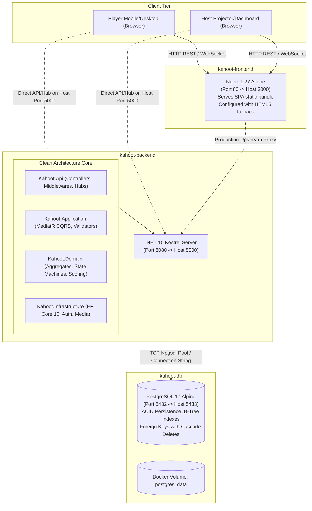
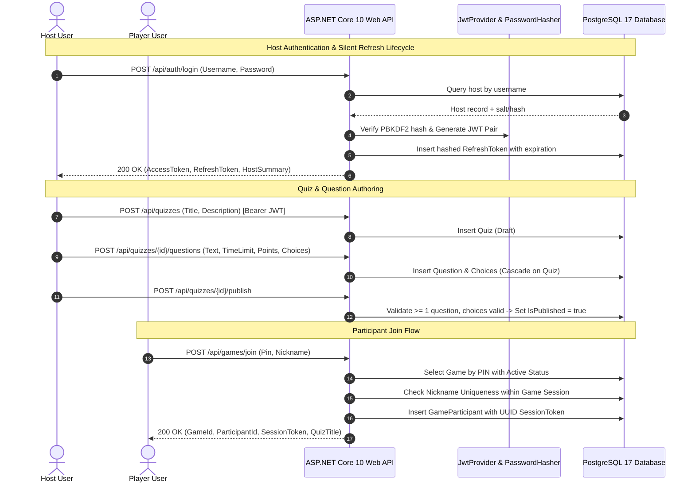
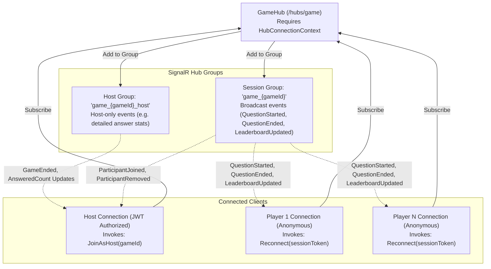
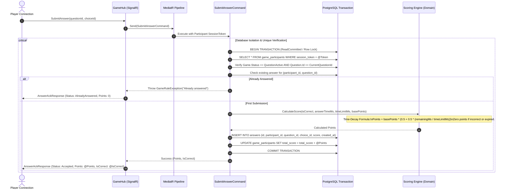
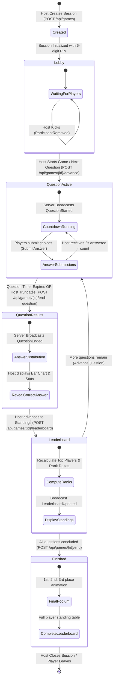

# System Architecture & Technical Design

This document details the end-to-end architecture, communication topology, real-time protocols, concurrency controls, and state machines for the IEEEXtreme Kahoot quiz system.

---

## 1. High-Level Deployment Topology

The system is containerized and orchestrated via Docker Compose, mirroring the single-instance production environment deployed on Railway.

---

## 2. HTTP API Interaction Flow

RESTful endpoints handle administrative tasks, authentication lifecycle, quiz management, and out-of-band game queries.

---

## 3. SignalR Group Isolation & Real-Time Topology

Real-time interactions are delivered via ASP.NET Core SignalR through `GameHub` mounted at `/hubs/game`. Connection multiplexing and isolation are maintained using isolated group subscriptions.

---

## 4. Answer Submission and Scoring Pipeline

To handle high-concurrency spikes when questions start, answer submissions execute under strict concurrency controls, time-decay scoring, and idempotency guarantees.

---

## 5. Host & Player Game State Machine

Both the host and participant client applications synchronize with the server-side authoritative state machine:

---

## 6. Component Breakdown & Boundaries

### 6.1 Backend Architecture (.NET 10 Clean Architecture)
- **`Kahoot.Domain`**: Authoritative domain entities (`Host`, `Quiz`, `Question`, `Choice`, `GameSession`, `GameParticipant`, `Answer`). Domain events, invariant validation, and mathematical scoring algorithms.
- **`Kahoot.Application`**: CQRS commands and queries mediated by MediatR. FluentValidation request filters, DTO contracts, and transactional pipeline behaviors.
- **`Kahoot.Infrastructure`**: EF Core DbContext, PostgreSQL relational mappings, PBKDF2 hashing service, JWT bearer token generator, static media disk storage.
- **`Kahoot.Api`**: REST Controllers (`AuthController`, `QuizzesController`, `QuizQuestionsController`, `GamesController`, `MediaController`), global `ApiExceptionMiddleware` mapping domain exceptions to RFC 7807 Problem Details, SignalR `GameHub`, and CORS policies.

### 6.2 Frontend Architecture (React 19 + TypeScript + Vite)
- **API & Data Services Layer (`src/api/`)**: Centralized Axios client with automatic 401 redirect, typed error extraction (`ApiError`), media URL resolution, and REST service wrappers.
- **Real-Time Client Layer (`src/realtime/`, `src/hooks/`)**: Strongly typed SignalR hub wrappers with randomized exponential backoff reconnection, event folding, and state re-hydration.
- **Accessible Design System (`src/theme/`, `src/components/`)**: Strictly light-themed Material UI v9 components customized to IEEE Ocean Blue brand guidelines, WCAG 2.2 AA compliant contrast, non-color visual cues (shapes + letters), ARIA live regions, and `prefers-reduced-motion` listeners.
- **Route Code Splitting (`src/routes/`)**: Dynamic `React.lazy` imports wrapped in a unified `<Suspense>` boundary to guarantee sub-250KB individual asset chunks.
