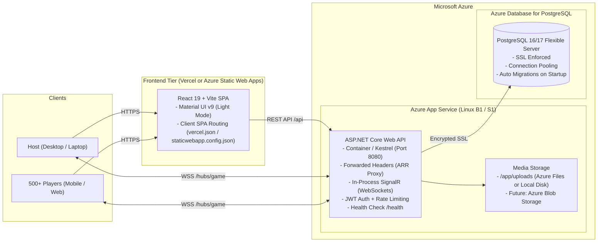

# Azure Production Deployment Guide

This guide details the end-to-end process of deploying the Kahoot-like platform to Microsoft Azure and Vercel/Azure Static Web Apps for production, engineered to support 500+ concurrent players with low latency.

---

## 1. Target Architecture



### Key Architecture Decisions:
1. **Single-Instance In-Process SignalR**:
   - Single Azure App Service instance hosts the ASP.NET Core API and SignalR Hub directly.
   - Built-in WebSockets eliminate Redis or Azure SignalR Service costs for the initial 500-player scale.
2. **PostgreSQL Flexible Server**:
   - Managed Azure PostgreSQL with automated backups, point-in-time restore, and SSL enforcement.
   - Migrations run automatically at startup via `DatabaseMigrationHostedService`.
3. **Decoupled Frontend**:
   - Frontend is a static Single Page Application (SPA) deployed to Vercel or Azure Static Web Apps with global edge CDN distribution.
   - API and SignalR endpoints are parameterized via `VITE_API_URL` and `VITE_SIGNALR_URL`.

---

## 2. Required Azure Resources

| Resource | Service | Recommended SKU | Notes |
| :--- | :--- | :--- | :--- |
| **Resource Group** | Azure Resource Group | N/A | Group for all related resources (e.g. `kahoot-rg`) |
| **Database** | Azure Database for PostgreSQL Flexible Server | `Standard_B1ms` or `Standard_B2s` | PostgreSQL 16 or 17, 32GB Storage, SSL Enforced |
| **Backend API** | Azure App Service (Linux) | `Basic B1` (Dev/Test) or `Standard S1` / `P1v3` (Prod) | Custom Container or .NET 10 runtime, WebSockets enabled |
| **Container Registry** (Optional) | Azure Container Registry (ACR) | `Basic` | Only if deploying custom Docker images to App Service |
| **Frontend** | Vercel or Azure Static Web Apps | Free / Standard | Edge hosting with client routing rewrites |

---

## 3. Azure CLI Deployment Steps

### Step 1: Login and Create Resource Group

```bash
# Login to Azure
az login

# Set your active subscription (if you have multiple)
az account set --subscription "<your-subscription-id>"

# Create Resource Group (e.g. in West Europe or closest region)
az group create --name kahoot-rg --location westeurope
```

---

### Step 2: Create Azure Database for PostgreSQL Flexible Server

1. **Create the PostgreSQL server**:
```bash
az postgres flexible-server create \
  --resource-group kahoot-rg \
  --name kahoot-db-prod \
  --location westeurope \
  --admin-user kahootadmin \
  --admin-password "<YourSecurePasswordHere123!>" \
  --sku-name Standard_B1ms \
  --tier Burstable \
  --version 16 \
  --storage-size 32 \
  --yes
```

2. **Configure Firewall to allow Azure Services**:
```bash
az postgres flexible-server firewall-rule create \
  --resource-group kahoot-rg \
  --name kahoot-db-prod \
  --rule-name AllowAllAzureServices \
  --start-ip-address 0.0.0.0 \
  --end-ip-address 0.0.0.0
```

3. **Create the Database**:
```bash
az postgres flexible-server db create \
  --resource-group kahoot-rg \
  --server-name kahoot-db-prod \
  --database-name kahoot
```

---

### Step 3: Deploy Backend App Service

You can deploy using either **Docker Container** (recommended) or **GitHub Actions code deployment**.

#### Option A: Docker Container via Azure Container Registry (ACR)

1. **Create Container Registry**:
```bash
az acr create \
  --resource-group kahoot-rg \
  --name kahootacrprod \
  --sku Basic \
  --admin-enabled true
```

2. **Build and push image to ACR**:
```bash
# Login to ACR
az acr login --name kahootacrprod

# Build and tag image from backend directory
docker build -t kahootacrprod.azurecr.io/kahoot-backend:latest ./backend
docker push kahootacrprod.azurecr.io/kahoot-backend:latest
```

3. **Create App Service Plan (Linux)**:
```bash
az appservice plan create \
  --resource-group kahoot-rg \
  --name kahoot-plan \
  --location westeurope \
  --is-linux \
  --sku B1
```

4. **Create Web App for Containers**:
```bash
az webapp create \
  --resource-group kahoot-rg \
  --plan kahoot-plan \
  --name kahoot-api-prod \
  --deployment-container-image-name kahootacrprod.azurecr.io/kahoot-backend:latest
```

5. **Configure ACR credentials on App Service**:
```bash
ACR_PASSWORD=$(az acr credential show --name kahootacrprod --query "passwords[0].value" -o tsv)

az webapp config container set \
  --resource-group kahoot-rg \
  --name kahoot-api-prod \
  --docker-custom-image-name kahootacrprod.azurecr.io/kahoot-backend:latest \
  --docker-registry-server-url https://kahootacrprod.azurecr.io \
  --docker-registry-server-user kahootacrprod \
  --docker-registry-server-password "$ACR_PASSWORD"
```

#### Option B: Code Deployment via GitHub Actions (.NET 10)
If deploying code directly:
1. In Azure Portal, create **Web App** with Runtime stack **.NET 10 (Linux)**.
2. In **Deployment Center**, select **GitHub**, choose your repository, branch `main`, and subfolder `backend`.

---

### Step 4: Configure App Service Settings & WebSockets

1. **Enable WebSockets and Always On**:
```bash
az webapp config set \
  --resource-group kahoot-rg \
  --name kahoot-api-prod \
  --web-sockets-enabled true \
  --always-on true
```

2. **Configure Application Settings (Environment Variables)**:
```bash
az webapp config appsettings set \
  --resource-group kahoot-rg \
  --name kahoot-api-prod \
  --settings \
    ASPNETCORE_ENVIRONMENT="Production" \
    WEBSITES_PORT="8080" \
    WEBSITES_ENABLE_APP_SERVICE_STORAGE="true" \
    ConnectionStrings__DefaultConnection="Host=kahoot-db-prod.postgres.database.azure.com;Port=5432;Database=kahoot;Username=kahootadmin;Password=<YourSecurePasswordHere123!>;Ssl Mode=Require;Trust Server Certificate=true;" \
    Jwt__Issuer="kahoot-api" \
    Jwt__Audience="kahoot-clients" \
    Jwt__SigningKey="<GENERATE_RANDOM_KEY_AT_LEAST_32_CHARS>" \
    Jwt__AccessTokenMinutes="15" \
    Jwt__RefreshTokenDays="14" \
    Seeding__Host__Username="IEEEXtreme Section" \
    Seeding__Host__Password="<StrongHostPasswordHere123!>" \
    Cors__AllowedOrigins="https://your-frontend.vercel.app"
```

---

## 4. Frontend Deployment

### Deploying to Vercel

1. Push your repository to GitHub.
2. Log in to [Vercel](https://vercel.com) and click **Add New Project**.
3. Import the repository:
   - **Root Directory**: Select `frontend` (or leave as `./` if using root `vercel.json`).
   - **Framework Preset**: Vite
   - **Build Command**: `npm run build`
   - **Output Directory**: `dist`
4. In **Environment Variables**, add:
   - `VITE_API_URL`: `https://kahoot-api-prod.azurewebsites.net/api`
   - `VITE_SIGNALR_URL`: `https://kahoot-api-prod.azurewebsites.net`
5. Click **Deploy**.
6. Copy your assigned Vercel URL (e.g. `https://kahoot-xxx.vercel.app`) and update `Cors__AllowedOrigins` on the Azure App Service.

### Deploying to Azure Static Web Apps

1. In Azure Portal or via Azure CLI:
```bash
az staticwebapp create \
  --resource-group kahoot-rg \
  --name kahoot-frontend-prod \
  --location westeurope \
  --source https://github.com/<your-username>/kahoot \
  --branch main \
  --app-location "/frontend" \
  --output-location "dist"
```
2. Configure App Settings in Azure Static Web Apps:
   - `VITE_API_URL`: `https://kahoot-api-prod.azurewebsites.net/api`
   - `VITE_SIGNALR_URL`: `https://kahoot-api-prod.azurewebsites.net`

---

## 5. Database Migrations Workflow

The backend application contains an automatic migration runner:
- When `Kahoot.Api` starts up, `DatabaseMigrationHostedService` executes before Kestrel begins accepting traffic.
- If pending migrations exist in EF Core (`KahootDbContext`), they are applied automatically and transactionally.
- If migration fails (e.g. database unreachable or invalid credentials), container startup terminates immediately with a clear error, preventing the app from running in an inconsistent state.

### Manual Migration Option (via CLI)
If your organization requires running migrations out-of-band:
```bash
dotnet ef database update \
  --project src/Kahoot.Infrastructure \
  --startup-project src/Kahoot.Api \
  --connection "Host=kahoot-db-prod.postgres.database.azure.com;Port=5432;Database=kahoot;Username=kahootadmin;Password=<YourPassword>;Ssl Mode=Require;Trust Server Certificate=true;"
```

---

## 6. Storage Evolution to Azure Blob Storage

Currently, images are stored via the clean `IFileStorage` abstraction:

```csharp
public interface IFileStorage
{
    Task<string> SaveAsync(Stream content, string fileExtension, CancellationToken cancellationToken);
}
```

### Current Production State (App Service Persistent Storage):
- Azure App Service mounts `/app/uploads` using `WEBSITES_ENABLE_APP_SERVICE_STORAGE=true`.
- Uploaded files persist across container restarts.

### Future Azure Blob Storage Provider:
To transition to Azure Blob Storage:
1. Install package `Azure.Storage.Blobs` in `Kahoot.Infrastructure`.
2. Implement `AzureBlobFileStorage : IFileStorage`.
3. In `DependencyInjection.cs`, register `AzureBlobFileStorage` when connection string or blob options are present.
4. Business logic in `ImageUploadService`, `UploadsController`, and quiz domain remains 100% untouched.

---

## 7. App Settings & Environment Variables Reference

### Backend Settings (Azure App Service)

| Variable | Description | Required | Example |
| :--- | :--- | :---: | :--- |
| `ASPNETCORE_ENVIRONMENT` | Environment profile | Yes | `Production` |
| `WEBSITES_PORT` | Port Azure ARR routes traffic to | Yes | `8080` |
| `WEBSITES_ENABLE_APP_SERVICE_STORAGE` | Enable persistent storage for uploads | Yes | `true` |
| `ConnectionStrings__DefaultConnection` | PostgreSQL connection string | Yes | `Host=...;Database=kahoot;Username=...;Password=...;Ssl Mode=Require;` |
| `Jwt__Issuer` | Token issuer claim | Yes | `kahoot-api` |
| `Jwt__Audience` | Token audience claim | Yes | `kahoot-clients` |
| `Jwt__SigningKey` | HMAC-SHA256 secret (>= 32 chars) | Yes | `a1b2c3d4e5...` (64 hex characters) |
| `Jwt__AccessTokenMinutes` | Access token lifespan | No | `15` |
| `Jwt__RefreshTokenDays` | Refresh token lifespan | No | `14` |
| `Seeding__Host__Username` | Initial host account name | No | `Admin` or `IEEEXtreme Section` |
| `Seeding__Host__Password` | Initial host account password | No | `StrongPassword123!` |
| `Cors__AllowedOrigins` | Allowed frontend domains (comma-separated) | Yes | `https://your-frontend.vercel.app` |

### Frontend Settings (Vercel / Static Web Apps)

| Variable | Description | Example |
| :--- | :--- | :--- |
| `VITE_API_URL` | Full URL to backend REST API | `https://kahoot-api-prod.azurewebsites.net/api` |
| `VITE_SIGNALR_URL` | Base URL to backend SignalR Hub | `https://kahoot-api-prod.azurewebsites.net` |

---

## 8. Verification & Health Checklist

After deployment, perform these verification checks:

1. **Health Check Endpoint**:
   ```bash
   curl -i https://kahoot-api-prod.azurewebsites.net/health
   # Expected: HTTP/1.1 200 OK -> Healthy
   ```

2. **API Access Control**:
   ```bash
   curl -i https://kahoot-api-prod.azurewebsites.net/api/quizzes
   # Expected: HTTP/1.1 401 Unauthorized
   ```

3. **CORS Verification**:
   ```bash
   curl -i -X OPTIONS https://kahoot-api-prod.azurewebsites.net/api/auth/login \
     -H "Origin: https://your-frontend.vercel.app" \
     -H "Access-Control-Request-Method: POST"
   # Expected: Access-Control-Allow-Origin: https://your-frontend.vercel.app
   ```

4. **WebSockets Verification**:
   - Open browser Developer Tools -> **Network** tab -> filter by **WS**.
   - Navigate to `/play/<gameId>` or `/host/game/<gameId>`.
   - Verify connection to `wss://kahoot-api-prod.azurewebsites.net/hubs/game` returns status **101 Switching Protocols**.

5. **SPA Routing on Refresh**:
   - Navigate to `/host/quizzes` or `/login`.
   - Press `Ctrl + F5` (hard refresh).
   - Ensure the page reloads correctly and does **not** return a 404 error (handled by `vercel.json` and `staticwebapp.config.json`).

6. **Load Verification (k6)**:
   - Run the k6 load test suite in `load-tests/` pointing to the Azure API URL before opening the session to 500 live players:
   ```bash
   BASE_URL=https://kahoot-api-prod.azurewebsites.net node load-tests/run-all.js
   ```

---

## 9. Troubleshooting Common Azure Issues

| Symptom | Cause | Solution |
| :--- | :--- | :--- |
| **502 Bad Gateway / Container failed to start** | Missing or invalid `ConnectionStrings__DefaultConnection` or `Jwt__SigningKey`. | Check App Service Logs: `az webapp log tail --name kahoot-api-prod --resource-group kahoot-rg`. Ensure all required app settings exist and PostgreSQL firewall allows Azure IPs. |
| **SignalR falls back to Long Polling or disconnects** | WebSockets disabled in App Service. | Go to **Configuration** -> **General Settings** -> set **Web sockets** to **On**. Also set **Always on** to **On**. |
| **CORS error: `No 'Access-Control-Allow-Origin' header`** | `Cors__AllowedOrigins` does not match frontend domain. | Update `Cors__AllowedOrigins` in App Settings to match the exact frontend URL (including `https://`, no trailing slash). |
| **404 Not Found when reloading frontend pages** | SPA rewrite rule missing on static host. | Verify `vercel.json` is deployed on Vercel or `staticwebapp.config.json` is deployed on Azure Static Web Apps. |
| **PostgreSQL connection timeout or SSL error** | Azure PostgreSQL requires SSL. | Ensure connection string includes `Ssl Mode=Require;Trust Server Certificate=true;`. |
| **Uploaded images return 404 after App Service restart** | App Service local storage is ephemeral by default. | Set `WEBSITES_ENABLE_APP_SERVICE_STORAGE=true` in App Settings. |
