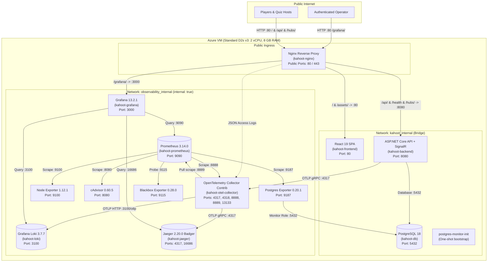

# Production Observability Architecture

This document details the architecture, signal flows, security trust boundaries, retention limits, and resource budgeting of the OpenTelemetry observability platform deployed on the Azure Linux Virtual Machine (`http://20.19.48.78/`).

---

## 1. System Architecture & Trust Boundaries

The platform separates production workloads into two isolated Docker networks. Only the reverse proxy (`kahoot-nginx`) exposes public ports (`80` and `443`). All telemetry backends, exporters, and databases remain strictly private.

---

## 2. Network Isolation & Private Ports

| Service | Container Name | Docker Networks | Private Port | Host Port | Purpose |
|---|---|---|---|---|---|
| Nginx | `kahoot-nginx` | `kahoot_internal`, `observability_internal` | 80, 443 | **80, 443** | Single entry point, SSL termination, subpath proxy |
| Frontend | `kahoot-frontend` | `kahoot_internal` | 80 | *None* | React SPA static web server |
| Backend | `kahoot-backend` | `kahoot_internal`, `observability_internal` | 8080 | *None* | ASP.NET Core API & SignalR gameplay hub |
| PostgreSQL | `kahoot-db` | `kahoot_internal` | 5432 | *None* | Relational application database |
| Grafana | `kahoot-grafana` | `observability_internal` | 3000 | *None* | Observability dashboard and alert visualization |
| Prometheus | `kahoot-prometheus` | `observability_internal` | 9090 | *None* | Time-series metrics and recording rules |
| Loki | `kahoot-loki` | `observability_internal` | 3100 | *None* | Structured log aggregation with OTLP native endpoint |
| Jaeger | `kahoot-jaeger` | `observability_internal` | 4317, 16686 | *None* | Distributed trace storage and query API |
| OTel Collector | `kahoot-otel-collector` | `observability_internal` | 4317, 4318, 8888, 8889, 13133 | *None* | Telemetry processing, sanitization, and routing |
| Node Exporter | `kahoot-node-exporter` | `observability_internal` | 9100 | *None* | Host VM CPU, memory, disk, and network metrics |
| cAdvisor | `kahoot-cadvisor` | `observability_internal` | 8080 | *None* | Container-level CPU and memory consumption |
| Postgres Exporter | `kahoot-postgres-exporter` | `kahoot_internal`, `observability_internal` | 9187 | *None* | PostgreSQL connections, locks, and query latency |
| Blackbox Exporter | `kahoot-blackbox-exporter` | `kahoot_internal`, `observability_internal` | 9115 | *None* | Internal HTTP availability probes |

---

## 3. Telemetry Signal Flows

### Metrics
1. **Application Metrics:** Emitted by .NET OpenTelemetry SDK (`Kahoot.Application` Meter) via OTLP gRPC to the OpenTelemetry Collector on port `4317`.
2. **Span Metrics & Service Graph:** Derived inside the Collector *before* tail sampling to ensure 100% accurate rate, error, and duration calculations without bias.
3. **Collector Prometheus Exporter:** The Collector exposes aggregated metrics at `:8889/metrics`.
4. **Scrape Infrastructure:** Prometheus scrapes the Collector (`:8889`), Collector self-health (`:8888`), Node Exporter (`:9100`), cAdvisor (`:8080`), Postgres Exporter (`:9187`), and Blackbox Exporter (`:9115`) every 15 seconds.

### Logs
1. **Application Logs:** Structured JSON logs emitted by .NET `ILogger` with scopes (`request.id`, `trace_id`, `span_id`) exported asynchronously via OTLP HTTP to Collector.
2. **Nginx Logs:** Safe JSON access logs written to rotated `/var/log/nginx/access-observability.json` volume, parsed by Collector `filelog` receiver.
3. **Loki Ingestion:** Collector sanitizes sensitive attributes and pushes logs to Loki via OTLP HTTP endpoint (`http://loki:3100/otlp`).

### Traces
1. **Span Creation:** ASP.NET Core creates activity spans on HTTP requests, MediatR handlers (`application.<Request>`), EF Core / Npgsql queries, and SignalR broadcasts.
2. **Sanitization:** Collector OTTL transforms redact passwords, tokens, query parameters, and SQL parameter values.
3. **Tail Sampling:** 
   - 100% of traces with error status or HTTP 5xx.
   - 100% of traces with duration >= 1000 ms.
   - 10% probabilistic sample of all remaining healthy traces.
4. **Export:** Selected traces exported via OTLP gRPC to Jaeger (`jaeger:4317`) for Badger disk persistence.

---

## 4. Persistent Storage Volumes & Data Retention

| Volume Name | Service | Mount Path | Retention Policy | Maximum Storage Budget |
|---|---|---|---|---|
| `prometheus_data` | Prometheus | `/prometheus` | 7 days (`--storage.tsdb.retention.time=7d`) | 4 GB hard cap (`--storage.tsdb.retention.size=4GB`) |
| `loki_data` | Loki | `/loki` | 7 days (`retention_period: 168h`) | Bounded ingestion (~1–2 GB) |
| `jaeger_data` | Jaeger | `/badger` | 72 hours (`ttl.spans: 72h`) | Bounded Badger storage (~1–2 GB) |
| `grafana_data` | Grafana | `/var/lib/grafana` | Persistent user metadata | < 100 MB |
| `postgres_data` | PostgreSQL | `/var/lib/postgresql` | Persistent relational data | Application lifetime |
| `uploads_data` | Backend | `/app/uploads` | Persistent uploaded media | Application lifetime |
| `nginx_logs` | Nginx & Collector | `/var/log/nginx` | Log rotation (`10m`, 3 files) | Max 30 MB |

Total observability disk budget is capped well below 10 GB, comfortably inside the ~30 GB free OS disk available on the Azure VM.

---

## 5. Resource Priority & Container Limits

The resource allocation strictly prioritizes application availability and database stability over telemetry:

1. **Priority 1 (Application):** `backend` (0.80 CPU, 1.5 GB RAM limit) + `frontend` (0.15 CPU, 128 MB RAM).
2. **Priority 2 (Database):** `db` (0.50 CPU, 2.0 GB RAM limit).
3. **Priority 3 (Ingress):** `nginx` (0.20 CPU, 256 MB RAM limit).
4. **Priority 4 (Observability):** Collector (0.25 CPU, 384 MB), Prometheus (0.30 CPU, 1.0 GB), Loki (0.20 CPU, 512 MB), Jaeger (0.15 CPU, 512 MB), Grafana (0.20 CPU, 384 MB), Exporters combined (~0.25 CPU, ~384 MB).

---

## 6. Out-of-Scope Design Decisions

### Why Frontend Browser Telemetry Is Out of Scope
- **Security:** Exposing an OTLP collector receiver to the public internet would create an unauthenticated DDoS and telemetry injection vector.
- **Client Overhead:** Running browser tracing on participant mobile devices wastes battery and bandwidth during live Kahoot games.
- **Adequate Coverage:** Real client availability and experience are measured at Nginx (request duration, status codes, upstream latency) and Blackbox probing.

### Why Azure Monitor Agent Is Out of Scope
- **Resource Constraints:** Running Azure Monitor Agent (AMA) daemon sets alongside Docker consumes host CPU and memory on a tight 2-vCPU / 8-GB VM.
- **Duplication:** Node Exporter and cAdvisor already provide real-time Linux kernel, CPU, RAM, disk, and container metrics directly into Prometheus without extra Azure ingestion charges.
- **Future Improvement:** Azure Monitor Agent is reserved as an optional future host-level safety layer if native Azure portal integration is desired.
