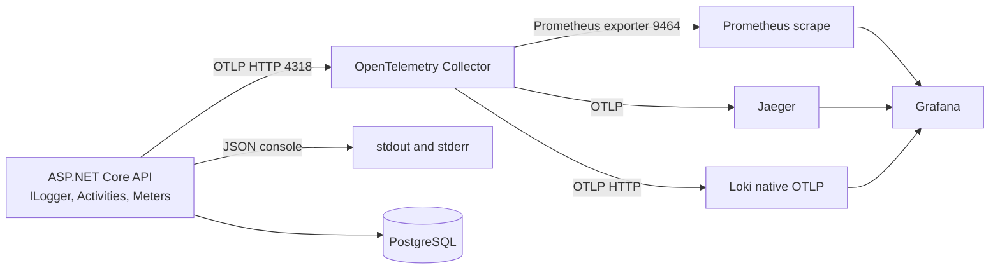

# OpenTelemetry implementation plan

**Goal:** Add a vendor-neutral, three-signal observability path for the existing .NET 10 backend: API to OpenTelemetry Collector over OTLP; metrics to Prometheus, traces to Jaeger, and logs to Loki; Grafana as the common exploration UI. Keep structured JSON console logs independently available.

**Source of requirements:** [`prompts/OpenTelemetry.md`](../prompts/OpenTelemetry.md). This is an execution plan, not an implementation. No OpenTelemetry code, service, package, test, or existing requirement document is changed by creating it.

## Current baseline and design boundaries

- `Kahoot.Api` is the composition root for `Kahoot.Application`, `Kahoot.Infrastructure`, controllers, exception handling, and the single `/health` endpoint. `Kahoot.Domain` stays free of telemetry dependencies.
- EF Core uses Npgsql; startup migration and seeding also open raw Npgsql connections. `ILogger<T>` is already used in operational services. There is no explicit OpenTelemetry registration, JSON console configuration, `HttpClient` registration, SignalR hub, or observability service in the current backend.
- Compose currently runs `api` and PostgreSQL on `web`/`data` networks. The observability services join a separate `observability` network; PostgreSQL does not. API startup and readiness remain independent of telemetry.
- The current `docs/12-platform-operations-and-health.md` already permits OpenTelemetry tracing and metrics, but describes logs as local only. `docs/13-architecture-and-deployment.md` lacks the target stack. The current `docs/` search found no explicit ban on OpenTelemetry/Prometheus/Grafana/Jaeger/Loki; Phase 0 must recheck the working tree, and Phase 1 updates only actual conflicts and missing requirements before application code.
- Existing unrelated working-tree edits must be preserved. `backend/test/` remains `.gitkeep` only; validation uses build, configuration, runtime, and manual inspections, with no new automated tests.

## Final architecture

The Collector is the only application telemetry destination. Prometheus pulls from the Collector. Jaeger uses ephemeral local trace storage; Prometheus and Loki use persistent local volumes with retention. Grafana provisions the three data sources. This Compose stack is a local/single-host reference, not a durable multi-node observability deployment.

## Ordered phases and recommended execution order

Execute in order. Each phase has its own acceptance criteria and produces a reviewable result before the next begins.

| Order | Phase | Status | Deliverable |
| --- | --- | :---: | --- |
| 0 | [Analyze backend and map requirements](<Phase 0 - Analyze backend and map requirements.md>) | **Completed** | Revalidated inventory, requirement-to-file map, version/component decision record, and risk register; no product edits. |
| 1 | [Align requirements and deployment docs](<Phase 1 - Align requirements and deployment docs.md>) | **Completed** | Updated normative docs and execution decisions before application code. |
| 2 | [Instrument the .NET API](<Phase 2 - Instrument the .NET API.md>) | **Completed** | OTLP logs/traces/metrics, safe Npgsql pool identity, JSON console, sampling, and health trace filter. |
| 3 | [Add Collector and signal backends](<Phase 3 - Add Collector and signal backends.md>) | **Completed** | Collector, Prometheus, Jaeger, Loki, Compose networking, retention, and signal paths. |
| 4 | [Provision Grafana and correlation](<Phase 4 - Provision Grafana and correlation.md>) | **Completed** | Provisioned data sources and verified log-to-trace navigation; exemplar decision. |
| 5 | [Refine operational logs and error correlation](<Phase 5 - Refine operational logs and error correlation.md>) | **Completed** | Correct retry levels, additive `traceId` in existing ProblemDetails paths, focused log review. |
| 6 | [Validate and document operations](<Phase 6 - Validate and document operations.md>) | **Completed** | End-to-end/security/failure-isolation checks and operator instructions. |

---

## Implementation Summary & Sign-off

All phases of the OpenTelemetry implementation plan have been executed and verified in sequence according to repository engineering standards:

1. **Vendor-Neutral Telemetry Architecture**:
   - `Kahoot.Api` instruments ASP.NET Core, .NET Runtime, and PostgreSQL (Npgsql) via official OpenTelemetry packages.
   - All three telemetry signals (metrics, traces, logs) are exported via OTLP HTTP exclusively to the OpenTelemetry Collector Contrib gateway (`:4318`).
   - The Collector routes metrics to Prometheus (`:9464` scrape), traces to Jaeger (`:4317` gRPC), and logs to Grafana Loki (`:3100/otlp` HTTP).
   - Grafana (`:3000`) is pre-provisioned with all three data sources and provides automatic log-to-trace navigation using `traceId`.
2. **Correlation & Logging Standards**:
   - Every log record includes `TraceId`, `SpanId`, and `TraceFlags`.
   - RFC 7807 `ProblemDetails` error responses include `["traceId"]` additively alongside `requestId` whenever an active trace exists.
   - Structured JSON console logging remains independently available on `stdout`/`stderr`.
3. **Resilience, Security & Performance**:
   - The API startup and health checks (`/health`, `/health/ready`) operate completely independent of the observability stack.
   - Unreachable backends drop telemetry gracefully in bounded queues without thread starvation or application degradation.
   - Sensitive credentials, tokens, query parameters, and database connection strings are strictly redacted.
   - High-frequency health probes are filtered out of distributed tracing.
   - Database connection pool identity is safely parameterized as `KahootPrimary`.
4. **Environment & Documentation Synchronization**:
   - Environment variables (`OTEL_*`, `GRAFANA_*`) are strictly synchronized across `.env.example`, `.env.development`, and `.env.production`.
   - Operator runbooks in `backend/README.md` and architecture contracts in `docs/` reflect the exact running topology.

## Cross-phase implementation rules

1. Preserve existing API contracts, startup migration coordination, database schema, and Clean Architecture dependency direction. No new business telemetry abstraction or vendor SDK in Domain/Application/Infrastructure.
2. Use exact stable package/image versions recorded in Phase 0. Phase 0 checks official versioned documentation before locking them; later phases consume that record. Do not use `latest`, preview, or RC.
3. Keep `.env.example`, `.env.development`, and `.env.production` synchronized for every new variable name, while preserving environment-specific values. Do not edit the developer's local `.env`. Avoid printing existing secret values during inspection.
4. Preserve `ILogger<T>` and the default console provider. Configure its JSON formatter through `Logging:Console`; add OpenTelemetry as an additional provider. Keep all OTLP destinations configurable through standard `OTEL_*` settings.
5. Use built-in/framework instrumentation first. No duplicate request logs, custom metrics or spans by default, raw URLs or user IDs in metric labels, or high-cardinality Loki index labels.
6. Telemetry loss during a backend outage is acceptable within bounded queues; application availability is not allowed to depend on the stack. No API `depends_on` health gate for Collector or backends.
7. All planned verification is manual/runtime/config/build verification. Do not create test files or change `backend/test/`.

## Definition of Done

- Normative docs and operator docs describe the approved stack without contradictory exclusions; unrelated SLOs remain intact.
- API emits OTLP logs, traces, and metrics only to Collector; JSON console logs continue if Collector fails.
- HTTP and PostgreSQL spans, HTTP/runtime/Npgsql metrics, and operational logs are visible in their intended backends; unsupported `HttpClient`/SignalR scenarios are recorded honestly as unexercised where no current code path exists.
- Grafana has provisioned Prometheus, Loki, and Jaeger sources; log-to-trace navigation works where supported by the pinned versions. Exemplar support is verified or documented as deferred.
- `requestId` remains in current ProblemDetails; `traceId` is added when an active trace exists, including existing controller, exception, and JWT challenge/forbidden paths.
- Database pool names, metric labels, Loki labels, span attributes, and log records contain no connection string or listed secret; URL query redaction stays enabled.
- Compose service/config validation, backend restore/build/format verification, live signal checks, storage restart checks, and backend-outage checks have recorded results. No schema migration, test file, or unrelated edit is introduced.
