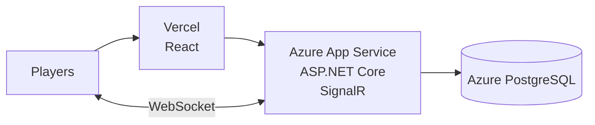

بما أن هدفك الآن هو **نقل المشروع من Local/Railway إلى Azure**، يجب أن تجعل Claude يجهز الكود للـ Azure deployment وليس فقط يبني Dockerfile.
حسب الـ NFR عندك، الـ deployment المطلوب هو:

* Frontend → Vercel أو Azure Static Web Apps
* Backend → Azure App Service (ASP.NET Core)
* Database → Azure PostgreSQL
* File storage → Azure Blob Storage لاحقًا إذا احتجت
* SignalR → في البداية داخل ASP.NET Core (بدون Azure SignalR Service) لأنك تبدأ بـ instance واحدة. 

---

## Prompt لـ Claude Code

انسخه كما هو:

```text
Act as a senior Azure DevOps engineer and ASP.NET Core deployment specialist.

I want to prepare this Kahoot-like platform for production deployment on Microsoft Azure.

The target deployment architecture is:

Frontend:
- React/Vite or Next.js frontend
- Deploy to Azure Static Web Apps or Vercel
- Environment variables must be used for API and SignalR URLs

Backend:
- ASP.NET Core Web API
- Deploy to Azure App Service
- Run as a production containerized application
- Support SignalR WebSocket connections
- Use environment-based configuration

Database:
- Azure Database for PostgreSQL
- No local database dependency in production

Storage:
- Keep the existing file storage abstraction.
- Prepare the code so Azure Blob Storage can be added later without changing business logic.

Important:
Do not redesign the architecture.
Keep the existing modular monolith and Clean Architecture.

Review the existing code and prepare everything required for Azure deployment.

## Tasks

### 1. Backend Azure Preparation

Review and update the ASP.NET Core backend.

Ensure:

- Correct production configuration
- Environment variables instead of hard-coded values
- PostgreSQL connection string from Azure configuration
- JWT secrets from Azure App Settings
- CORS configured for the production frontend domain
- HTTPS/proxy headers configured correctly
- Correct port binding for Azure App Service
- Health endpoint available:

GET /health

- Structured production logging
- Proper exception handling
- No secrets in logs

Verify:

- EF Core migrations can run in Azure
- Database startup behavior is safe
- Seed data does not expose development credentials

---

### 2. Dockerization

Create or improve Docker support.

Requirements:

- Production Dockerfile
- Multi-stage build
- Small runtime image
- Correct ASP.NET Core port configuration
- No development dependencies in runtime image
- Container starts successfully locally

Add:

- .dockerignore
- Docker build instructions
- Docker run instructions

---

### 3. Azure App Service Compatibility

Prepare the backend for Azure App Service.

Verify:

- Application listens on the Azure provided port
- WebSockets are enabled/documented
- SignalR works behind Azure reverse proxy
- Forwarded headers are configured
- Production environment works correctly

Document required App Settings:

Example:

```

ASPNETCORE_ENVIRONMENT
ConnectionStrings__DefaultConnection
Jwt__SigningKey
Cors__AllowedOrigins__0

```

---

### 4. Frontend Azure Preparation

Review frontend deployment requirements.

Ensure:

- No localhost URLs
- API URL comes from environment variables
- SignalR URL comes from environment variables
- Production build works

Document:

```

VITE_API_URL
VITE_SIGNALR_URL

```

---

### 5. Database Preparation

Prepare PostgreSQL deployment.

Verify:

- EF migrations are production safe
- Database schema is generated through migrations only
- Required indexes and constraints exist
- Connection pooling settings are reasonable

Create documentation for:

- Creating Azure PostgreSQL
- Applying migrations
- Connecting the backend

---

### 6. SignalR Production Review

Review SignalR deployment.

Verify:

- WebSocket transport works
- Connection lifecycle is handled
- Reconnection works
- Game groups are isolated
- No local-only in-memory state breaks deployment

Do not add Azure SignalR Service yet.

The first deployment uses:

One Azure App Service instance + built-in ASP.NET Core SignalR.

---

### 7. Security Review

Before deployment verify:

- No secrets committed
- Production JWT signing key required
- CORS is restricted
- HTTPS enforced
- Debug mode disabled
- Detailed exceptions disabled
- Secure cookies/token handling

---

### 8. Documentation

Create:

```

docs/azure-deployment.md

```

Include:

- Azure architecture
- Required Azure resources
- Environment variables
- Deployment steps
- Database migration steps
- Troubleshooting
- Local vs Azure differences

Include Mermaid architecture diagrams where useful.

---

### 9. Verification

Before finishing:

Run:

- Backend build
- Frontend build
- Docker build
- Local container startup

Verify:

- API starts
- Database connection works
- Health endpoint works
- SignalR connection works

Do not claim Azure deployment is complete unless the application is ready to deploy.

Final output should include:

- Files changed
- Deployment readiness status
- Remaining manual Azure steps
- Any risks
```

---

# خطوات رفع المشروع على Azure بالتفصيل

سأفترض أنك تستخدم:

```
Frontend:
React/Vite

Backend:
ASP.NET Core

Database:
PostgreSQL
```

---

# المرحلة 1: إنشاء Azure Resources

## 1) تسجيل الدخول

ثبت Azure CLI:

[https://learn.microsoft.com/cli/azure/install-azure-cli](https://learn.microsoft.com/cli/azure/install-azure-cli)

ثم:

```bash
az login
```

سيفتح المتصفح.

---

# 2) إنشاء Resource Group

```bash
az group create \
 --name kahoot-rg \
 --location westeurope
```

---

# 3) إنشاء PostgreSQL

من Azure Portal:

```
Create Resource
↓
Azure Database for PostgreSQL Flexible Server
```

اختار:

```
Resource Group:
kahoot-rg

Server name:
kahoot-db

Region:
West Europe

Postgres version:
16

Authentication:
PostgreSQL authentication
```

أنشئ user:

```
kahootadmin
```

---

بعد الإنشاء:

اذهب:

```
Networking
```

فعّل:

```
Allow Azure services
```

ثم احفظ.

---

# 4) إنشاء Database

داخل PostgreSQL:

```sql
CREATE DATABASE kahoot;
```

---

# المرحلة 2: رفع Backend

## 1) إنشاء App Service

Azure Portal:

```
Create Resource

Web App
```

اختار:

```
Publish:
Docker Container

Operating System:
Linux
```

أو:

```
Code
.NET 10
```

حسب طريقة تجهيز Claude.

---

اختار:

```
Region:
West Europe

Plan:
Basic / Standard
```

للتجربة:

B1 ممكن.

---

# 2) إعداد Environment Variables

اذهب:

```
App Service
↓
Configuration
↓
Application Settings
```

أضف:

مثلاً:

```
ASPNETCORE_ENVIRONMENT=Production
```

---

Connection string:

```
ConnectionStrings__DefaultConnection
```

القيمة:

```
Host=kahoot-db.postgres.database.azure.com;
Database=kahoot;
Username=kahootadmin;
Password=YOUR_PASSWORD;
Ssl Mode=Require;
```

---

JWT:

```
Jwt__SigningKey
```

ضع secret قوي.

---

CORS:

```
Cors__AllowedOrigins__0
```

مثلا:

```
https://your-frontend.vercel.app
```

---

# 3) تفعيل WebSockets

في App Service:

```
Configuration
↓
General Settings
```

فعّل:

```
Web sockets = On
```

مهم جدًا لـ SignalR.

---

# المرحلة 3: نشر Backend

عندك خيارين:

## الطريقة الأولى (أنصح بها): Docker

Build:

```bash
docker build -t kahoot-api .
```

ثم ترفع image إلى:

```
Azure Container Registry
```

أو GitHub Container Registry.

---

## الطريقة الثانية: GitHub Deployment

اربط:

```
App Service
↓
Deployment Center
↓
GitHub
```

اختار repo.

---

# المرحلة 4: تشغيل Migration

بعد deploy:

ادخل:

```
App Service
↓
SSH
```

أو استخدم:

```bash
dotnet ef database update
```

حسب طريقة المشروع.

---

# المرحلة 5: Frontend

أنا أنصح:

```
Frontend → Vercel
Backend → Azure
```

أسهل.

في Vercel:

Environment Variables:

```
VITE_API_URL=https://your-api.azurewebsites.net/api

VITE_SIGNALR_URL=https://your-api.azurewebsites.net
```

ثم:

Deploy.

---

# المرحلة 6: اختبار SignalR

افتح:

```
Frontend URL
```

جرّب:

1. Host login
2. Create quiz
3. Start game
4. Join من هاتف
5. افتح أكثر من browser
6. تأكد من:

```
QuestionStarted
Answer
Leaderboard
Reconnect
```

---

# المرحلة 7: قبل الـ 500 مستخدم

لا تطلق مباشرة.

اعمل:

```
k6 test
```

حسب الـ NFR عندك:

* 500 SignalR connections
* 500 answers burst
* no duplicate answers
* no lost scores


---

## Architecture النهائية التي أنصحك بها:



ابدأ بهذه. لا تضف Azure SignalR Service أو Redis الآن، لأن متطلباتك نفسها تقول ابدأ بـ single replica ثم قِس الأداء قبل التوسع. 

هذا التصميم مناسب جدًا لمشروعك الجامعي و500 مستخدم.
